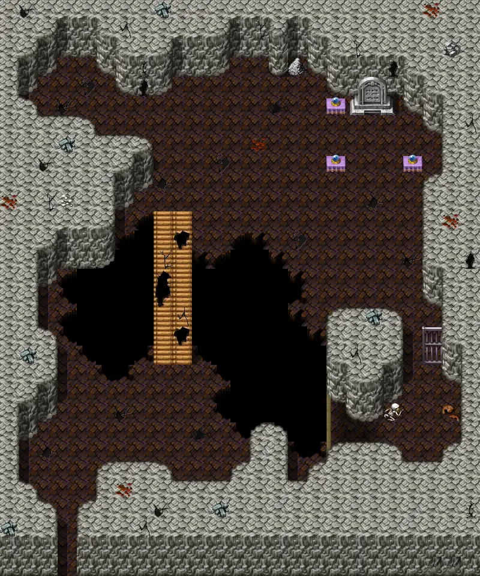

# Laerothprison7

| | |
|---|---|
| **Map ID** | `laerothprison7` |
| **Type** | Indoors / underground |
| **Size** | 25×30 tiles |
| **World map** | [Laeroth prison](index.md) |
| **Introduced** | [v0.8.11](../versions/0.8.11.md) |
| **NPCs** | 8 |
| **Enemy types** | 1 |
| **Quests** | 3 |

**Laerothprison7** is an indoor map. It has 8 NPCs and 1 kind of enemy. Exits lead to Laerothprison6.

## Map

<label class="lg"><input type="checkbox" data-t="spawn" checked><b>Red</b>&nbsp;Monsters / NPCs</label><label class="lg"><input type="checkbox" data-t="mapchange" checked><b>Blue</b>&nbsp;Exit to another map</label><label class="lg"><input type="checkbox" data-t="container" checked><b>Yellow</b>&nbsp;Container (click to see contents)</label><label class="lg"><input type="checkbox" data-t="sign" checked><b>Purple</b>&nbsp;Sign</label><label class="lg"><input type="checkbox" data-t="rest" checked><b>Green</b>&nbsp;Resting place</label><label class="lg"><input type="checkbox" data-t="key" checked><b>Orange dashed</b>&nbsp;Blocked until a quest step / item</label><label class="lg"><input type="checkbox" data-t="script"><b>Grey dotted</b>&nbsp;Scripted event</label><label class="lg"><input type="checkbox" data-t="replace"><b>White dotted</b>&nbsp;Changes during a quest</label><label class="lg"><input type="checkbox" data-t="pin" checked><b>Numbers</b>&nbsp;Numbered key points (see the key below the map)</label>

<a class="pin pin-exit" href="#key-1" style="left:14.000%;top:98.333%" title="Exit (south): to [Laerothprison6](../laerothprison6.md)">1</a><a class="pin pin-npc" href="#key-2" style="left:58.000%;top:85.000%" title="[Dark watch](../../monsters/lae_demon9.md): 1 quest">2</a><a class="pin pin-npc" href="#key-3" style="left:82.000%;top:28.333%" title="[Dark watch](../../monsters/lae_demon7_safe.md): NPC">3</a><a class="pin pin-npc" href="#key-4" style="left:62.000%;top:81.667%" title="[Dark watch](../../monsters/lae_demon5.md): NPC">4</a><a class="pin pin-npc" href="#key-5" style="left:70.000%;top:21.667%" title="[Dark watch](../../monsters/lae_demon9_safe.md): NPC">5</a><a class="pin pin-npc" href="#key-6" style="left:58.000%;top:75.000%" title="[Dark watch](../../monsters/lae_demon4.md): 1 quest">6</a><a class="pin pin-npc" href="#key-7" style="left:62.000%;top:85.000%" title="[Dark watch](../../monsters/lae_demon4b.md): 1 quest">7</a><a class="pin pin-npc" href="#key-8" style="left:62.000%;top:75.000%" title="[Dark watch](../../monsters/lae_demon7.md): NPC">8</a><a class="pin pin-npc" href="#key-9" style="left:78.000%;top:21.667%" title="[Kotheses](../../monsters/kotheses.md): 2 quests">9</a><a class="pin pin-script" href="#key-10" style="left:70.000%;top:73.333%" title="Quest trigger: Scripted event: advances the quest: Shadow of the torturer to stage 100 (“I have thrown an Oegyth crystal down into the abyss to call for the dark watch.”)">10</a><a class="pin pin-key" href="#key-11" style="left:66.000%;top:73.333%" title="Blocked passage: Unlocked during the quest: base_nondisplay (stage 2: “2=This stage is never set”)">11</a><a class="pin pin-key" href="#key-12" style="left:86.000%;top:61.667%" title="Blocked passage: Unlocked during the quest: Shadow of the torturer (stage 25: “Kotheses the torturer offered to teach me his art, as he had done for Andor before.”)">12</a><a class="pin pin-key" href="#key-13" style="left:14.000%;top:95.000%" title="Blocked passage: Unlocked during the quest: Search for Andor (stage 1: “My father Mikhail says that Andor has not been home since yesterday. I should go look for him in the village.”)">13</a><a class="pin pin-key" href="#key-11" style="left:90.000%;top:61.667%" title="Blocked passage: Unlocked during the quest: base_nondisplay (stage 2: “2=This stage is never set”)">11</a>

??? abstract "Key to the numbers on the map"

    | # | What | Details |
    |---|---|---|
    | 1 | Exit (south) | to [Laerothprison6](../laerothprison6.md) |
    | 2 | [Dark watch](../monsters/lae_demon9.md) | 1 quest |
    | 3 | [Dark watch](../monsters/lae_demon7_safe.md) | NPC |
    | 4 | [Dark watch](../monsters/lae_demon5.md) | NPC |
    | 5 | [Dark watch](../monsters/lae_demon9_safe.md) | NPC |
    | 6 | [Dark watch](../monsters/lae_demon4.md) | 1 quest |
    | 7 | [Dark watch](../monsters/lae_demon4b.md) | 1 quest |
    | 8 | [Dark watch](../monsters/lae_demon7.md) | NPC |
    | 9 | [Kotheses](../monsters/kotheses.md) | 2 quests |
    | 10 | Quest trigger | Scripted event: advances the quest: Shadow of the torturer to stage 100 (“I have thrown an Oegyth crystal down into the abyss to call for the dark watch.”) |
    | 11 | Blocked passage | Unlocked during the quest: base_nondisplay (stage 2: “2=This stage is never set”) |
    | 12 | Blocked passage | Unlocked during the quest: Shadow of the torturer (stage 25: “Kotheses the torturer offered to teach me his art, as he had done for Andor before.”) |
    | 13 | Blocked passage | Unlocked during the quest: Search for Andor (stage 1: “My father Mikhail says that Andor has not been home since yesterday. I should go look for him in the village.”) |

Verified against v0.8.18 map data.

## Connections

| Direction | Leads to | Region there | Map # |
|---|---|---|---|
| South | [Laerothprison6](laerothprison6.md) | – | 1 |

## NPCs

- [Dark watch](../monsters/lae_demon9.md) — quests: [Shadow of the torturer](../quests/lae_torturer.md) (#2)
- [Dark watch](../monsters/lae_demon7_safe.md) (#3)
- [Dark watch](../monsters/lae_demon5.md) (#4)
- [Dark watch](../monsters/lae_demon9_safe.md) (#5)
- [Dark watch](../monsters/lae_demon4.md) — quests: [Shadow of the torturer](../quests/lae_torturer.md) (#6)
- [Dark watch](../monsters/lae_demon4b.md) — quests: [Shadow of the torturer](../quests/lae_torturer.md) (#7)
- [Dark watch](../monsters/lae_demon7.md) (#8)
- [Kotheses](../monsters/kotheses.md) — quests: [Search for Andor](../quests/andor.md), [Shadow of the torturer](../quests/lae_torturer.md) (#9)

## Enemies

| Enemy | HP | Damage | Up to | Notes |
|---|---|---|---|---|
| [Greater wight](../monsters/wight_greater.md) | 150 | 2–17 | 17 | – |

<small>“Up to” is the most that can be alive at once from the spawn areas on this map.</small>

## Quests

- [base_nondisplay](../quests/base_nondisplay.md): blocked passage opens at stage 2
- [Search for Andor](../quests/andor.md): [Kotheses](../monsters/kotheses.md) is involved; blocked passage opens at stage 1
- [Shadow of the torturer](../quests/lae_torturer.md): [Dark watch](../monsters/lae_demon4.md) is involved; [Dark watch](../monsters/lae_demon4b.md) is involved; [Dark watch](../monsters/lae_demon9.md) is involved; [Kotheses](../monsters/kotheses.md) is involved; a scripted event can trigger here from stage 30; blocked passage opens at stage 25; something on this map advances it; stepping on a trigger here sets stage 100

## Points of interest

- **Quest trigger** (#10): Scripted event: advances the quest: Shadow of the torturer to stage 100 (“I have thrown an Oegyth crystal down into the abyss to call for the dark watch.”)
- **Blocked passage** (#11): Unlocked during the quest: base_nondisplay (stage 2: “2=This stage is never set”)
- **Blocked passage** (#12): Unlocked during the quest: Shadow of the torturer (stage 25: “Kotheses the torturer offered to teach me his art, as he had done for Andor before.”)
- **Blocked passage** (#13): Unlocked during the quest: Search for Andor (stage 1: “My father Mikhail says that Andor has not been home since yesterday. I should go look for him in the village.”)

## Version history

| Version | Change |
|---|---|
| [v0.8.11](../versions/0.8.11.md) | Added |

Verified against v0.8.18 and every earlier release back to v0.7.0 (game data compared release by release).

## Community notes

<small>Written by players, not generated from game data. **Observations**: what players notice in-game · **Lore**: the in-world story · **Trivia**: real-world facts, references, development history · **Theory / speculation**: unconfirmed ideas; may just be unfinished content</small>

### Observations

*Nothing here yet. Know something? [Add it](https://github.com/asdfghjkl628/Andor-s-Trail-Wikiiii/new/main/notes/maps?filename=laerothprison7.md&value=%23%23%20Observations%0A%0A%3C%21--%20what%20players%20notice%20in-game%20--%3E%0A%0A%23%23%20Lore%0A%0A%3C%21--%20the%20in-world%20story%20--%3E%0A%0A%23%23%20Trivia%0A%0A%3C%21--%20real-world%20facts%2C%20references%2C%20development%20history%20--%3E%0A%0A%23%23%20Theory%20/%20speculation%0A%0A%3C%21--%20unconfirmed%20ideas%3B%20may%20just%20be%20unfinished%20content%20--%3E%0A).*

### Lore

*Nothing here yet. Know something? [Add it](https://github.com/asdfghjkl628/Andor-s-Trail-Wikiiii/new/main/notes/maps?filename=laerothprison7.md&value=%23%23%20Observations%0A%0A%3C%21--%20what%20players%20notice%20in-game%20--%3E%0A%0A%23%23%20Lore%0A%0A%3C%21--%20the%20in-world%20story%20--%3E%0A%0A%23%23%20Trivia%0A%0A%3C%21--%20real-world%20facts%2C%20references%2C%20development%20history%20--%3E%0A%0A%23%23%20Theory%20/%20speculation%0A%0A%3C%21--%20unconfirmed%20ideas%3B%20may%20just%20be%20unfinished%20content%20--%3E%0A).*

### Trivia

*Nothing here yet. Know something? [Add it](https://github.com/asdfghjkl628/Andor-s-Trail-Wikiiii/new/main/notes/maps?filename=laerothprison7.md&value=%23%23%20Observations%0A%0A%3C%21--%20what%20players%20notice%20in-game%20--%3E%0A%0A%23%23%20Lore%0A%0A%3C%21--%20the%20in-world%20story%20--%3E%0A%0A%23%23%20Trivia%0A%0A%3C%21--%20real-world%20facts%2C%20references%2C%20development%20history%20--%3E%0A%0A%23%23%20Theory%20/%20speculation%0A%0A%3C%21--%20unconfirmed%20ideas%3B%20may%20just%20be%20unfinished%20content%20--%3E%0A).*

### Theory / speculation

*Nothing here yet. Know something? [Add it](https://github.com/asdfghjkl628/Andor-s-Trail-Wikiiii/new/main/notes/maps?filename=laerothprison7.md&value=%23%23%20Observations%0A%0A%3C%21--%20what%20players%20notice%20in-game%20--%3E%0A%0A%23%23%20Lore%0A%0A%3C%21--%20the%20in-world%20story%20--%3E%0A%0A%23%23%20Trivia%0A%0A%3C%21--%20real-world%20facts%2C%20references%2C%20development%20history%20--%3E%0A%0A%23%23%20Theory%20/%20speculation%0A%0A%3C%21--%20unconfirmed%20ideas%3B%20may%20just%20be%20unfinished%20content%20--%3E%0A).*

??? info "Technical information"

    | | |
    |---|---|
    | Map ID | `laerothprison7` |
    | File | `res/xml/laerothprison7.tmx` |
    | Size | 25×30 tiles (800×960 px) |
    | outdoors property | – |
    | Layers drawn | ground, objects, above, top |
    | Tilesets | map_bed_1, map_border_1, map_bridge_1, map_broken_1, map_cavewall_1, map_cavewall_2, map_cavewall_3, map_chair_table_1, map_crate_1, map_cupboard_1, map_curtain_1, map_entrance_1, map_fence_1, map_fence_2, map_ground_1, map_ground_2, map_ground_3, map_ground_4, map_ground_5, map_ground_6, map_ground_7, map_ground_8, map_guynmart, map_indoor_1, map_kitchen_1, map_outdoor_1, map_pillar_1, map_plant_1, map_rock_1, map_roof_1, map_roof_2, map_shop_1, map_sign_ladder_1, map_table_1, map_trail_1, map_transition_5, map_tree_1, map_wall_1, map_wall_2, map_wall_3, map_window_1, map_window_2 |
    | Map objects | spawn: 12, script: 4, key: 4, mapchange: 1 |
    | World map position | segment `laeroth_prison`, x 99, y 63 |

<small>Data from v0.8.18</small>
