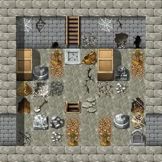

# Laerothtomb 0

| | |
|---|---|
| **Map ID** | `laerothtomb0` |
| **Type** | Indoors / underground |
| **Size** | 10×10 tiles |
| **World map** | [Laeroth caves](index.md) |
| **Introduced** | [v0.8.11](../versions/0.8.11.md) |
| **Enemy types** | 2 |
| **Quests** | 0 |

**Laerothtomb 0** is an indoor map. It has no NPCs and 2 kinds of enemy. Exits lead to Laerothtomb 1, Laerothcave 4.

## Map

<label class="lg"><input type="checkbox" data-t="spawn" checked><b>Red</b>&nbsp;Monsters / NPCs</label><label class="lg"><input type="checkbox" data-t="mapchange" checked><b>Blue</b>&nbsp;Exit to another map</label><label class="lg"><input type="checkbox" data-t="container" checked><b>Yellow</b>&nbsp;Container (click to see contents)</label><label class="lg"><input type="checkbox" data-t="sign" checked><b>Purple</b>&nbsp;Sign</label><label class="lg"><input type="checkbox" data-t="rest" checked><b>Green</b>&nbsp;Resting place</label><label class="lg"><input type="checkbox" data-t="key" checked><b>Orange dashed</b>&nbsp;Blocked until a quest step / item</label><label class="lg"><input type="checkbox" data-t="script"><b>Grey dotted</b>&nbsp;Scripted event</label><label class="lg"><input type="checkbox" data-t="replace"><b>White dotted</b>&nbsp;Changes during a quest</label><label class="lg"><input type="checkbox" data-t="pin" checked><b>Numbers</b>&nbsp;Numbered key points (see the key below the map)</label>

<a class="pin pin-exit" href="#key-1" style="left:45.000%;top:15.000%" title="Exit (north): to [Laerothtomb 1](laerothtomb1.md)">1</a><a class="pin pin-exit" href="#key-2" style="left:45.000%;top:65.000%" title="Exit (stairs / passage): to [Laerothcave 4](laerothcave4.md)">2</a><a class="pin pin-sign" href="#key-3" style="left:85.000%;top:45.000%" title="Sign: “Here lies Breen, a loyal servant.”">3</a><a class="pin pin-sign" href="#key-4" style="left:35.000%;top:45.000%" title="Sign: “Interred here is Snuffy. A loyal dog.”">4</a><a class="pin pin-sign" href="#key-5" style="left:45.000%;top:75.000%" title="Sign: “There is no epitaph on this grave. Strange.”">5</a><a class="pin pin-sign" href="#key-6" style="left:65.000%;top:75.000%" title="Sign: “Here lies Athonnaith.”">6</a>

??? abstract "Key to the numbers on the map"

    | # | What | Details |
    |---|---|---|
    | 1 | Exit (north) | to [Laerothtomb 1](laerothtomb1.md) |
    | 2 | Exit (stairs / passage) | to [Laerothcave 4](laerothcave4.md) |
    | 3 | Sign | “Here lies Breen, a loyal servant.” |
    | 4 | Sign | “Interred here is Snuffy. A loyal dog.” |
    | 5 | Sign | “There is no epitaph on this grave. Strange.” |
    | 6 | Sign | “Here lies Athonnaith.” |

Verified against v0.8.18 map data.

## Connections

| Direction | Leads to | Region there | Map # |
|---|---|---|---|
| North | [Laerothtomb 1](laerothtomb1.md) | Lake Laeroth | 1 |
| Stairs / passage | [Laerothcave 4](laerothcave4.md) | – | 2 |

## Enemies

| Enemy | HP | Damage | Up to | Notes |
|---|---|---|---|---|
| [Cave worm](../monsters/cave_worm.md) | 80 | 1–11 | 6 | shares spawn with Vicious cave worm |
| [Vicious cave worm](../monsters/cave_worm_vicious.md) | 90 | 3–12 | 6 | shares spawn with Cave worm |

<small>“Up to” is the most that can be alive at once from the spawn areas on this map.</small>

## Points of interest

- **Sign** (#3): “Here lies Breen, a loyal servant.”
- **Sign** (#4): “Interred here is Snuffy. A loyal dog.”
- **Sign** (#5): “There is no epitaph on this grave. Strange.”
- **Sign** (#6): “Here lies Athonnaith.”

## Version history

| Version | Change |
|---|---|
| [v0.8.11](../versions/0.8.11.md) | Added |
| [v0.8.12.1](../versions/0.8.12.1.md) | Map layout or objects changed |

Verified against v0.8.18 and every earlier release back to v0.7.0 (game data compared release by release).

## Community notes

<small>Written by players, not generated from game data. **Observations**: what players notice in-game · **Lore**: the in-world story · **Trivia**: real-world facts, references, development history · **Theory / speculation**: unconfirmed ideas; may just be unfinished content</small>

### Observations

*No notes yet. Contributions are welcome: [add a note](https://github.com/asdfghjkl628/Andor-s-Trail-Wikiiii/new/main/notes/maps?filename=laerothtomb0.md&value=%23%23%20Observations%0A%0A%3C%21--%20what%20players%20notice%20in-game%20--%3E%0A%0A%23%23%20Lore%0A%0A%3C%21--%20the%20in-world%20story%20--%3E%0A%0A%23%23%20Trivia%0A%0A%3C%21--%20real-world%20facts%2C%20references%2C%20development%20history%20--%3E%0A%0A%23%23%20Theory%20/%20speculation%0A%0A%3C%21--%20unconfirmed%20ideas%3B%20may%20just%20be%20unfinished%20content%20--%3E%0A).*

### Lore

*No notes yet. Contributions are welcome: [add a note](https://github.com/asdfghjkl628/Andor-s-Trail-Wikiiii/new/main/notes/maps?filename=laerothtomb0.md&value=%23%23%20Observations%0A%0A%3C%21--%20what%20players%20notice%20in-game%20--%3E%0A%0A%23%23%20Lore%0A%0A%3C%21--%20the%20in-world%20story%20--%3E%0A%0A%23%23%20Trivia%0A%0A%3C%21--%20real-world%20facts%2C%20references%2C%20development%20history%20--%3E%0A%0A%23%23%20Theory%20/%20speculation%0A%0A%3C%21--%20unconfirmed%20ideas%3B%20may%20just%20be%20unfinished%20content%20--%3E%0A).*

### Trivia

*No notes yet. Contributions are welcome: [add a note](https://github.com/asdfghjkl628/Andor-s-Trail-Wikiiii/new/main/notes/maps?filename=laerothtomb0.md&value=%23%23%20Observations%0A%0A%3C%21--%20what%20players%20notice%20in-game%20--%3E%0A%0A%23%23%20Lore%0A%0A%3C%21--%20the%20in-world%20story%20--%3E%0A%0A%23%23%20Trivia%0A%0A%3C%21--%20real-world%20facts%2C%20references%2C%20development%20history%20--%3E%0A%0A%23%23%20Theory%20/%20speculation%0A%0A%3C%21--%20unconfirmed%20ideas%3B%20may%20just%20be%20unfinished%20content%20--%3E%0A).*

### Theory / speculation

*No notes yet. Contributions are welcome: [add a note](https://github.com/asdfghjkl628/Andor-s-Trail-Wikiiii/new/main/notes/maps?filename=laerothtomb0.md&value=%23%23%20Observations%0A%0A%3C%21--%20what%20players%20notice%20in-game%20--%3E%0A%0A%23%23%20Lore%0A%0A%3C%21--%20the%20in-world%20story%20--%3E%0A%0A%23%23%20Trivia%0A%0A%3C%21--%20real-world%20facts%2C%20references%2C%20development%20history%20--%3E%0A%0A%23%23%20Theory%20/%20speculation%0A%0A%3C%21--%20unconfirmed%20ideas%3B%20may%20just%20be%20unfinished%20content%20--%3E%0A).*

??? info "Technical information"

    | | |
    |---|---|
    | Map ID | `laerothtomb0` |
    | File | `res/xml/laerothtomb0.tmx` |
    | Size | 10×10 tiles (320×320 px) |
    | outdoors property | – |
    | Layers drawn | ground, objects, above |
    | Tilesets | map_bed_1, map_border_1, map_bridge_1, map_broken_1, map_cavewall_1, map_cavewall_2, map_cavewall_3, map_chair_table_1, map_crate_1, map_cupboard_1, map_curtain_1, map_entrance_1, map_fence_1, map_fence_2, map_ground_1, map_ground_2, map_ground_3, map_ground_4, map_ground_5, map_ground_6, map_ground_7, map_ground_8, map_indoor_1, map_kitchen_1, map_outdoor_1, map_pillar_1, map_plant_1, map_rock_1, map_roof_1, map_roof_2, map_shop_1, map_sign_ladder_1, map_table_1, map_trail_1, map_tree_1, map_wall_1, map_wall_2, map_wall_3, map_window_1, map_window_2 |
    | Map objects | sign: 4, spawn: 3, mapchange: 2 |
    | World map position | segment `laeroth_caves`, x 268, y 160 |

<small>Data from v0.8.18</small>
