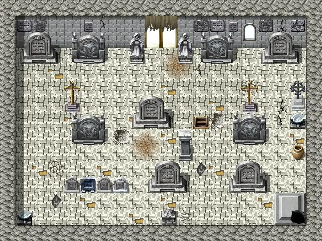

# Laerothtomb1

20×15 tiles · part of [Laeroth caves](index.md)

<label class="lg lg-spawn"><input type="checkbox" data-t="spawn" checked> Monsters / NPCs</label><label class="lg lg-mapchange"><input type="checkbox" data-t="mapchange" checked> Exit to another map</label><label class="lg lg-container"><input type="checkbox" data-t="container" checked> Container</label><label class="lg lg-sign"><input type="checkbox" data-t="sign" checked> Sign</label><label class="lg lg-rest"><input type="checkbox" data-t="rest" checked> Resting place</label><label class="lg lg-key"><input type="checkbox" data-t="key" checked> Blocked / needs key or quest</label><label class="lg lg-script"><input type="checkbox" data-t="script"> Scripted event</label><label class="lg lg-replace"><input type="checkbox" data-t="replace"> Changes after a quest</label>

## Exits

- [Laerothisland0](laerothisland0.md)
- [Laerothtomb0](laerothtomb0.md)

## Monsters & NPCs here

| Name | HP |
|---|---|
| [Jerelin](../monsters/jerelin.md) | 0 |
| [Jerelin](../monsters/jerelin_b.md) | 0 |
| [Eyvipa](../monsters/eyvipa.md) | 0 |
| [Verigil](../monsters/verigil.md) | 0 |
| [Cuned](../monsters/cuned.md) | 0 |
| [Audela](../monsters/audela.md) | 0 |
| [Giant centipede](../monsters/centipede.md) | 90 |
| [Aggressive giant centipede](../monsters/centipede_aggressive.md) | 100 |

<small>Map ID: `laerothtomb1` · Data from v0.8.18</small>
