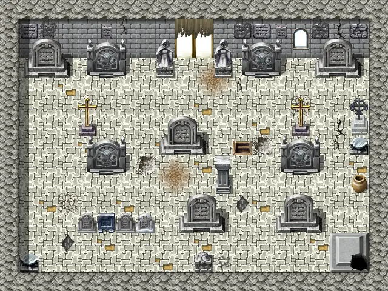

# Laerothtomb1

| | |
|---|---|
| **Map ID** | `laerothtomb1` |
| **Region** | In Lake Laeroth (other) |
| **Type** | Indoors / underground |
| **Size** | 20×15 tiles |
| **World map** | [Laeroth caves](index.md) |
| **Introduced** | [v0.8.11](../versions/0.8.11.md) |
| **NPCs** | 5 |
| **Enemy types** | 3 |
| **Quests** | 1 |

**Laerothtomb1** is an indoor map, in Lake Laeroth (other). It has 5 NPCs and 3 kinds of enemy. Exits lead to Laerothisland0, Laerothtomb0.

## Map

<label class="lg"><input type="checkbox" data-t="spawn" checked><b>Red</b>&nbsp;Monsters / NPCs</label><label class="lg"><input type="checkbox" data-t="mapchange" checked><b>Blue</b>&nbsp;Exit to another map</label><label class="lg"><input type="checkbox" data-t="container" checked><b>Yellow</b>&nbsp;Container (click to see contents)</label><label class="lg"><input type="checkbox" data-t="sign" checked><b>Purple</b>&nbsp;Sign</label><label class="lg"><input type="checkbox" data-t="rest" checked><b>Green</b>&nbsp;Resting place</label><label class="lg"><input type="checkbox" data-t="key" checked><b>Orange dashed</b>&nbsp;Blocked until a quest step / item</label><label class="lg"><input type="checkbox" data-t="script"><b>Grey dotted</b>&nbsp;Scripted event</label><label class="lg"><input type="checkbox" data-t="replace"><b>White dotted</b>&nbsp;Changes during a quest</label><label class="lg"><input type="checkbox" data-t="pin" checked><b>Numbers</b>&nbsp;Numbered key points (see the key below the map)</label>

<a class="pin pin-exit" href="#key-1" style="left:50.000%;top:16.667%" title="Exit (exit outside): to [Laerothisland0](laerothisland0.md)">1</a><a class="pin pin-exit" href="#key-2" style="left:62.500%;top:50.000%" title="Exit (stairs / passage): to [Laerothtomb0](laerothtomb0.md)">2</a><a id="pin-npc-audela" class="pin pin-npc" href="#key-3" style="left:12.500%;top:30.000%" title="[Audela](../../monsters/audela.md): 1 quest">3</a><a id="pin-npc-cuned" class="pin pin-npc" href="#key-4" style="left:87.500%;top:30.000%" title="[Cuned](../../monsters/cuned.md): 1 quest">4</a><a id="pin-npc-jerelin" class="pin pin-npc" href="#key-5" style="left:27.500%;top:30.000%" title="[Jerelin](../../monsters/jerelin.md): 1 quest">5</a><a id="pin-npc-jerelin_b" class="pin pin-npc" href="#key-6" style="left:32.500%;top:30.000%" title="[Jerelin](../../monsters/jerelin.md#v-jerelin_b): 1 quest">6</a><a id="pin-npc-verigil" class="pin pin-npc" href="#key-7" style="left:62.500%;top:30.000%" title="[Verigil](../../monsters/verigil.md): 1 quest">7</a><a class="pin pin-script" href="#key-8" style="left:67.500%;top:30.000%" title="Quest trigger: Scripted event: advances the quest: Take care of the caretaker to stage 40 (“Verigil told me he could not release the Caretaker from his oath, because he is from the wrong branch of the family. I must talk to his uncle, Eyvipa. He has gone back to his rest.”) (+1 more quest(s))">8</a><a class="pin pin-sign" href="#key-9" style="left:37.500%;top:83.333%" title="Sign: “Here lies Gormelyn, caretaker of Laeroth.”">9</a><a class="pin pin-sign" href="#key-10" style="left:32.500%;top:83.333%" title="Sign: “Here lies Leofric, caretaker of Laeroth, son of Gormelyn.”">10</a><a class="pin pin-sign" href="#key-11" style="left:27.500%;top:83.333%" title="Sign: “Here lies Gauron, caretaker of Laeroth, son of Leofric.”">11</a><a class="pin pin-sign" href="#key-12" style="left:22.500%;top:83.333%" title="Sign: “Here lies Farpith, caretaker of Laeroth, son of Gauron.”">12</a><a class="pin pin-script" href="#key-13" style="left:87.829%;top:25.001%" title="Quest trigger: Scripted event: advances the quest: Take care of the caretaker to stage 120 (“Cuned told me to speak to his mother, Audela. Jerelin didn&#x27;t listen to many people, but he listened to her.”) (+1 more quest(s))">13</a><a class="pin pin-script" href="#key-14" style="left:12.829%;top:25.001%" title="Quest trigger: Scripted event: advances the quest: Take care of the caretaker to stage 160 (“Audela told me to talk to Jerelin again, but tell him Audela wants this done.”) (+1 more quest(s))">14</a><a class="pin pin-script" href="#key-15" style="left:27.829%;top:25.001%" title="Quest trigger: Scripted event: advances the quest: Take care of the caretaker to stage 170 (“I spoke to Jerelin again, and told him of Audela&#x27;s wishes. He told me he will release the caretaker, but with a condition. The caretakers last act must be to move his grave away from that of his nagging wife.”) (+1 more quest(s))">15</a><a class="pin pin-script" href="#key-16" style="left:47.500%;top:56.667%" title="Quest trigger: Scripted event: advances the quest: Take care of the caretaker to stage 70 (“Eyvipa was angry that I woke him from his rest. He refused to help me because his father passed him over, and made his younger brother, Cuned, lord. I had to send him back to his rest with the chant &quot;estray inyay eacepay&quot;.”) (+1 more quest(s))">16</a><a class="pin pin-sign" href="#key-17" style="left:27.500%;top:63.333%" title="Sign: “Here lies Jenoel, a great friend of the Laeroth family.”">17</a><a class="pin pin-replace" href="#key-18" style="left:27.500%;top:20.000%" title="Changes during a quest: This area changes during the quest: Take care of the caretaker (stage 180: “I told the caretaker what he has to do to be released from the oath. He thanked me, and agreed to do it.”)">18</a><a class="pin pin-replace" href="#key-18" style="left:12.500%;top:66.667%" title="Changes during a quest: This area changes during the quest: Take care of the caretaker (stage 180: “I told the caretaker what he has to do to be released from the oath. He thanked me, and agreed to do it.”)">18</a>

??? abstract "Key to the numbers on the map"

    | # | What | Details |
    |---|---|---|
    | 1 | Exit (exit outside) | to [Laerothisland0](laerothisland0.md) |
    | 2 | Exit (stairs / passage) | to [Laerothtomb0](laerothtomb0.md) |
    | 3 | [Audela](../monsters/audela.md) | 1 quest |
    | 4 | [Cuned](../monsters/cuned.md) | 1 quest |
    | 5 | [Jerelin](../monsters/jerelin.md) | 1 quest |
    | 6 | [Jerelin](../monsters/jerelin.md#v-jerelin_b) | 1 quest |
    | 7 | [Verigil](../monsters/verigil.md) | 1 quest |
    | 8 | Quest trigger | Scripted event: advances the quest: Take care of the caretaker to stage 40 (“Verigil told me he could not release the Caretaker from his oath, because he is from the wrong branch of the family. I must talk to his uncle, Eyvipa. He has gone back to his rest.”) (+1 more quest(s)) |
    | 9 | Sign | “Here lies Gormelyn, caretaker of Laeroth.” |
    | 10 | Sign | “Here lies Leofric, caretaker of Laeroth, son of Gormelyn.” |
    | 11 | Sign | “Here lies Gauron, caretaker of Laeroth, son of Leofric.” |
    | 12 | Sign | “Here lies Farpith, caretaker of Laeroth, son of Gauron.” |
    | 13 | Quest trigger | Scripted event: advances the quest: Take care of the caretaker to stage 120 (“Cuned told me to speak to his mother, Audela. Jerelin didn't listen to many people, but he listened to her.”) (+1 more quest(s)) |
    | 14 | Quest trigger | Scripted event: advances the quest: Take care of the caretaker to stage 160 (“Audela told me to talk to Jerelin again, but tell him Audela wants this done.”) (+1 more quest(s)) |
    | 15 | Quest trigger | Scripted event: advances the quest: Take care of the caretaker to stage 170 (“I spoke to Jerelin again, and told him of Audela's wishes. He told me he will release the caretaker, but with a condition. The caretakers last act must be to move his grave away from that of his nagging wife.”) (+1 more quest(s)) |
    | 16 | Quest trigger | Scripted event: advances the quest: Take care of the caretaker to stage 70 (“Eyvipa was angry that I woke him from his rest. He refused to help me because his father passed him over, and made his younger brother, Cuned, lord. I had to send him back to his rest with the chant "estray inyay eacepay".”) (+1 more quest(s)) |
    | 17 | Sign | “Here lies Jenoel, a great friend of the Laeroth family.” |
    | 18 | Changes during a quest | This area changes during the quest: Take care of the caretaker (stage 180: “I told the caretaker what he has to do to be released from the oath. He thanked me, and agreed to do it.”) |

Verified against v0.8.18 map data.

## Connections

| Direction | Leads to | Region there | Map # |
|---|---|---|---|
| Exit outside | [Laerothisland0](laerothisland0.md) | Lake Laeroth | 1 |
| Stairs / passage | [Laerothtomb0](laerothtomb0.md) | – | 2 |

## NPCs

- [Audela](../monsters/audela.md) — quests: [Take care of the caretaker](../quests/laeroth_caretaker.md) (#3)
- [Cuned](../monsters/cuned.md) — quests: [Take care of the caretaker](../quests/laeroth_caretaker.md) (#4)
- [Jerelin](../monsters/jerelin.md) — quests: [Take care of the caretaker](../quests/laeroth_caretaker.md) (#5)
- [Jerelin](../monsters/jerelin.md#v-jerelin_b) — quests: [Take care of the caretaker](../quests/laeroth_caretaker.md) (#6)
- [Verigil](../monsters/verigil.md) — quests: [Take care of the caretaker](../quests/laeroth_caretaker.md) (#7)

## Enemies

| Enemy | HP | Damage | Up to | Notes |
|---|---|---|---|---|
| [Eyvipa](../monsters/eyvipa.md) | 0 | 0–0 | 1 | appears later, during a quest |
| [Giant centipede](../monsters/centipede.md) | 90 | 3–9 | 6 | shares spawn with Aggressive giant centipede |
| [Aggressive giant centipede](../monsters/centipede_aggressive.md) | 100 | 5–11 | 6 | shares spawn with Giant centipede |

<small>“Up to” is the most that can be alive at once from the spawn areas on this map.</small>

## Quests

- [Take care of the caretaker](../quests/laeroth_caretaker.md): [Audela](../monsters/audela.md) is involved; [Cuned](../monsters/cuned.md) is involved; [Jerelin](../monsters/jerelin.md) is involved; [Jerelin](../monsters/jerelin.md#v-jerelin_b) is involved; [Verigil](../monsters/verigil.md) is involved; part of the map changes at stage 180; something on this map advances it; stepping on a trigger here sets stage 110; stepping on a trigger here sets stage 120; stepping on a trigger here sets stage 160; stepping on a trigger here sets stage 170; stepping on a trigger here sets stage 40; stepping on a trigger here sets stage 70; stepping on a trigger here sets stage 90
- [laeroth_nondisplay (hidden flag)](../quests/laeroth_nondisplay.md): a scripted event can trigger here from stage 120; something on this map advances it; stepping on a trigger here sets stage 10; stepping on a trigger here sets stage 12; stepping on a trigger here sets stage 13; stepping on a trigger here sets stage 14; stepping on a trigger here sets stage 4; stepping on a trigger here sets stage 6; stepping on a trigger here sets stage 8

## Points of interest

- **Quest trigger** (#8): Scripted event: advances the quest: Take care of the caretaker to stage 40 (“Verigil told me he could not release the Caretaker from his oath, because he is from the wrong branch of the family. I must talk to his uncle, Eyvipa. He has gone back to his rest.”) (+1 more quest(s))
- **Sign** (#9): “Here lies Gormelyn, caretaker of Laeroth.”
- **Sign** (#10): “Here lies Leofric, caretaker of Laeroth, son of Gormelyn.”
- **Sign** (#11): “Here lies Gauron, caretaker of Laeroth, son of Leofric.”
- **Sign** (#12): “Here lies Farpith, caretaker of Laeroth, son of Gauron.”
- **Quest trigger** (#13): Scripted event: advances the quest: Take care of the caretaker to stage 120 (“Cuned told me to speak to his mother, Audela. Jerelin didn't listen to many people, but he listened to her.”) (+1 more quest(s))
- **Quest trigger** (#14): Scripted event: advances the quest: Take care of the caretaker to stage 160 (“Audela told me to talk to Jerelin again, but tell him Audela wants this done.”) (+1 more quest(s))
- **Quest trigger** (#15): Scripted event: advances the quest: Take care of the caretaker to stage 170 (“I spoke to Jerelin again, and told him of Audela's wishes. He told me he will release the caretaker, but with a condition. The caretakers last act must be to move his grave away from that of his nagging wife.”) (+1 more quest(s))
- **Quest trigger** (#16): Scripted event: advances the quest: Take care of the caretaker to stage 70 (“Eyvipa was angry that I woke him from his rest. He refused to help me because his father passed him over, and made his younger brother, Cuned, lord. I had to send him back to his rest with the chant "estray inyay eacepay".”) (+1 more quest(s))
- **Sign** (#17): “Here lies Jenoel, a great friend of the Laeroth family.”
- **Changes during a quest** (#18): This area changes during the quest: Take care of the caretaker (stage 180: “I told the caretaker what he has to do to be released from the oath. He thanked me, and agreed to do it.”)

## Version history

| Version | Change |
|---|---|
| [v0.8.11](../versions/0.8.11.md) | Added |

Verified against v0.8.18 and every earlier release back to v0.7.0 (game data compared release by release).

## Community notes

<small>Written by players, not generated from game data. **Observations**: what players notice in-game · **Lore**: the in-world story · **Trivia**: real-world facts, references, development history · **Theory / speculation**: unconfirmed ideas; may just be unfinished content</small>

### Observations

*No notes yet. Contributions are welcome: [add a note](https://github.com/asdfghjkl628/Andor-s-Trail-Wikiiii/new/main/notes/maps?filename=laerothtomb1.md&value=%23%23%20Observations%0A%0A%3C%21--%20what%20players%20notice%20in-game%20--%3E%0A%0A%23%23%20Lore%0A%0A%3C%21--%20the%20in-world%20story%20--%3E%0A%0A%23%23%20Trivia%0A%0A%3C%21--%20real-world%20facts%2C%20references%2C%20development%20history%20--%3E%0A%0A%23%23%20Theory%20/%20speculation%0A%0A%3C%21--%20unconfirmed%20ideas%3B%20may%20just%20be%20unfinished%20content%20--%3E%0A).*

### Lore

*No notes yet. Contributions are welcome: [add a note](https://github.com/asdfghjkl628/Andor-s-Trail-Wikiiii/new/main/notes/maps?filename=laerothtomb1.md&value=%23%23%20Observations%0A%0A%3C%21--%20what%20players%20notice%20in-game%20--%3E%0A%0A%23%23%20Lore%0A%0A%3C%21--%20the%20in-world%20story%20--%3E%0A%0A%23%23%20Trivia%0A%0A%3C%21--%20real-world%20facts%2C%20references%2C%20development%20history%20--%3E%0A%0A%23%23%20Theory%20/%20speculation%0A%0A%3C%21--%20unconfirmed%20ideas%3B%20may%20just%20be%20unfinished%20content%20--%3E%0A).*

### Trivia

*No notes yet. Contributions are welcome: [add a note](https://github.com/asdfghjkl628/Andor-s-Trail-Wikiiii/new/main/notes/maps?filename=laerothtomb1.md&value=%23%23%20Observations%0A%0A%3C%21--%20what%20players%20notice%20in-game%20--%3E%0A%0A%23%23%20Lore%0A%0A%3C%21--%20the%20in-world%20story%20--%3E%0A%0A%23%23%20Trivia%0A%0A%3C%21--%20real-world%20facts%2C%20references%2C%20development%20history%20--%3E%0A%0A%23%23%20Theory%20/%20speculation%0A%0A%3C%21--%20unconfirmed%20ideas%3B%20may%20just%20be%20unfinished%20content%20--%3E%0A).*

### Theory / speculation

*No notes yet. Contributions are welcome: [add a note](https://github.com/asdfghjkl628/Andor-s-Trail-Wikiiii/new/main/notes/maps?filename=laerothtomb1.md&value=%23%23%20Observations%0A%0A%3C%21--%20what%20players%20notice%20in-game%20--%3E%0A%0A%23%23%20Lore%0A%0A%3C%21--%20the%20in-world%20story%20--%3E%0A%0A%23%23%20Trivia%0A%0A%3C%21--%20real-world%20facts%2C%20references%2C%20development%20history%20--%3E%0A%0A%23%23%20Theory%20/%20speculation%0A%0A%3C%21--%20unconfirmed%20ideas%3B%20may%20just%20be%20unfinished%20content%20--%3E%0A).*

??? info "Technical information"

    | | |
    |---|---|
    | Map ID | `laerothtomb1` |
    | File | `res/xml/laerothtomb1.tmx` |
    | Size | 20×15 tiles (640×480 px) |
    | outdoors property | – |
    | Layers drawn | ground, objects, above, top |
    | Tilesets | map_bed_1, map_border_1, map_bridge_1, map_broken_1, map_cavewall_1, map_cavewall_2, map_cavewall_3, map_chair_table_1, map_crate_1, map_cupboard_1, map_curtain_1, map_entrance_1, map_fence_1, map_fence_2, map_ground_1, map_ground_2, map_ground_3, map_ground_4, map_ground_5, map_ground_6, map_ground_7, map_ground_8, map_indoor_1, map_kitchen_1, map_outdoor_1, map_pillar_1, map_plant_1, map_rock_1, map_roof_1, map_roof_2, map_shop_1, map_sign_ladder_1, map_table_1, map_trail_1, map_tree_1, map_wall_1, map_wall_2, map_wall_3, map_window_1, map_window_2 |
    | Map objects | script: 9, spawn: 9, sign: 5, mapchange: 2, replace: 2 |
    | World map position | segment `laeroth_caves`, x 260, y 144 |

<small>Data from v0.8.18</small>
