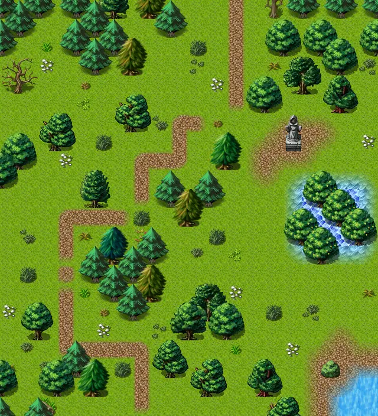

# Lake shore road 0

| | |
|---|---|
| **Map ID** | `lake_shore_road_0` |
| **Region** | Near Flagstone Prison (other) |
| **Type** | Outdoors |
| **Size** | 20×22 tiles |
| **World map** | [World 1](index.md) |
| **Introduced** | [v0.8.8](../versions/0.8.8.md) |
| **NPCs** | 1 |
| **Enemy types** | 3 |
| **Quests** | 0 |

**Lake shore road 0** is an outdoor map, near Flagstone Prison (other). It has 1 NPC and 3 kinds of enemy. Exits lead to Wild 7, Lake shore road 1, Lake shore road 2, Flagstone filler east 1 and 1 more.

## Map

<label class="lg"><input type="checkbox" data-t="spawn" checked><b>Red</b>&nbsp;Monsters / NPCs</label><label class="lg"><input type="checkbox" data-t="mapchange" checked><b>Blue</b>&nbsp;Exit to another map</label><label class="lg"><input type="checkbox" data-t="container" checked><b>Yellow</b>&nbsp;Container (click to see contents)</label><label class="lg"><input type="checkbox" data-t="sign" checked><b>Purple</b>&nbsp;Sign</label><label class="lg"><input type="checkbox" data-t="rest" checked><b>Green</b>&nbsp;Resting place</label><label class="lg"><input type="checkbox" data-t="key" checked><b>Orange dashed</b>&nbsp;Blocked until a quest step / item</label><label class="lg"><input type="checkbox" data-t="script"><b>Grey dotted</b>&nbsp;Scripted event</label><label class="lg"><input type="checkbox" data-t="replace"><b>White dotted</b>&nbsp;Changes during a quest</label><label class="lg"><input type="checkbox" data-t="pin" checked><b>Numbers</b>&nbsp;Numbered key points (see the key below the map)</label>

<a class="pin pin-exit" href="#key-1" style="left:60.000%;top:2.273%" title="Exit (north): to [Wild 7](wild7.md)">1</a><a class="pin pin-exit" href="#key-2" style="left:97.500%;top:47.727%" title="Exit (east): to [Lake shore road 1](lake_shore_road_1.md)">2</a><a class="pin pin-exit" href="#key-3" style="left:50.000%;top:97.727%" title="Exit (south): to [Lake shore road 2](lake_shore_road_2.md)">3</a><a class="pin pin-exit" href="#key-4" style="left:2.500%;top:59.091%" title="Exit (west): to [Flagstone filler east 1](flagstone_filler_east_1.md)">4</a><a class="pin pin-exit" href="#key-5" style="left:87.500%;top:65.909%" title="Exit (path): to [Lake shore road 0](lake_shore_road_0.md)">5</a><a class="pin pin-exit" href="#key-5" style="left:82.500%;top:79.545%" title="Exit (path): to [Lake shore road 0](lake_shore_road_0.md)">5</a><a class="pin pin-exit" href="#key-5" style="left:72.500%;top:70.455%" title="Exit (path): to [Lake shore road 0](lake_shore_road_0.md)">5</a><a id="pin-npc-witch_playing_kid" class="pin pin-npc" href="#key-6" style="left:87.500%;top:75.000%" title="[Playing kid](../../monsters/witch_playing_kid.md): NPC">6</a><a class="pin pin-replace" href="#key-7" style="left:80.000%;top:72.727%" title="Changes during a quest: This area changes during the quest: hidden story flag “sutdover_hidden” (stage 1: “PC has completed enough of &#x27;A Wicked witch&#x27; to enable mountain teleportation crystals.”)">7</a>

??? abstract "Key to the numbers on the map"

    | # | What | Details |
    |---|---|---|
    | 1 | Exit (north) | to [Wild 7](wild7.md) |
    | 2 | Exit (east) | to [Lake shore road 1](lake_shore_road_1.md) |
    | 3 | Exit (south) | to [Lake shore road 2](lake_shore_road_2.md) |
    | 4 | Exit (west) | to [Flagstone filler east 1](flagstone_filler_east_1.md) |
    | 5 | Exit (path) | to [Lake shore road 0](lake_shore_road_0.md) |
    | 6 | [Playing kid](../monsters/witch_playing_kid.md) | NPC |
    | 7 | Changes during a quest | This area changes during the quest: hidden story flag “sutdover_hidden” (stage 1: “PC has completed enough of 'A Wicked witch' to enable mountain teleportation crystals.”) |

Verified against v0.8.18 map data.

## Connections

| Direction | Leads to | Region there | Map # |
|---|---|---|---|
| North | [Wild 7](wild7.md) | Blackwater Mountain | 1 |
| East | [Lake shore road 1](lake_shore_road_1.md) | Flagstone Prison | 2 |
| South | [Lake shore road 2](lake_shore_road_2.md) | Flagstone Prison | 3 |
| West | [Flagstone filler east 1](flagstone_filler_east_1.md) | Flagstone Prison | 4 |
| Path | [Lake shore road 0](lake_shore_road_0.md) | Flagstone Prison | 5 |

## NPCs

- [Playing kid](../monsters/witch_playing_kid.md) (#6)

## Enemies

| Enemy | HP | Damage | Up to | Notes |
|---|---|---|---|---|
| [Forest serpent](../monsters/forest_serpent.md) | 20 | 2–3 | 5 | – |
| [Wolf](../monsters/wolf.md) | 30 | 3–6 | 3 | – |
| [Lizard](../monsters/stn_lizard.md) | 50 | 4–7 | 2 | – |

<small>“Up to” is the most that can be alive at once from the spawn areas on this map.</small>

## Quests

- [Sutdover story flags (hidden flag)](../quests/sutdover_hidden.md): part of the map changes at stage 1

## Points of interest

- **Changes during a quest** (#7): This area changes during the quest: hidden story flag “sutdover_hidden” (stage 1: “PC has completed enough of 'A Wicked witch' to enable mountain teleportation crystals.”)

## Version history

| Version | Change |
|---|---|
| [v0.8.8](../versions/0.8.8.md) | Added |
| [v0.8.9](../versions/0.8.9.md) | Map layout or objects changed |
| [v0.8.12.1](../versions/0.8.12.1.md) | Map layout or objects changed |

Verified against v0.8.18 and every earlier release back to v0.7.0 (game data compared release by release).

## Community notes

<small>Written by players, not generated from game data. **Observations**: what players notice in-game · **Lore**: the in-world story · **Trivia**: real-world facts, references, development history · **Theory / speculation**: unconfirmed ideas; may just be unfinished content</small>

### Observations

*No notes yet. Contributions are welcome: [add a note](https://github.com/asdfghjkl628/Andor-s-Trail-Wikiiii/new/main/notes/maps?filename=lake_shore_road_0.md&value=%23%23%20Observations%0A%0A%3C%21--%20what%20players%20notice%20in-game%20--%3E%0A%0A%23%23%20Lore%0A%0A%3C%21--%20the%20in-world%20story%20--%3E%0A%0A%23%23%20Trivia%0A%0A%3C%21--%20real-world%20facts%2C%20references%2C%20development%20history%20--%3E%0A%0A%23%23%20Theory%20/%20speculation%0A%0A%3C%21--%20unconfirmed%20ideas%3B%20may%20just%20be%20unfinished%20content%20--%3E%0A).*

### Lore

*No notes yet. Contributions are welcome: [add a note](https://github.com/asdfghjkl628/Andor-s-Trail-Wikiiii/new/main/notes/maps?filename=lake_shore_road_0.md&value=%23%23%20Observations%0A%0A%3C%21--%20what%20players%20notice%20in-game%20--%3E%0A%0A%23%23%20Lore%0A%0A%3C%21--%20the%20in-world%20story%20--%3E%0A%0A%23%23%20Trivia%0A%0A%3C%21--%20real-world%20facts%2C%20references%2C%20development%20history%20--%3E%0A%0A%23%23%20Theory%20/%20speculation%0A%0A%3C%21--%20unconfirmed%20ideas%3B%20may%20just%20be%20unfinished%20content%20--%3E%0A).*

### Trivia

*No notes yet. Contributions are welcome: [add a note](https://github.com/asdfghjkl628/Andor-s-Trail-Wikiiii/new/main/notes/maps?filename=lake_shore_road_0.md&value=%23%23%20Observations%0A%0A%3C%21--%20what%20players%20notice%20in-game%20--%3E%0A%0A%23%23%20Lore%0A%0A%3C%21--%20the%20in-world%20story%20--%3E%0A%0A%23%23%20Trivia%0A%0A%3C%21--%20real-world%20facts%2C%20references%2C%20development%20history%20--%3E%0A%0A%23%23%20Theory%20/%20speculation%0A%0A%3C%21--%20unconfirmed%20ideas%3B%20may%20just%20be%20unfinished%20content%20--%3E%0A).*

### Theory / speculation

*No notes yet. Contributions are welcome: [add a note](https://github.com/asdfghjkl628/Andor-s-Trail-Wikiiii/new/main/notes/maps?filename=lake_shore_road_0.md&value=%23%23%20Observations%0A%0A%3C%21--%20what%20players%20notice%20in-game%20--%3E%0A%0A%23%23%20Lore%0A%0A%3C%21--%20the%20in-world%20story%20--%3E%0A%0A%23%23%20Trivia%0A%0A%3C%21--%20real-world%20facts%2C%20references%2C%20development%20history%20--%3E%0A%0A%23%23%20Theory%20/%20speculation%0A%0A%3C%21--%20unconfirmed%20ideas%3B%20may%20just%20be%20unfinished%20content%20--%3E%0A).*

??? info "Technical information"

    | | |
    |---|---|
    | Map ID | `lake_shore_road_0` |
    | File | `res/xml/lake_shore_road_0.tmx` |
    | Size | 20×22 tiles (640×704 px) |
    | outdoors property | 1 |
    | Layers drawn | base, ground, objects, above, top |
    | Tilesets | map_bed_1, map_border_1, map_bridge_1, map_bridge_2, map_broken_1, map_cavewall_1, map_cavewall_2, map_cavewall_3, map_cavewall_4, map_chair_table_1, map_chair_table_2, map_crate_1, map_cupboard_1, map_curtain_1, map_entrance_1, map_entrance_2, map_fence_1, map_fence_2, map_fence_3, map_fence_4, map_ground_1, map_ground_2, map_ground_3, map_ground_4, map_ground_5, map_ground_6, map_ground_7, map_ground_8, map_house_1, map_house_2, map_indoor_1, map_indoor_2, map_kitchen_1, map_outdoor_1, map_pillar_1, map_pillar_2, map_plant_1, map_plant_2, map_rock_1, map_rock_2, map_roof_1, map_roof_2, map_roof_3, map_shop_1, map_sign_ladder_1, map_table_1, map_trail_1, map_transition_1, map_transition_2, map_transition_3, map_transition_4, map_transition_5, map_tree_1, map_tree_2, map_tree_3, map_wall_1, map_wall_2, map_wall_3, map_wall_4, map_window_1, map_window_2 |
    | Map objects | mapchange: 7, spawn: 6, replace: 3, script: 1 |
    | World map position | segment `world1`, x 147, y 480 |

<small>Data from v0.8.18</small>
