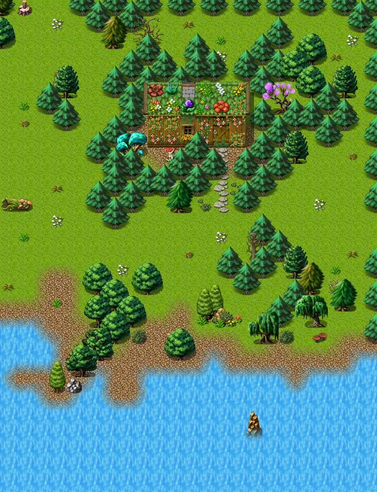
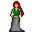
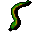

# Lake shore road 1

| | |
|---|---|
| **Map ID** | `lake_shore_road_1` |
| **Region** | Near Flagstone Prison (other) |
| **Type** | Outdoors |
| **Size** | 23×30 tiles |
| **World map** | [World1](index.md) |
| **Introduced** | [v0.8.8](../versions/0.8.8.md) |
| **NPCs** | 1 |
| **Enemy types** | 4 |
| **Quests** | 1 |

**Lake shore road 1** is an outdoor map, near Flagstone Prison (other). It has 1 NPC and 4 kinds of enemy. Exits lead to Mywild18, Mywildcave, Lake shore road 0, Witch house.

## Map

<label class="lg"><input type="checkbox" data-t="spawn" checked><b>Red</b>&nbsp;Monsters / NPCs</label><label class="lg"><input type="checkbox" data-t="mapchange" checked><b>Blue</b>&nbsp;Exit to another map</label><label class="lg"><input type="checkbox" data-t="container" checked><b>Yellow</b>&nbsp;Container (click to see contents)</label><label class="lg"><input type="checkbox" data-t="sign" checked><b>Purple</b>&nbsp;Sign</label><label class="lg"><input type="checkbox" data-t="rest" checked><b>Green</b>&nbsp;Resting place</label><label class="lg"><input type="checkbox" data-t="key" checked><b>Orange dashed</b>&nbsp;Blocked until a quest step / item</label><label class="lg"><input type="checkbox" data-t="script"><b>Grey dotted</b>&nbsp;Scripted event</label><label class="lg"><input type="checkbox" data-t="replace"><b>White dotted</b>&nbsp;Changes during a quest</label><label class="lg"><input type="checkbox" data-t="pin" checked><b>Numbers</b>&nbsp;Numbered key points (see the key below the map)</label>

<a class="pin pin-exit" href="#key-1" style="left:13.043%;top:1.667%" title="Exit (north): to [Mywild18](mywild18.md)">1</a><a class="pin pin-exit" href="#key-2" style="left:97.826%;top:46.667%" title="Exit (east): to [Mywildcave](mywildcave.md)">2</a><a class="pin pin-exit" href="#key-3" style="left:2.174%;top:35.000%" title="Exit (west): to [Lake shore road 0](lake_shore_road_0.md)">3</a><a class="pin pin-exit" href="#key-4" style="left:58.696%;top:28.333%" title="Exit (door): to [Witch house](witch_house.md)">4</a><a id="pin-npc-captive_girl" class="pin pin-npc" href="#key-5" style="left:45.652%;top:8.333%" title="[Emmeline](../../monsters/captive_girl.md): 1 quest">5</a><a class="pin pin-replace" href="#key-6" style="left:56.522%;top:33.333%" title="Changes during a quest: This area changes during the quest: A Wicked witch (stage 40: “The &quot;busy farmer&quot; told me that the witch&#x27;s house is just south of Fallhaven. Covered in beautiful flowers.”)">6</a>

??? abstract "Key to the numbers on the map"

    | # | What | Details |
    |---|---|---|
    | 1 | Exit (north) | to [Mywild18](mywild18.md) |
    | 2 | Exit (east) | to [Mywildcave](mywildcave.md) |
    | 3 | Exit (west) | to [Lake shore road 0](lake_shore_road_0.md) |
    | 4 | Exit (door) | to [Witch house](witch_house.md) |
    | 5 | [Emmeline](../monsters/captive_girl.md) | 1 quest |
    | 6 | Changes during a quest | This area changes during the quest: A Wicked witch (stage 40: “The "busy farmer" told me that the witch's house is just south of Fallhaven. Covered in beautiful flowers.”) |

Verified against v0.8.18 map data.

## Connections

| Direction | Leads to | Region there | Map # |
|---|---|---|---|
| North | [Mywild18](mywild18.md) | Blackwater Mountain | 1 |
| East | [Mywildcave](mywildcave.md) | – | 2 |
| West | [Lake shore road 0](lake_shore_road_0.md) | Flagstone Prison | 3 |
| Door | [Witch house](witch_house.md) | – | 4 |

## NPCs

- [Emmeline](../monsters/captive_girl.md) — quests: [A Wicked witch](../quests/wicked_witch.md) (#5)

## Enemies

| Enemy | HP | Damage | Up to | Notes |
|---|---|---|---|---|
| [Blue fish](../monsters/fish_school.md) | 0 | 0–0 | 3 | – |
| [Small stone worm](../monsters/small_stone_worm.md) | 17 | 2–4 | 2 | – |
| [Forest serpent](../monsters/forest_serpent.md) | 20 | 2–3 | 3 | – |
| [Wolf](../monsters/wolf.md) | 30 | 3–6 | 6 | – |

<small>“Up to” is the most that can be alive at once from the spawn areas on this map.</small>

## Quests

- [A Wicked witch](../quests/wicked_witch.md): [Emmeline](../monsters/captive_girl.md) is involved; part of the map changes at stage 40
- [Sutdove_nondisplay (hidden flag)](../quests/sutdover_hidden.md): [Emmeline](../monsters/captive_girl.md) is involved

## Points of interest

- **Changes during a quest** (#6): This area changes during the quest: A Wicked witch (stage 40: “The "busy farmer" told me that the witch's house is just south of Fallhaven. Covered in beautiful flowers.”)

## Version history

| Version | Change |
|---|---|
| [v0.8.8](../versions/0.8.8.md) | Added |
| [v0.8.9](../versions/0.8.9.md) | map layout or objects changed |
| [v0.8.12.1](../versions/0.8.12.1.md) | map layout or objects changed |

Verified against v0.8.18 and every earlier release back to v0.7.0 (game data compared release by release).

## Community notes

<small>Written by players, not generated from game data. **Observations**: what players notice in-game · **Lore**: the in-world story · **Trivia**: real-world facts, references, development history · **Theory / speculation**: unconfirmed ideas; may just be unfinished content</small>

### Observations

*No notes yet. Contributions are welcome: [add a note](https://github.com/asdfghjkl628/Andor-s-Trail-Wikiiii/new/main/notes/maps?filename=lake_shore_road_1.md&value=%23%23%20Observations%0A%0A%3C%21--%20what%20players%20notice%20in-game%20--%3E%0A%0A%23%23%20Lore%0A%0A%3C%21--%20the%20in-world%20story%20--%3E%0A%0A%23%23%20Trivia%0A%0A%3C%21--%20real-world%20facts%2C%20references%2C%20development%20history%20--%3E%0A%0A%23%23%20Theory%20/%20speculation%0A%0A%3C%21--%20unconfirmed%20ideas%3B%20may%20just%20be%20unfinished%20content%20--%3E%0A).*

### Lore

*No notes yet. Contributions are welcome: [add a note](https://github.com/asdfghjkl628/Andor-s-Trail-Wikiiii/new/main/notes/maps?filename=lake_shore_road_1.md&value=%23%23%20Observations%0A%0A%3C%21--%20what%20players%20notice%20in-game%20--%3E%0A%0A%23%23%20Lore%0A%0A%3C%21--%20the%20in-world%20story%20--%3E%0A%0A%23%23%20Trivia%0A%0A%3C%21--%20real-world%20facts%2C%20references%2C%20development%20history%20--%3E%0A%0A%23%23%20Theory%20/%20speculation%0A%0A%3C%21--%20unconfirmed%20ideas%3B%20may%20just%20be%20unfinished%20content%20--%3E%0A).*

### Trivia

*No notes yet. Contributions are welcome: [add a note](https://github.com/asdfghjkl628/Andor-s-Trail-Wikiiii/new/main/notes/maps?filename=lake_shore_road_1.md&value=%23%23%20Observations%0A%0A%3C%21--%20what%20players%20notice%20in-game%20--%3E%0A%0A%23%23%20Lore%0A%0A%3C%21--%20the%20in-world%20story%20--%3E%0A%0A%23%23%20Trivia%0A%0A%3C%21--%20real-world%20facts%2C%20references%2C%20development%20history%20--%3E%0A%0A%23%23%20Theory%20/%20speculation%0A%0A%3C%21--%20unconfirmed%20ideas%3B%20may%20just%20be%20unfinished%20content%20--%3E%0A).*

### Theory / speculation

*No notes yet. Contributions are welcome: [add a note](https://github.com/asdfghjkl628/Andor-s-Trail-Wikiiii/new/main/notes/maps?filename=lake_shore_road_1.md&value=%23%23%20Observations%0A%0A%3C%21--%20what%20players%20notice%20in-game%20--%3E%0A%0A%23%23%20Lore%0A%0A%3C%21--%20the%20in-world%20story%20--%3E%0A%0A%23%23%20Trivia%0A%0A%3C%21--%20real-world%20facts%2C%20references%2C%20development%20history%20--%3E%0A%0A%23%23%20Theory%20/%20speculation%0A%0A%3C%21--%20unconfirmed%20ideas%3B%20may%20just%20be%20unfinished%20content%20--%3E%0A).*

??? info "Technical information"

    | | |
    |---|---|
    | Map ID | `lake_shore_road_1` |
    | File | `res/xml/lake_shore_road_1.tmx` |
    | Size | 23×30 tiles (736×960 px) |
    | outdoors property | 1 |
    | Layers drawn | base, ground, objects, above, top |
    | Tilesets | map_bed_1, map_border_1, map_bridge_1, map_bridge_2, map_broken_1, map_cavewall_1, map_cavewall_2, map_cavewall_3, map_cavewall_4, map_chair_table_1, map_chair_table_2, map_crate_1, map_cupboard_1, map_curtain_1, map_entrance_1, map_entrance_2, map_fence_1, map_fence_2, map_fence_3, map_fence_4, map_ground_1, map_ground_2, map_ground_3, map_ground_4, map_ground_5, map_ground_6, map_ground_7, map_ground_8, map_guynmart, map_house_1, map_house_2, map_indoor_1, map_indoor_2, map_kitchen_1, map_outdoor_1, map_pillar_1, map_pillar_2, map_plant_1, map_plant_2, map_plant_3, map_rock_1, map_rock_2, map_roof_1, map_roof_2, map_roof_3, map_shop_1, map_sign_ladder_1, map_table_1, map_trail_1, map_transition_1, map_transition_2, map_transition_3, map_transition_4, map_transition_5, map_tree_1, map_tree_2, map_tree_3, map_wall_1, map_wall_2, map_wall_3, map_wall_4, map_window_1, map_window_2 |
    | Map objects | spawn: 6, mapchange: 4, replace: 1 |
    | World map position | segment `world1`, x 168, y 480 |

<small>Data from v0.8.18</small>
