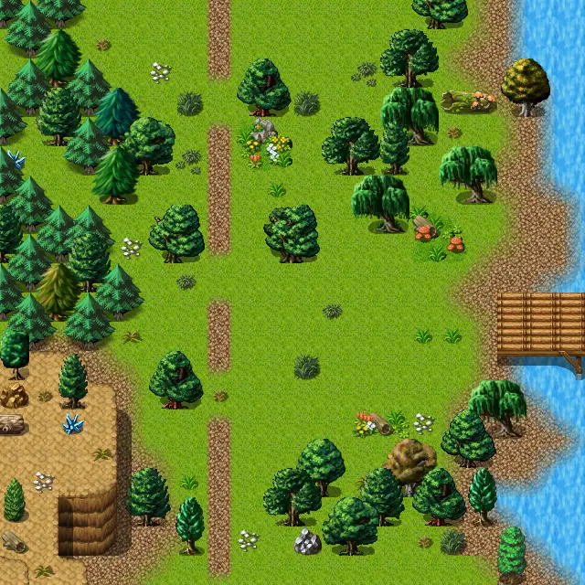

# Lake shore road 2

20×20 tiles · outdoors · part of [World1](index.md)

<label class="lg"><input type="checkbox" data-t="spawn" checked><b>Red</b>&nbsp;Monsters / NPCs</label><label class="lg"><input type="checkbox" data-t="mapchange" checked><b>Blue</b>&nbsp;Exit to another map</label><label class="lg"><input type="checkbox" data-t="container" checked><b>Yellow</b>&nbsp;Container (click to see contents)</label><label class="lg"><input type="checkbox" data-t="sign" checked><b>Purple</b>&nbsp;Sign</label><label class="lg"><input type="checkbox" data-t="rest" checked><b>Green</b>&nbsp;Resting place</label><label class="lg"><input type="checkbox" data-t="key" checked><b>Orange dashed</b>&nbsp;Blocked until a quest step / item</label><label class="lg"><input type="checkbox" data-t="script"><b>Grey dotted</b>&nbsp;Scripted event</label><label class="lg"><input type="checkbox" data-t="replace"><b>White dotted</b>&nbsp;Changes during a quest</label>

## Exits

- [Lake shore road 0](lake_shore_road_0.md)
- [Lake shore road 2](lake_shore_road_2.md)
- [Lake shore road 3](lake_shore_road_3.md)
- [Lake shore road 5](lake_shore_road_5.md)
- [Rat mountain 1](rat_mountain_1.md)

## Monsters & NPCs here

| Name | HP |
|---|---|
| [Vicious hound](../monsters/vicious_hound.md) | 31 |
| [Slithering venomfang](../monsters/slithering_venomfang.md) | 35 |
| [Lizard](../monsters/stn_lizard.md) | 50 |

<small>Map ID: `lake_shore_road_2` · Data from v0.8.18</small>
