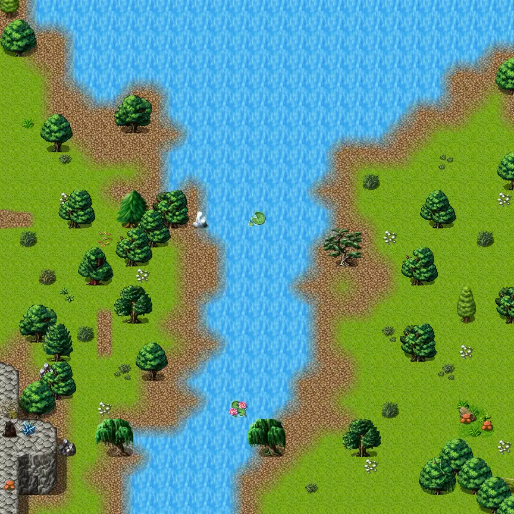

# Lake shore road 7

27×27 tiles · outdoors · part of [World1](index.md)

<label class="lg lg-spawn"><input type="checkbox" data-t="spawn" checked> Monsters / NPCs</label><label class="lg lg-mapchange"><input type="checkbox" data-t="mapchange" checked> Exit to another map</label><label class="lg lg-container"><input type="checkbox" data-t="container" checked> Container</label><label class="lg lg-sign"><input type="checkbox" data-t="sign" checked> Sign</label><label class="lg lg-rest"><input type="checkbox" data-t="rest" checked> Resting place</label><label class="lg lg-key"><input type="checkbox" data-t="key" checked> Blocked / needs key or quest</label><label class="lg lg-script"><input type="checkbox" data-t="script"> Scripted event</label><label class="lg lg-replace"><input type="checkbox" data-t="replace"> Changes after a quest</label>

## Exits

- [Lake shore road7a](lake_shore_road7a.md)
- [Lake shore road 2](lake_shore_road_2.md)
- [Lake shore road 6](lake_shore_road_6.md)
- [Lake shore road 8](lake_shore_road_8.md)
- [Rat mountain 5](rat_mountain_5.md)

## Monsters & NPCs here

| Name | HP |
|---|---|
| [Pond fish](../monsters/pond_fish.md) | 0 |
| [Strong izthiel](../monsters/izthiel_3.md) | 52 |
| [Young ViridToxin dartmaw](../monsters/young_virid_toxin.md) | 80 |
| [ViridToxin dartmaw](../monsters/virid_toxin.md) | 93 |
| [River troll](../monsters/rivertroll.md) | 210 |

<small>Map ID: `lake_shore_road_7` · Data from v0.8.18</small>
