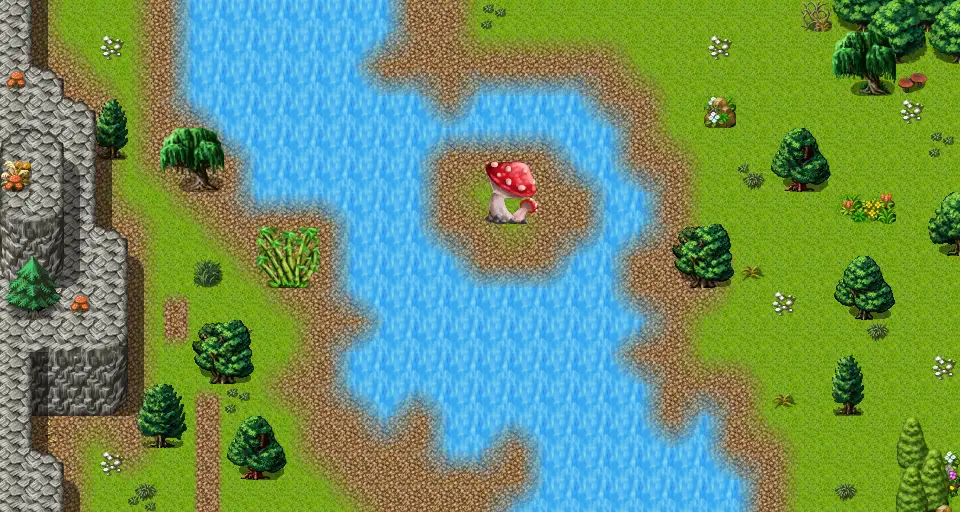

# Lake shore road 8

30×16 tiles · outdoors · part of [World1](index.md)

<label class="lg lg-spawn"><input type="checkbox" data-t="spawn" checked> Monsters / NPCs</label><label class="lg lg-mapchange"><input type="checkbox" data-t="mapchange" checked> Exit to another map</label><label class="lg lg-container"><input type="checkbox" data-t="container" checked> Container</label><label class="lg lg-sign"><input type="checkbox" data-t="sign" checked> Sign</label><label class="lg lg-rest"><input type="checkbox" data-t="rest" checked> Resting place</label><label class="lg lg-key"><input type="checkbox" data-t="key" checked> Blocked / needs key or quest</label><label class="lg lg-script"><input type="checkbox" data-t="script"> Scripted event</label><label class="lg lg-replace"><input type="checkbox" data-t="replace"> Changes after a quest</label>

## Exits

- [Lake shore road 7](lake_shore_road_7.md)
- [Lake shore road 8a](lake_shore_road_8a.md)
- [Lake shore road 9](lake_shore_road_9.md)

## Monsters & NPCs here

| Name | HP |
|---|---|
| [Pond fish](../monsters/pond_fish.md) | 0 |
| [Young ViridToxin dartmaw](../monsters/young_virid_toxin.md) | 80 |
| [ViridToxin dartmaw](../monsters/virid_toxin.md) | 93 |
| [Mushroom guardian](../monsters/guardian_mushroom.md) | 160 |

<small>Map ID: `lake_shore_road_8` · Data from v0.8.18</small>
