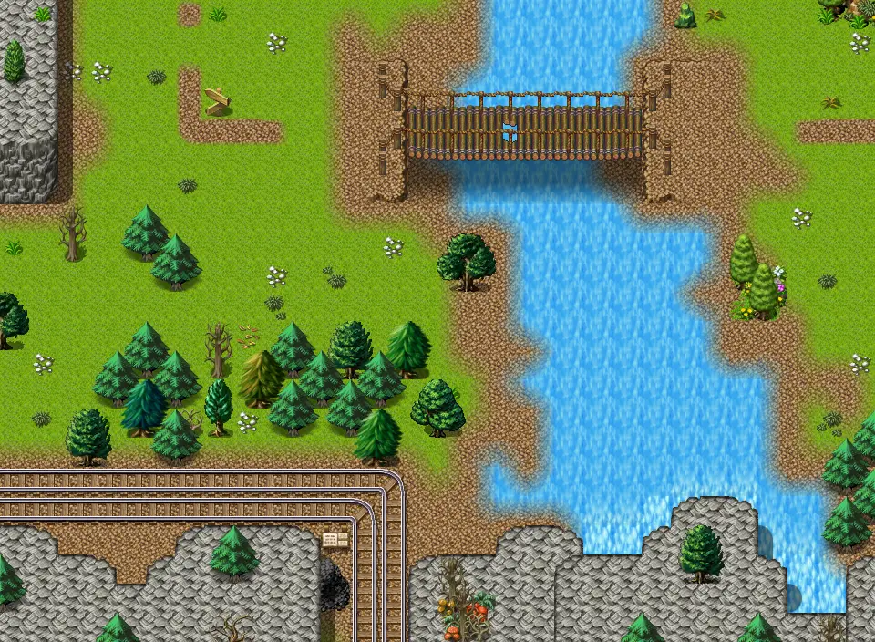

# Lake shore road 9

| | |
|---|---|
| **Map ID** | `lake_shore_road_9` |
| **Type** | Outdoors |
| **Size** | 30×22 tiles |
| **World map** | [World1](index.md) |
| **Introduced** | [v0.8.8](../versions/0.8.8.md) |
| **NPCs** | 1 |
| **Enemy types** | 4 |
| **Quests** | 3 |

**Lake shore road 9** is an outdoor map. It has 1 NPC and 4 kinds of enemy. Exits lead to Lake shore road 8, Way to sullengard west 0, Galmore 19, Galmore 10a.

## Map

<label class="lg"><input type="checkbox" data-t="spawn" checked><b>Red</b>&nbsp;Monsters / NPCs</label><label class="lg"><input type="checkbox" data-t="mapchange" checked><b>Blue</b>&nbsp;Exit to another map</label><label class="lg"><input type="checkbox" data-t="container" checked><b>Yellow</b>&nbsp;Container (click to see contents)</label><label class="lg"><input type="checkbox" data-t="sign" checked><b>Purple</b>&nbsp;Sign</label><label class="lg"><input type="checkbox" data-t="rest" checked><b>Green</b>&nbsp;Resting place</label><label class="lg"><input type="checkbox" data-t="key" checked><b>Orange dashed</b>&nbsp;Blocked until a quest step / item</label><label class="lg"><input type="checkbox" data-t="script"><b>Grey dotted</b>&nbsp;Scripted event</label><label class="lg"><input type="checkbox" data-t="replace"><b>White dotted</b>&nbsp;Changes during a quest</label><label class="lg"><input type="checkbox" data-t="pin" checked><b>Numbers</b>&nbsp;Numbered key points (see the key below the map)</label>

<a class="pin pin-exit" href="#key-1" style="left:30.000%;top:2.273%" title="Exit (north): to [Lake shore road 8](lake_shore_road_8.md)">1</a><a class="pin pin-exit" href="#key-1" style="left:86.667%;top:2.273%" title="Exit (north): to [Lake shore road 8](lake_shore_road_8.md)">1</a><a class="pin pin-exit" href="#key-2" style="left:98.333%;top:45.455%" title="Exit (east): to [Way to sullengard west 0](way_to_sullengard_west_0.md)">2</a><a class="pin pin-exit" href="#key-3" style="left:41.667%;top:97.727%" title="Exit (south): to [Galmore 19](galmore_19.md)">3</a><a class="pin pin-exit" href="#key-4" style="left:1.667%;top:56.818%" title="Exit (west): to [Galmore 10a](galmore_10a.md)">4</a><a id="pin-npc-thief_seraphina" class="pin pin-npc" href="#key-5" style="left:41.667%;top:15.909%" title="[Sly Seraphina](../../monsters/tt_seraphina.md#v-thief_seraphina): shopkeeper, 1 quest">5</a><a class="pin pin-script" href="#key-6" style="left:58.333%;top:20.455%" title="Quest trigger: Scripted event: advances the quest: hidden story flag “sullengard_hidden” to stage 37 (“East of Stoutford and west of Sullengard, the PC has seen firsthand that the once-broken bridge is now fixed.”)">6</a><a class="pin pin-script" href="#key-7" style="left:41.886%;top:12.500%" title="Quest trigger: Scripted event: advances the quest: hidden story flag “sutdover_hidden” to stage 3 (“Sly Seraphina has sold the Armored Helmet to the PC.”)">7</a><a class="pin pin-sign" href="#key-8" style="left:25.000%;top:15.909%" title="Sign: “Here: Sutdover River
East: Sullengard
South: Galmore Mountain”">8</a><a class="pin pin-script" href="#key-9" style="left:30.000%;top:29.545%" title="Quest trigger: Scripted event: advances the quest: hidden story flag “mg2_exploded_star_nd” to stage 1 (“1=Seek in galmore_66”)">9</a><a class="pin pin-key" href="#key-10" style="left:38.333%;top:84.091%" title="Blocked passage: Closed off once you reach this point in the quest: Search for Andor (stage 1: “My father Mikhail says that Andor has not been home since yesterday. I should go look for him in the village.”)">10</a><a class="pin pin-replace" href="#key-11" style="left:58.553%;top:17.046%" title="Changes during a quest: This area changes during the quest: Another ruthless Crackshot (stage 75: “Sullengard has been given their share of the gold and now it&#x27;s time to revisit Umar.”)">11</a>

??? abstract "Key to the numbers on the map"

    | # | What | Details |
    |---|---|---|
    | 1 | Exit (north) | to [Lake shore road 8](lake_shore_road_8.md) |
    | 2 | Exit (east) | to [Way to sullengard west 0](way_to_sullengard_west_0.md) |
    | 3 | Exit (south) | to [Galmore 19](galmore_19.md) |
    | 4 | Exit (west) | to [Galmore 10a](galmore_10a.md) |
    | 5 | [Sly Seraphina](../monsters/tt_seraphina.md#v-thief_seraphina) | shopkeeper, 1 quest |
    | 6 | Quest trigger | Scripted event: advances the quest: hidden story flag “sullengard_hidden” to stage 37 (“East of Stoutford and west of Sullengard, the PC has seen firsthand that the once-broken bridge is now fixed.”) |
    | 7 | Quest trigger | Scripted event: advances the quest: hidden story flag “sutdover_hidden” to stage 3 (“Sly Seraphina has sold the Armored Helmet to the PC.”) |
    | 8 | Sign | “Here: Sutdover River East: Sullengard South: Galmore Mountain” |
    | 9 | Quest trigger | Scripted event: advances the quest: hidden story flag “mg2_exploded_star_nd” to stage 1 (“1=Seek in galmore_66”) |
    | 10 | Blocked passage | Closed off once you reach this point in the quest: Search for Andor (stage 1: “My father Mikhail says that Andor has not been home since yesterday. I should go look for him in the village.”) |
    | 11 | Changes during a quest | This area changes during the quest: Another ruthless Crackshot (stage 75: “Sullengard has been given their share of the gold and now it's time to revisit Umar.”) |

Verified against v0.8.18 map data.

## Connections

| Direction | Leads to | Region there | Map # |
|---|---|---|---|
| North | [Lake shore road 8](lake_shore_road_8.md) | Flagstone Prison | 1 |
| East | [Way to sullengard west 0](way_to_sullengard_west_0.md) | – | 2 |
| South | [Galmore 19](galmore_19.md) | – | 3 |
| West | [Galmore 10a](galmore_10a.md) | – | 4 |

## NPCs

- [Sly Seraphina](../monsters/tt_seraphina.md#v-thief_seraphina) — shopkeeper — quests: [Troubling times](../quests/troubling_times.md) (#5)

## Enemies

| Enemy | HP | Damage | Up to | Notes |
|---|---|---|---|---|
| [Hardshell beetle](../monsters/hardshell_beetle.md) | 25 | 0–5 | 3 | – |
| [Young ViridToxin dartmaw](../monsters/young_virid_toxin.md) | 80 | 4–12 | 3 | – |
| [ViridToxin dartmaw](../monsters/virid_toxin.md) | 93 | 6–14 | 4 | – |
| [Flying tree ant](../monsters/flying_tree_ant.md) | 119 | 9–15 | 3 | – |

<small>“Up to” is the most that can be alive at once from the spawn areas on this map.</small>

## Items & containers

**Shops:** [Sly Seraphina](../monsters/tt_seraphina.md#v-thief_seraphina)

## Quests

- [Another ruthless Crackshot](../quests/Thieves04.md): part of the map changes at stage 75
- [Search for Andor](../quests/andor.md): blocked passage closes at stage 1
- [Troubling times](../quests/troubling_times.md): [Sly Seraphina](../monsters/tt_seraphina.md#v-thief_seraphina) is involved
- [mg2_exploded_star_nd (hidden flag)](../quests/mg2_exploded_star_nd.md): something on this map advances it; stepping on a trigger here sets stage 1; stepping on a trigger here sets stage 10; stepping on a trigger here sets stage 2; stepping on a trigger here sets stage 3; stepping on a trigger here sets stage 4; stepping on a trigger here sets stage 5; stepping on a trigger here sets stage 6; stepping on a trigger here sets stage 7; stepping on a trigger here sets stage 8; stepping on a trigger here sets stage 9; stepping on a trigger here sets stage 90
- [sullengard_nondisplay (hidden flag)](../quests/sullengard_hidden.md): [Sly Seraphina](../monsters/tt_seraphina.md#v-thief_seraphina) is involved; something on this map advances it; stepping on a trigger here sets stage 36; stepping on a trigger here sets stage 37
- [Sutdove_nondisplay (hidden flag)](../quests/sutdover_hidden.md): something on this map advances it; stepping on a trigger here sets stage 3

## Points of interest

- **Quest trigger** (#6): Scripted event: advances the quest: hidden story flag “sullengard_hidden” to stage 37 (“East of Stoutford and west of Sullengard, the PC has seen firsthand that the once-broken bridge is now fixed.”)
- **Quest trigger** (#7): Scripted event: advances the quest: hidden story flag “sutdover_hidden” to stage 3 (“Sly Seraphina has sold the Armored Helmet to the PC.”)
- **Sign** (#8): “Here: Sutdover River East: Sullengard South: Galmore Mountain”
- **Quest trigger** (#9): Scripted event: advances the quest: hidden story flag “mg2_exploded_star_nd” to stage 1 (“1=Seek in galmore_66”)
- **Blocked passage** (#10): Closed off once you reach this point in the quest: Search for Andor (stage 1: “My father Mikhail says that Andor has not been home since yesterday. I should go look for him in the village.”)
- **Changes during a quest** (#11): This area changes during the quest: Another ruthless Crackshot (stage 75: “Sullengard has been given their share of the gold and now it's time to revisit Umar.”)

## Version history

| Version | Change |
|---|---|
| [v0.8.8](../versions/0.8.8.md) | Added |
| [v0.8.12.1](../versions/0.8.12.1.md) | Map layout or objects changed |
| [v0.8.14](../versions/0.8.14.md) | Map layout or objects changed |
| [v0.8.18](../versions/0.8.18.md) | Map layout or objects changed |

Verified against v0.8.18 and every earlier release back to v0.7.0 (game data compared release by release).

## Community notes

<small>Written by players, not generated from game data. **Observations**: what players notice in-game · **Lore**: the in-world story · **Trivia**: real-world facts, references, development history · **Theory / speculation**: unconfirmed ideas; may just be unfinished content</small>

### Observations

*No notes yet. Contributions are welcome: [add a note](https://github.com/asdfghjkl628/Andor-s-Trail-Wikiiii/new/main/notes/maps?filename=lake_shore_road_9.md&value=%23%23%20Observations%0A%0A%3C%21--%20what%20players%20notice%20in-game%20--%3E%0A%0A%23%23%20Lore%0A%0A%3C%21--%20the%20in-world%20story%20--%3E%0A%0A%23%23%20Trivia%0A%0A%3C%21--%20real-world%20facts%2C%20references%2C%20development%20history%20--%3E%0A%0A%23%23%20Theory%20/%20speculation%0A%0A%3C%21--%20unconfirmed%20ideas%3B%20may%20just%20be%20unfinished%20content%20--%3E%0A).*

### Lore

*No notes yet. Contributions are welcome: [add a note](https://github.com/asdfghjkl628/Andor-s-Trail-Wikiiii/new/main/notes/maps?filename=lake_shore_road_9.md&value=%23%23%20Observations%0A%0A%3C%21--%20what%20players%20notice%20in-game%20--%3E%0A%0A%23%23%20Lore%0A%0A%3C%21--%20the%20in-world%20story%20--%3E%0A%0A%23%23%20Trivia%0A%0A%3C%21--%20real-world%20facts%2C%20references%2C%20development%20history%20--%3E%0A%0A%23%23%20Theory%20/%20speculation%0A%0A%3C%21--%20unconfirmed%20ideas%3B%20may%20just%20be%20unfinished%20content%20--%3E%0A).*

### Trivia

*No notes yet. Contributions are welcome: [add a note](https://github.com/asdfghjkl628/Andor-s-Trail-Wikiiii/new/main/notes/maps?filename=lake_shore_road_9.md&value=%23%23%20Observations%0A%0A%3C%21--%20what%20players%20notice%20in-game%20--%3E%0A%0A%23%23%20Lore%0A%0A%3C%21--%20the%20in-world%20story%20--%3E%0A%0A%23%23%20Trivia%0A%0A%3C%21--%20real-world%20facts%2C%20references%2C%20development%20history%20--%3E%0A%0A%23%23%20Theory%20/%20speculation%0A%0A%3C%21--%20unconfirmed%20ideas%3B%20may%20just%20be%20unfinished%20content%20--%3E%0A).*

### Theory / speculation

*No notes yet. Contributions are welcome: [add a note](https://github.com/asdfghjkl628/Andor-s-Trail-Wikiiii/new/main/notes/maps?filename=lake_shore_road_9.md&value=%23%23%20Observations%0A%0A%3C%21--%20what%20players%20notice%20in-game%20--%3E%0A%0A%23%23%20Lore%0A%0A%3C%21--%20the%20in-world%20story%20--%3E%0A%0A%23%23%20Trivia%0A%0A%3C%21--%20real-world%20facts%2C%20references%2C%20development%20history%20--%3E%0A%0A%23%23%20Theory%20/%20speculation%0A%0A%3C%21--%20unconfirmed%20ideas%3B%20may%20just%20be%20unfinished%20content%20--%3E%0A).*

??? info "Technical information"

    | | |
    |---|---|
    | Map ID | `lake_shore_road_9` |
    | File | `res/xml/lake_shore_road_9.tmx` |
    | Size | 30×22 tiles (960×704 px) |
    | outdoors property | 1 |
    | Layers drawn | base, ground, objects, above, top |
    | Tilesets | map_bed_1, map_border_1, map_bridge_1, map_bridge_2, map_broken_1, map_cavewall_1, map_cavewall_2, map_cavewall_3, map_cavewall_4, map_chair_table_1, map_chair_table_2, map_crate_1, map_cupboard_1, map_curtain_1, map_entrance_1, map_entrance_2, map_fence_1, map_fence_2, map_fence_3, map_fence_4, map_ground_1, map_ground_2, map_ground_3, map_ground_4, map_ground_5, map_ground_6, map_ground_7, map_ground_8, map_house_1, map_house_2, map_indoor_1, map_indoor_2, map_kitchen_1, map_outdoor_1, map_pillar_1, map_pillar_2, map_plant_1, map_plant_2, map_rock_1, map_rock_2, map_roof_1, map_roof_2, map_roof_3, map_shop_1, map_sign_ladder_1, map_table_1, map_trail_1, map_transition_1, map_transition_2, map_transition_3, map_transition_4, map_transition_5, map_tree_1, map_tree_2, map_tree_3, map_wall_1, map_wall_2, map_wall_3, map_wall_4, map_window_1, map_window_2 |
    | Map objects | spawn: 6, mapchange: 5, script: 5, sign: 1, key: 1, replace: 1 |
    | World map position | segment `world1`, x 189, y 580 |

<small>Data from v0.8.18</small>
