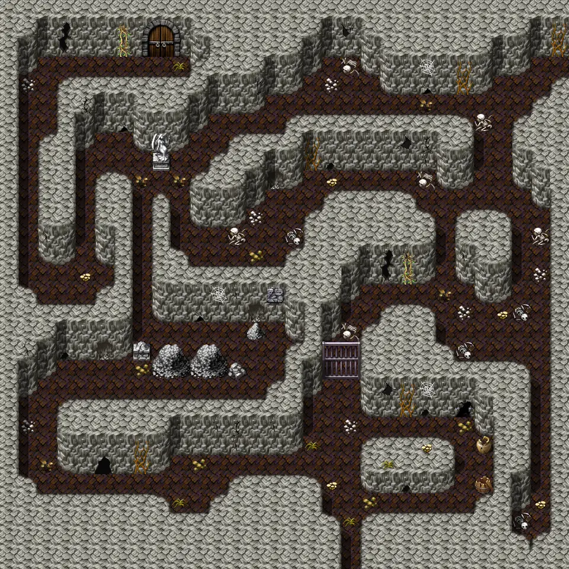

# Lakecave0

| | |
|---|---|
| **Map ID** | `lakecave0` |
| **Type** | Indoors / underground |
| **Size** | 30×30 tiles |
| **World map** | [Lakecave](index.md) |
| **Introduced** | [v0.7.2](../versions/0.7.2.md) |
| **Enemy types** | 12 |
| **Quests** | 1 |

**Lakecave0** is an indoor map. It has no NPCs and 12 kinds of enemy. Exits lead to Lakecave2, Mountainlake11, Lakecave1.

## Map

<label class="lg"><input type="checkbox" data-t="spawn" checked><b>Red</b>&nbsp;Monsters / NPCs</label><label class="lg"><input type="checkbox" data-t="mapchange" checked><b>Blue</b>&nbsp;Exit to another map</label><label class="lg"><input type="checkbox" data-t="container" checked><b>Yellow</b>&nbsp;Container (click to see contents)</label><label class="lg"><input type="checkbox" data-t="sign" checked><b>Purple</b>&nbsp;Sign</label><label class="lg"><input type="checkbox" data-t="rest" checked><b>Green</b>&nbsp;Resting place</label><label class="lg"><input type="checkbox" data-t="key" checked><b>Orange dashed</b>&nbsp;Blocked until a quest step / item</label><label class="lg"><input type="checkbox" data-t="script"><b>Grey dotted</b>&nbsp;Scripted event</label><label class="lg"><input type="checkbox" data-t="replace"><b>White dotted</b>&nbsp;Changes during a quest</label><label class="lg"><input type="checkbox" data-t="pin" checked><b>Numbers</b>&nbsp;Numbered key points (see the key below the map)</label>

<a class="pin pin-exit" href="#key-1" style="left:98.333%;top:11.667%" title="Exit (east): to [Lakecave2](lakecave2.md)">1</a><a class="pin pin-exit" href="#key-2" style="left:61.667%;top:98.333%" title="Exit (south): to [Mountainlake11](mountainlake11.md)">2</a><a class="pin pin-exit" href="#key-3" style="left:28.333%;top:8.333%" title="Exit (stairs / passage): to [Lakecave1](lakecave1.md)">3</a><a class="pin pin-script" href="#key-4" style="left:28.333%;top:31.667%" title="Quest trigger: Scripted event: advances the quest: hidden story flag “nondisplay” to stage 24 (“Have been warned in lakecave0”)">4</a><a class="pin pin-script" href="#key-5" style="left:18.333%;top:11.667%" title="Quest trigger: Scripted event: advances the quest: hidden story flag “nondisplay” to stage 26 (“Closed glade door in lakecave0”)">5</a><a class="pin pin-script" href="#key-6" style="left:26.667%;top:11.667%" title="Quest trigger: Scripted event: advances the quest: hidden story flag “nondisplay” to stage 25 (“Opened glade door in lakecave0”)">6</a><a class="pin pin-script" href="#key-7" style="left:30.015%;top:13.860%" title="Quest trigger: Scripted event: advances the quest: hidden story flag “nondisplay” to stage 39 (“Damerilia #5 grew back in lakecave1”)">7</a><a class="pin pin-script" href="#key-8" style="left:61.667%;top:48.333%" title="Quest trigger: Scripted event: advances the quest: A secret garden to stage 55 (“Many monsters are dead now. The rest will no longer dare to approach the statue.”)">8</a><a class="pin pin-replace" href="#key-9" style="left:28.553%;top:4.167%" title="Changes during a quest: This area changes during the quest: hidden story flag “nondisplay” (stage 25: “Opened glade door in lakecave0”)">9</a><a class="pin pin-replace" href="#key-10" style="left:25.400%;top:6.148%" title="Changes during a quest: This area changes during the quest: hidden story flag “nondisplay” (stage 26: “Closed glade door in lakecave0”)">10</a>

??? abstract "Key to the numbers on the map"

    | # | What | Details |
    |---|---|---|
    | 1 | Exit (east) | to [Lakecave2](lakecave2.md) |
    | 2 | Exit (south) | to [Mountainlake11](mountainlake11.md) |
    | 3 | Exit (stairs / passage) | to [Lakecave1](lakecave1.md) |
    | 4 | Quest trigger | Scripted event: advances the quest: hidden story flag “nondisplay” to stage 24 (“Have been warned in lakecave0”) |
    | 5 | Quest trigger | Scripted event: advances the quest: hidden story flag “nondisplay” to stage 26 (“Closed glade door in lakecave0”) |
    | 6 | Quest trigger | Scripted event: advances the quest: hidden story flag “nondisplay” to stage 25 (“Opened glade door in lakecave0”) |
    | 7 | Quest trigger | Scripted event: advances the quest: hidden story flag “nondisplay” to stage 39 (“Damerilia #5 grew back in lakecave1”) |
    | 8 | Quest trigger | Scripted event: advances the quest: A secret garden to stage 55 (“Many monsters are dead now. The rest will no longer dare to approach the statue.”) |
    | 9 | Changes during a quest | This area changes during the quest: hidden story flag “nondisplay” (stage 25: “Opened glade door in lakecave0”) |
    | 10 | Changes during a quest | This area changes during the quest: hidden story flag “nondisplay” (stage 26: “Closed glade door in lakecave0”) |

Verified against v0.8.18 map data.

## Connections

| Direction | Leads to | Region there | Map # |
|---|---|---|---|
| East | [Lakecave2](lakecave2.md) | – | 1 |
| South | [Mountainlake11](mountainlake11.md) | – | 2 |
| Stairs / passage | [Lakecave1](lakecave1.md) | – | 3 |

## Enemies

| Enemy | HP | Damage | Up to | Notes |
|---|---|---|---|---|
| [Tough cave scorpion](../monsters/cave_scorpion_3.md) | 30 | 3–6 | 3 | shares spawn with Aggressive cave scorpion |
| [Cave scorpion](../monsters/cave_scorpion_0.md) | 30 | 3–6 | 6 | shares spawn with Puny cave scorpion |
| [Puny cave scorpion](../monsters/cave_scorpion_2.md) | 30 | 2–5 | 6 | shares spawn with Cave scorpion |
| [Fierce cave scorpion](../monsters/cave_scorpion_5.md) | 35 | 5–10 | 4 | shares spawn with Armored cave scorpion |
| [Aggressive cave scorpion](../monsters/cave_scorpion_1.md) | 35 | 4–7 | 3 | shares spawn with Tough cave scorpion |
| [Armored cave scorpion](../monsters/cave_scorpion_4.md) | 35 | 4–8 | 4 | shares spawn with Fierce cave scorpion |
| [Cave troll](../monsters/cave_troll_1.md#v-cave_troll_7) | 230 | 1–15 | 1 | appears later, during a quest |
| [Cave troll](../monsters/cave_troll_1.md) | 230 | 1–15 | 5 | – |
| [Strong cave troll](../monsters/cave_troll_2.md) | 250 | 5–15 | 4 | – |
| [Tough cave troll](../monsters/cave_troll_3.md) | 290 | 5–15 | 1 | – |
| [Cave troll shaman](../monsters/cave_troll_4.md) | 300 | 1–15 | 4 | – |
| [Cave troll shaman](../monsters/cave_troll_4.md#v-cave_troll_6) | 370 | 7–18 | 1 | – |

<small>“Up to” is the most that can be alive at once from the spawn areas on this map.</small>

## Quests

- [A secret garden](../quests/secret_garden.md): something on this map advances it; stepping on a trigger here sets stage 55
- [Placeholder for hidden quest stages (not displayed) (hidden flag)](../quests/nondisplay.md): part of the map changes at stage 25; part of the map changes at stage 26; something on this map advances it; stepping on a trigger here sets stage 24; stepping on a trigger here sets stage 25; stepping on a trigger here sets stage 26; stepping on a trigger here sets stage 31; stepping on a trigger here sets stage 33; stepping on a trigger here sets stage 35; stepping on a trigger here sets stage 37; stepping on a trigger here sets stage 39

## Points of interest

- **Quest trigger** (#4): Scripted event: advances the quest: hidden story flag “nondisplay” to stage 24 (“Have been warned in lakecave0”)
- **Quest trigger** (#5): Scripted event: advances the quest: hidden story flag “nondisplay” to stage 26 (“Closed glade door in lakecave0”)
- **Quest trigger** (#6): Scripted event: advances the quest: hidden story flag “nondisplay” to stage 25 (“Opened glade door in lakecave0”)
- **Quest trigger** (#7): Scripted event: advances the quest: hidden story flag “nondisplay” to stage 39 (“Damerilia #5 grew back in lakecave1”)
- **Quest trigger** (#8): Scripted event: advances the quest: A secret garden to stage 55 (“Many monsters are dead now. The rest will no longer dare to approach the statue.”)
- **Changes during a quest** (#9): This area changes during the quest: hidden story flag “nondisplay” (stage 25: “Opened glade door in lakecave0”)
- **Changes during a quest** (#10): This area changes during the quest: hidden story flag “nondisplay” (stage 26: “Closed glade door in lakecave0”)

## Version history

| Version | Change |
|---|---|
| [v0.7.2](../versions/0.7.2.md) | Added |
| [v0.7.11](../versions/0.7.11.md) | map layout or objects changed |

Verified against v0.8.18 and every earlier release back to v0.7.0 (game data compared release by release).

## Community notes

<small>Written by players, not generated from game data. **Observations**: what players notice in-game · **Lore**: the in-world story · **Trivia**: real-world facts, references, development history · **Theory / speculation**: unconfirmed ideas; may just be unfinished content</small>

### Observations

*No notes yet. Contributions are welcome: [add a note](https://github.com/asdfghjkl628/Andor-s-Trail-Wikiiii/new/main/notes/maps?filename=lakecave0.md&value=%23%23%20Observations%0A%0A%3C%21--%20what%20players%20notice%20in-game%20--%3E%0A%0A%23%23%20Lore%0A%0A%3C%21--%20the%20in-world%20story%20--%3E%0A%0A%23%23%20Trivia%0A%0A%3C%21--%20real-world%20facts%2C%20references%2C%20development%20history%20--%3E%0A%0A%23%23%20Theory%20/%20speculation%0A%0A%3C%21--%20unconfirmed%20ideas%3B%20may%20just%20be%20unfinished%20content%20--%3E%0A).*

### Lore

*No notes yet. Contributions are welcome: [add a note](https://github.com/asdfghjkl628/Andor-s-Trail-Wikiiii/new/main/notes/maps?filename=lakecave0.md&value=%23%23%20Observations%0A%0A%3C%21--%20what%20players%20notice%20in-game%20--%3E%0A%0A%23%23%20Lore%0A%0A%3C%21--%20the%20in-world%20story%20--%3E%0A%0A%23%23%20Trivia%0A%0A%3C%21--%20real-world%20facts%2C%20references%2C%20development%20history%20--%3E%0A%0A%23%23%20Theory%20/%20speculation%0A%0A%3C%21--%20unconfirmed%20ideas%3B%20may%20just%20be%20unfinished%20content%20--%3E%0A).*

### Trivia

*No notes yet. Contributions are welcome: [add a note](https://github.com/asdfghjkl628/Andor-s-Trail-Wikiiii/new/main/notes/maps?filename=lakecave0.md&value=%23%23%20Observations%0A%0A%3C%21--%20what%20players%20notice%20in-game%20--%3E%0A%0A%23%23%20Lore%0A%0A%3C%21--%20the%20in-world%20story%20--%3E%0A%0A%23%23%20Trivia%0A%0A%3C%21--%20real-world%20facts%2C%20references%2C%20development%20history%20--%3E%0A%0A%23%23%20Theory%20/%20speculation%0A%0A%3C%21--%20unconfirmed%20ideas%3B%20may%20just%20be%20unfinished%20content%20--%3E%0A).*

### Theory / speculation

*No notes yet. Contributions are welcome: [add a note](https://github.com/asdfghjkl628/Andor-s-Trail-Wikiiii/new/main/notes/maps?filename=lakecave0.md&value=%23%23%20Observations%0A%0A%3C%21--%20what%20players%20notice%20in-game%20--%3E%0A%0A%23%23%20Lore%0A%0A%3C%21--%20the%20in-world%20story%20--%3E%0A%0A%23%23%20Trivia%0A%0A%3C%21--%20real-world%20facts%2C%20references%2C%20development%20history%20--%3E%0A%0A%23%23%20Theory%20/%20speculation%0A%0A%3C%21--%20unconfirmed%20ideas%3B%20may%20just%20be%20unfinished%20content%20--%3E%0A).*

??? info "Technical information"

    | | |
    |---|---|
    | Map ID | `lakecave0` |
    | File | `res/xml/lakecave0.tmx` |
    | Size | 30×30 tiles (960×960 px) |
    | outdoors property | – |
    | Layers drawn | ground, objects, above |
    | Tilesets | map_bed_1, map_border_1, map_bridge_1, map_bridge_2, map_broken_1, map_cavewall_1, map_cavewall_2, map_cavewall_3, map_cavewall_4, map_chair_table_1, map_chair_table_2, map_crate_1, map_cupboard_1, map_curtain_1, map_entrance_1, map_entrance_2, map_fence_1, map_fence_2, map_fence_3, map_fence_4, map_ground_1, map_ground_2, map_ground_3, map_ground_4, map_ground_5, map_ground_6, map_ground_7, map_ground_8, map_house_1, map_house_2, map_indoor_1, map_indoor_2, map_kitchen_1, map_outdoor_1, map_pillar_1, map_pillar_2, map_plant_1, map_plant_2, map_rock_1, map_rock_2, map_roof_1, map_roof_2, map_roof_3, map_shop_1, map_sign_ladder_1, map_table_1, map_trail_1, map_transition_1, map_transition_2, map_transition_3, map_transition_4, map_transition_5, map_tree_1, map_tree_2, map_wall_1, map_wall_2, map_wall_3, map_wall_4, map_window_1, map_window_2 |
    | Map objects | spawn: 18, script: 5, mapchange: 3, replace: 2 |
    | World map position | segment `lakecave`, x 349, y 438 |

<small>Data from v0.8.18</small>
