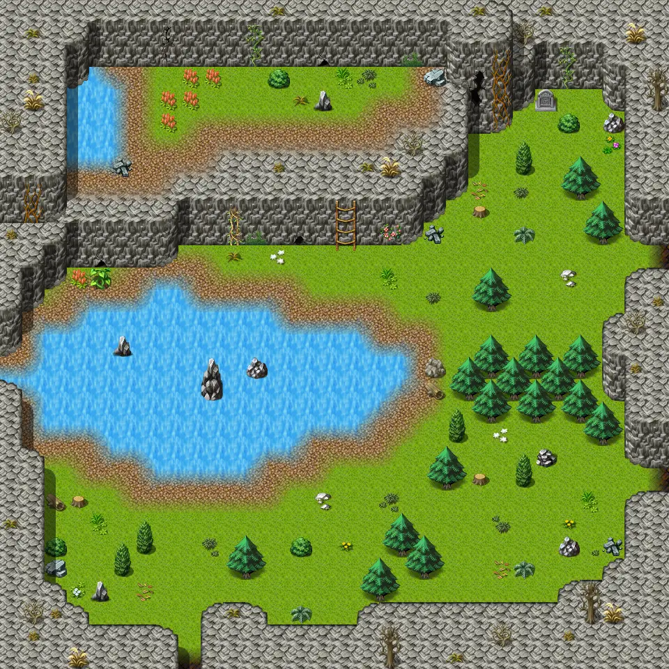

# Lakecave1

| | |
|---|---|
| **Map ID** | `lakecave1` |
| **Type** | Indoors / underground |
| **Size** | 30×30 tiles |
| **World map** | [World1](index.md) |
| **Introduced** | [v0.7.2](../versions/0.7.2.md) |
| **NPCs** | 1 |
| **Enemy types** | 1 |
| **Quests** | 0 |

**Lakecave1** is an indoor map. It has 1 NPC and 1 kind of enemy. Exits lead to Lakecave2, Lakecave0.

## Map

<label class="lg"><input type="checkbox" data-t="spawn" checked><b>Red</b>&nbsp;Monsters / NPCs</label><label class="lg"><input type="checkbox" data-t="mapchange" checked><b>Blue</b>&nbsp;Exit to another map</label><label class="lg"><input type="checkbox" data-t="container" checked><b>Yellow</b>&nbsp;Container (click to see contents)</label><label class="lg"><input type="checkbox" data-t="sign" checked><b>Purple</b>&nbsp;Sign</label><label class="lg"><input type="checkbox" data-t="rest" checked><b>Green</b>&nbsp;Resting place</label><label class="lg"><input type="checkbox" data-t="key" checked><b>Orange dashed</b>&nbsp;Blocked until a quest step / item</label><label class="lg"><input type="checkbox" data-t="script"><b>Grey dotted</b>&nbsp;Scripted event</label><label class="lg"><input type="checkbox" data-t="replace"><b>White dotted</b>&nbsp;Changes during a quest</label><label class="lg"><input type="checkbox" data-t="pin" checked><b>Numbers</b>&nbsp;Numbered key points (see the key below the map)</label>

<a class="pin pin-exit" href="#key-1" style="left:98.333%;top:71.667%" title="Exit (east): to [Lakecave2](lakecave2.md)">1</a><a class="pin pin-exit" href="#key-1" style="left:98.333%;top:38.333%" title="Exit (east): to [Lakecave2](lakecave2.md)">1</a><a class="pin pin-exit" href="#key-2" style="left:28.333%;top:98.333%" title="Exit (south): to [Lakecave0](lakecave0.md)">2</a><a id="pin-npc-honey_bee" class="pin pin-npc" href="#key-3" style="left:51.667%;top:81.667%" title="[Honey bee](../../monsters/honey_bee.md): NPC">3</a><a class="pin pin-sign" href="#key-4" style="left:81.667%;top:18.333%" title="Sign: “Here lies Zorin, the first to tend this glade. Its beauty would be diminished without him.”">4</a><a class="pin pin-replace" href="#key-5" style="left:31.667%;top:11.667%" title="Changes during a quest: This area changes during the quest: hidden story flag “nondisplay” (stage 30: “Damerilia #1 fetched in lakecave1”)">5</a><a class="pin pin-replace" href="#key-6" style="left:31.886%;top:9.167%" title="Changes during a quest: This area changes during the quest: hidden story flag “nondisplay” (stage 31: “Damerilia #1 grew back in lakecave1”)">6</a><a class="pin pin-script" href="#key-7" style="left:33.349%;top:13.860%" title="Quest trigger: Scripted event: advances the quest: hidden story flag “nondisplay” to stage 30 (“Damerilia #1 fetched in lakecave1”) (+1 more quest(s))">7</a><a class="pin pin-replace" href="#key-8" style="left:28.333%;top:11.667%" title="Changes during a quest: This area changes during the quest: hidden story flag “nondisplay” (stage 32: “Damerilia #2 fetched in lakecave1”)">8</a><a class="pin pin-replace" href="#key-9" style="left:28.553%;top:9.167%" title="Changes during a quest: This area changes during the quest: hidden story flag “nondisplay” (stage 33: “Damerilia #2 grew back in lakecave1”)">9</a><a class="pin pin-script" href="#key-10" style="left:30.015%;top:13.860%" title="Quest trigger: Scripted event: advances the quest: hidden story flag “nondisplay” to stage 32 (“Damerilia #2 fetched in lakecave1”) (+1 more quest(s))">10</a><a class="pin pin-replace" href="#key-11" style="left:26.728%;top:16.471%" title="Changes during a quest: This area changes during the quest: hidden story flag “nondisplay” (stage 34: “Damerilia #3 fetched in lakecave1”)">11</a><a class="pin pin-replace" href="#key-12" style="left:30.015%;top:17.194%" title="Changes during a quest: This area changes during the quest: hidden story flag “nondisplay” (stage 35: “Damerilia #3 grew back in lakecave1”)">12</a><a class="pin pin-script" href="#key-13" style="left:25.400%;top:14.481%" title="Quest trigger: Scripted event: advances the quest: hidden story flag “nondisplay” to stage 34 (“Damerilia #3 fetched in lakecave1”) (+1 more quest(s))">13</a><a class="pin pin-replace" href="#key-14" style="left:23.395%;top:16.471%" title="Changes during a quest: This area changes during the quest: hidden story flag “nondisplay” (stage 36: “Damerilia #4 fetched in lakecave1”)">14</a><a class="pin pin-replace" href="#key-15" style="left:22.066%;top:14.481%" title="Changes during a quest: This area changes during the quest: hidden story flag “nondisplay” (stage 37: “Damerilia #4 grew back in lakecave1”)">15</a><a class="pin pin-script" href="#key-16" style="left:23.388%;top:11.897%" title="Quest trigger: Scripted event: advances the quest: hidden story flag “nondisplay” to stage 36 (“Damerilia #4 fetched in lakecave1”) (+1 more quest(s))">16</a><a class="pin pin-replace" href="#key-17" style="left:25.000%;top:18.333%" title="Changes during a quest: This area changes during the quest: hidden story flag “nondisplay” (stage 38: “Damerilia #5 fetched in lakecave1”)">17</a><a class="pin pin-replace" href="#key-18" style="left:26.682%;top:20.527%" title="Changes during a quest: This area changes during the quest: hidden story flag “nondisplay” (stage 39: “Damerilia #5 grew back in lakecave1”)">18</a><a class="pin pin-script" href="#key-19" style="left:24.133%;top:21.559%" title="Quest trigger: Scripted event: advances the quest: hidden story flag “nondisplay” to stage 38 (“Damerilia #5 fetched in lakecave1”) (+1 more quest(s))">19</a>

??? abstract "Key to the numbers on the map"

    | # | What | Details |
    |---|---|---|
    | 1 | Exit (east) | to [Lakecave2](lakecave2.md) |
    | 2 | Exit (south) | to [Lakecave0](lakecave0.md) |
    | 3 | [Honey bee](../monsters/honey_bee.md) | NPC |
    | 4 | Sign | “Here lies Zorin, the first to tend this glade. Its beauty would be diminished without him.” |
    | 5 | Changes during a quest | This area changes during the quest: hidden story flag “nondisplay” (stage 30: “Damerilia #1 fetched in lakecave1”) |
    | 6 | Changes during a quest | This area changes during the quest: hidden story flag “nondisplay” (stage 31: “Damerilia #1 grew back in lakecave1”) |
    | 7 | Quest trigger | Scripted event: advances the quest: hidden story flag “nondisplay” to stage 30 (“Damerilia #1 fetched in lakecave1”) (+1 more quest(s)) |
    | 8 | Changes during a quest | This area changes during the quest: hidden story flag “nondisplay” (stage 32: “Damerilia #2 fetched in lakecave1”) |
    | 9 | Changes during a quest | This area changes during the quest: hidden story flag “nondisplay” (stage 33: “Damerilia #2 grew back in lakecave1”) |
    | 10 | Quest trigger | Scripted event: advances the quest: hidden story flag “nondisplay” to stage 32 (“Damerilia #2 fetched in lakecave1”) (+1 more quest(s)) |
    | 11 | Changes during a quest | This area changes during the quest: hidden story flag “nondisplay” (stage 34: “Damerilia #3 fetched in lakecave1”) |
    | 12 | Changes during a quest | This area changes during the quest: hidden story flag “nondisplay” (stage 35: “Damerilia #3 grew back in lakecave1”) |
    | 13 | Quest trigger | Scripted event: advances the quest: hidden story flag “nondisplay” to stage 34 (“Damerilia #3 fetched in lakecave1”) (+1 more quest(s)) |
    | 14 | Changes during a quest | This area changes during the quest: hidden story flag “nondisplay” (stage 36: “Damerilia #4 fetched in lakecave1”) |
    | 15 | Changes during a quest | This area changes during the quest: hidden story flag “nondisplay” (stage 37: “Damerilia #4 grew back in lakecave1”) |
    | 16 | Quest trigger | Scripted event: advances the quest: hidden story flag “nondisplay” to stage 36 (“Damerilia #4 fetched in lakecave1”) (+1 more quest(s)) |
    | 17 | Changes during a quest | This area changes during the quest: hidden story flag “nondisplay” (stage 38: “Damerilia #5 fetched in lakecave1”) |
    | 18 | Changes during a quest | This area changes during the quest: hidden story flag “nondisplay” (stage 39: “Damerilia #5 grew back in lakecave1”) |
    | 19 | Quest trigger | Scripted event: advances the quest: hidden story flag “nondisplay” to stage 38 (“Damerilia #5 fetched in lakecave1”) (+1 more quest(s)) |

Verified against v0.8.18 map data.

## Connections

| Direction | Leads to | Region there | Map # |
|---|---|---|---|
| East | [Lakecave2](lakecave2.md) | – | 1 |
| South | [Lakecave0](lakecave0.md) | – | 2 |

## NPCs

- [Honey bee](../monsters/honey_bee.md) (#3)

## Enemies

| Enemy | HP | Damage | Up to | Notes |
|---|---|---|---|---|
| [Forest beetle](../monsters/forest_beetle.md) | 14 | 2–4 | 5 | – |

<small>“Up to” is the most that can be alive at once from the spawn areas on this map.</small>

## Quests

- [Placeholder for hidden quest stages (not displayed) (hidden flag)](../quests/nondisplay.md): part of the map changes at stage 30; part of the map changes at stage 31; part of the map changes at stage 32; part of the map changes at stage 33; part of the map changes at stage 34; part of the map changes at stage 35; part of the map changes at stage 36; part of the map changes at stage 37; part of the map changes at stage 38; part of the map changes at stage 39; something on this map advances it; stepping on a trigger here sets stage 30; stepping on a trigger here sets stage 32; stepping on a trigger here sets stage 34; stepping on a trigger here sets stage 36; stepping on a trigger here sets stage 38
- [stn_nondisplay (hidden flag)](../quests/stn_nondisplay.md): something on this map advances it; stepping on a trigger here sets stage 206

## Points of interest

- **Sign** (#4): “Here lies Zorin, the first to tend this glade. Its beauty would be diminished without him.”
- **Changes during a quest** (#5): This area changes during the quest: hidden story flag “nondisplay” (stage 30: “Damerilia #1 fetched in lakecave1”)
- **Changes during a quest** (#6): This area changes during the quest: hidden story flag “nondisplay” (stage 31: “Damerilia #1 grew back in lakecave1”)
- **Quest trigger** (#7): Scripted event: advances the quest: hidden story flag “nondisplay” to stage 30 (“Damerilia #1 fetched in lakecave1”) (+1 more quest(s))
- **Changes during a quest** (#8): This area changes during the quest: hidden story flag “nondisplay” (stage 32: “Damerilia #2 fetched in lakecave1”)
- **Changes during a quest** (#9): This area changes during the quest: hidden story flag “nondisplay” (stage 33: “Damerilia #2 grew back in lakecave1”)
- **Quest trigger** (#10): Scripted event: advances the quest: hidden story flag “nondisplay” to stage 32 (“Damerilia #2 fetched in lakecave1”) (+1 more quest(s))
- **Changes during a quest** (#11): This area changes during the quest: hidden story flag “nondisplay” (stage 34: “Damerilia #3 fetched in lakecave1”)
- **Changes during a quest** (#12): This area changes during the quest: hidden story flag “nondisplay” (stage 35: “Damerilia #3 grew back in lakecave1”)
- **Quest trigger** (#13): Scripted event: advances the quest: hidden story flag “nondisplay” to stage 34 (“Damerilia #3 fetched in lakecave1”) (+1 more quest(s))
- **Changes during a quest** (#14): This area changes during the quest: hidden story flag “nondisplay” (stage 36: “Damerilia #4 fetched in lakecave1”)
- **Changes during a quest** (#15): This area changes during the quest: hidden story flag “nondisplay” (stage 37: “Damerilia #4 grew back in lakecave1”)
- **Quest trigger** (#16): Scripted event: advances the quest: hidden story flag “nondisplay” to stage 36 (“Damerilia #4 fetched in lakecave1”) (+1 more quest(s))
- **Changes during a quest** (#17): This area changes during the quest: hidden story flag “nondisplay” (stage 38: “Damerilia #5 fetched in lakecave1”)
- **Changes during a quest** (#18): This area changes during the quest: hidden story flag “nondisplay” (stage 39: “Damerilia #5 grew back in lakecave1”)
- **Quest trigger** (#19): Scripted event: advances the quest: hidden story flag “nondisplay” to stage 38 (“Damerilia #5 fetched in lakecave1”) (+1 more quest(s))

## Version history

| Version | Change |
|---|---|
| [v0.7.2](../versions/0.7.2.md) | Added |
| [v0.8.12.1](../versions/0.8.12.1.md) | Map layout or objects changed |

Verified against v0.8.18 and every earlier release back to v0.7.0 (game data compared release by release).

## Community notes

<small>Written by players, not generated from game data. **Observations**: what players notice in-game · **Lore**: the in-world story · **Trivia**: real-world facts, references, development history · **Theory / speculation**: unconfirmed ideas; may just be unfinished content</small>

### Observations

*No notes yet. Contributions are welcome: [add a note](https://github.com/asdfghjkl628/Andor-s-Trail-Wikiiii/new/main/notes/maps?filename=lakecave1.md&value=%23%23%20Observations%0A%0A%3C%21--%20what%20players%20notice%20in-game%20--%3E%0A%0A%23%23%20Lore%0A%0A%3C%21--%20the%20in-world%20story%20--%3E%0A%0A%23%23%20Trivia%0A%0A%3C%21--%20real-world%20facts%2C%20references%2C%20development%20history%20--%3E%0A%0A%23%23%20Theory%20/%20speculation%0A%0A%3C%21--%20unconfirmed%20ideas%3B%20may%20just%20be%20unfinished%20content%20--%3E%0A).*

### Lore

*No notes yet. Contributions are welcome: [add a note](https://github.com/asdfghjkl628/Andor-s-Trail-Wikiiii/new/main/notes/maps?filename=lakecave1.md&value=%23%23%20Observations%0A%0A%3C%21--%20what%20players%20notice%20in-game%20--%3E%0A%0A%23%23%20Lore%0A%0A%3C%21--%20the%20in-world%20story%20--%3E%0A%0A%23%23%20Trivia%0A%0A%3C%21--%20real-world%20facts%2C%20references%2C%20development%20history%20--%3E%0A%0A%23%23%20Theory%20/%20speculation%0A%0A%3C%21--%20unconfirmed%20ideas%3B%20may%20just%20be%20unfinished%20content%20--%3E%0A).*

### Trivia

*No notes yet. Contributions are welcome: [add a note](https://github.com/asdfghjkl628/Andor-s-Trail-Wikiiii/new/main/notes/maps?filename=lakecave1.md&value=%23%23%20Observations%0A%0A%3C%21--%20what%20players%20notice%20in-game%20--%3E%0A%0A%23%23%20Lore%0A%0A%3C%21--%20the%20in-world%20story%20--%3E%0A%0A%23%23%20Trivia%0A%0A%3C%21--%20real-world%20facts%2C%20references%2C%20development%20history%20--%3E%0A%0A%23%23%20Theory%20/%20speculation%0A%0A%3C%21--%20unconfirmed%20ideas%3B%20may%20just%20be%20unfinished%20content%20--%3E%0A).*

### Theory / speculation

*No notes yet. Contributions are welcome: [add a note](https://github.com/asdfghjkl628/Andor-s-Trail-Wikiiii/new/main/notes/maps?filename=lakecave1.md&value=%23%23%20Observations%0A%0A%3C%21--%20what%20players%20notice%20in-game%20--%3E%0A%0A%23%23%20Lore%0A%0A%3C%21--%20the%20in-world%20story%20--%3E%0A%0A%23%23%20Trivia%0A%0A%3C%21--%20real-world%20facts%2C%20references%2C%20development%20history%20--%3E%0A%0A%23%23%20Theory%20/%20speculation%0A%0A%3C%21--%20unconfirmed%20ideas%3B%20may%20just%20be%20unfinished%20content%20--%3E%0A).*

??? info "Technical information"

    | | |
    |---|---|
    | Map ID | `lakecave1` |
    | File | `res/xml/lakecave1.tmx` |
    | Size | 30×30 tiles (960×960 px) |
    | outdoors property | – |
    | Layers drawn | ground, objects, above, top |
    | Tilesets | map_bed_1, map_border_1, map_bridge_1, map_bridge_2, map_broken_1, map_cavewall_1, map_cavewall_2, map_cavewall_3, map_cavewall_4, map_chair_table_1, map_chair_table_2, map_crate_1, map_cupboard_1, map_curtain_1, map_entrance_1, map_entrance_2, map_fence_1, map_fence_2, map_fence_3, map_fence_4, map_ground_1, map_ground_2, map_ground_3, map_ground_4, map_ground_5, map_ground_6, map_ground_7, map_ground_8, map_house_1, map_house_2, map_indoor_1, map_indoor_2, map_kitchen_1, map_outdoor_1, map_pillar_1, map_pillar_2, map_plant_1, map_plant_2, map_rock_1, map_rock_2, map_roof_1, map_roof_2, map_roof_3, map_shop_1, map_sign_ladder_1, map_table_1, map_trail_1, map_transition_1, map_transition_2, map_transition_3, map_transition_4, map_transition_5, map_tree_1, map_tree_2, map_wall_1, map_wall_2, map_wall_3, map_wall_4, map_window_1, map_window_2 |
    | Map objects | replace: 10, spawn: 5, script: 5, mapchange: 3, sign: 1 |
    | World map position | segment `world1`, x 695, y -52 |

<small>Data from v0.8.18</small>
