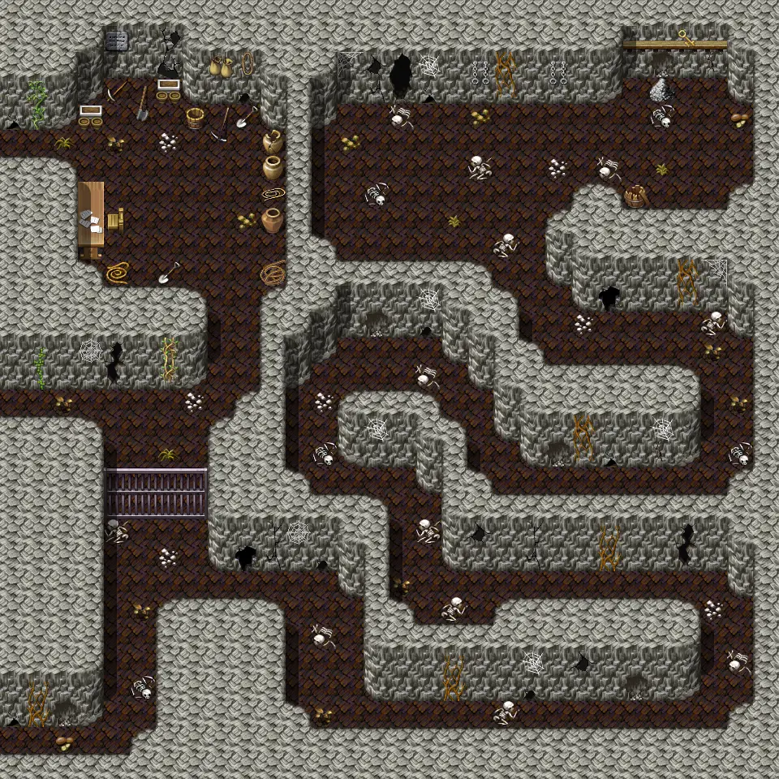

# Lakecave2

30×30 tiles · part of [Lakecave](index.md)

<label class="lg lg-spawn"><input type="checkbox" data-t="spawn" checked> Monsters / NPCs</label><label class="lg lg-mapchange"><input type="checkbox" data-t="mapchange" checked> Exit to another map</label><label class="lg lg-container"><input type="checkbox" data-t="container" checked> Container</label><label class="lg lg-sign"><input type="checkbox" data-t="sign" checked> Sign</label><label class="lg lg-rest"><input type="checkbox" data-t="rest" checked> Resting place</label><label class="lg lg-key"><input type="checkbox" data-t="key" checked> Blocked / needs key or quest</label><label class="lg lg-script"><input type="checkbox" data-t="script"> Scripted event</label><label class="lg lg-replace"><input type="checkbox" data-t="replace"> Changes after a quest</label>

## Exits

- [Lakecave0](lakecave0.md)
- [Lakecave1](lakecave1.md)

## Monsters & NPCs here

| Name | HP |
|---|---|
| [Caeda](../monsters/caeda.md) | 0 |
| [Cave scorpion](../monsters/cave_scorpion_0.md) | 30 |
| [Puny cave scorpion](../monsters/cave_scorpion_2.md) | 30 |
| [Strong cave troll](../monsters/cave_troll_2.md) | 250 |
| [Tough cave troll](../monsters/cave_troll_3.md) | 290 |
| [Cave troll shaman](../monsters/cave_troll_4.md) | 300 |
| [Cave troll leader](../monsters/cave_troll_5.md) | 410 |

<small>Map ID: `lakecave2` · Data from v0.8.18</small>
