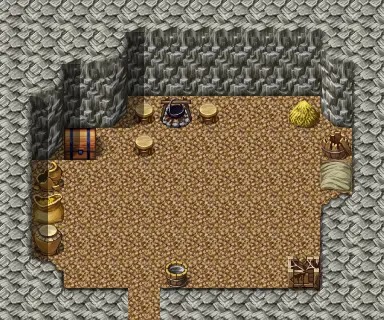
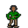

# Ll2 cyclops cave

12×10 tiles

<label class="lg"><input type="checkbox" data-t="spawn" checked><b>Red</b>&nbsp;Monsters / NPCs</label><label class="lg"><input type="checkbox" data-t="mapchange" checked><b>Blue</b>&nbsp;Exit to another map</label><label class="lg"><input type="checkbox" data-t="container" checked><b>Yellow</b>&nbsp;Container (click to see contents)</label><label class="lg"><input type="checkbox" data-t="sign" checked><b>Purple</b>&nbsp;Sign</label><label class="lg"><input type="checkbox" data-t="rest" checked><b>Green</b>&nbsp;Resting place</label><label class="lg"><input type="checkbox" data-t="key" checked><b>Orange dashed</b>&nbsp;Blocked until a quest step / item</label><label class="lg"><input type="checkbox" data-t="script"><b>Grey dotted</b>&nbsp;Scripted event</label><label class="lg"><input type="checkbox" data-t="replace"><b>White dotted</b>&nbsp;Changes during a quest</label>

## Containers

<b>Container 1</b><ul><li><a href="../../items/gold/">Gold coins</a> <small>100% · ×500 to 1500</small></li><li><a href="../../items/ll2_key_polyphem/">Tiny grey stone key from Polyphem</a> <small>100%</small></li></ul>

<b>Container 2</b><ul><li><a href="../../items/soap/">Soap</a> <small>100%</small></li><li><a href="../../items/meat2/">Rotten meat</a> <small>100% · ×1 to 2</small></li><li><a href="../../items/skull1/">Human skull</a> <small>100%</small></li></ul>

## Exits

- [Mountainlake28](mountainlake28.md)

## Monsters & NPCs here

| Name | HP |
|---|---|
| [Polyphem](../monsters/polyphem.md) | 0 |
| [Polyphem](../monsters/polyphem_door.md) | 0 |
| [Polyphem](../monsters/polyphem_bed.md) | 0 |
| [Sheep](../monsters/ll2_cyclops_sheep1.md) | 0 |
| [Sheep](../monsters/ll2_cyclops_sheep2.md) | 0 |
| [Aphem](../monsters/ll2_cyclops2.md) | 100 |
| [Polyasem](../monsters/ll2_cyclops1.md) | 100 |

<small>Map ID: `ll2_cyclops_cave` · Data from v0.8.18</small>
