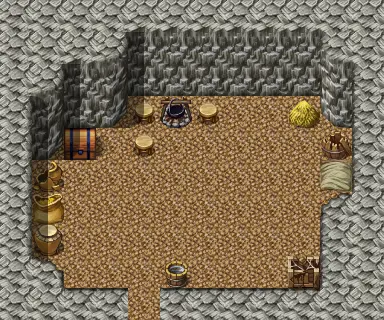
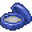

# Ll 2 cyclops cave

| | |
|---|---|
| **Map ID** | `ll2_cyclops_cave` |
| **Type** | Indoors / underground |
| **Size** | 12×10 tiles |
| **Introduced** | [v0.8.18](../versions/0.8.18.md) |
| **NPCs** | 7 |
| **Quests** | 2 |
| **Containers** | 2 |

**Ll 2 cyclops cave** is an indoor map. It has 7 NPCs, and no enemies. Exits lead to Mountainlake 28.

## Map

<label class="lg"><input type="checkbox" data-t="spawn" checked><b>Red</b>&nbsp;Monsters / NPCs</label><label class="lg"><input type="checkbox" data-t="mapchange" checked><b>Blue</b>&nbsp;Exit to another map</label><label class="lg"><input type="checkbox" data-t="container" checked><b>Yellow</b>&nbsp;Container (click to see contents)</label><label class="lg"><input type="checkbox" data-t="sign" checked><b>Purple</b>&nbsp;Sign</label><label class="lg"><input type="checkbox" data-t="rest" checked><b>Green</b>&nbsp;Resting place</label><label class="lg"><input type="checkbox" data-t="key" checked><b>Orange dashed</b>&nbsp;Blocked until a quest step / item</label><label class="lg"><input type="checkbox" data-t="script"><b>Grey dotted</b>&nbsp;Scripted event</label><label class="lg"><input type="checkbox" data-t="replace"><b>White dotted</b>&nbsp;Changes during a quest</label><label class="lg"><input type="checkbox" data-t="pin" checked><b>Numbers</b>&nbsp;Numbered key points (see the key below the map)</label>

<a class="pin pin-exit" href="#key-1" style="left:37.500%;top:95.000%" title="Exit (south): to [Mountainlake 28](mountainlake28.md)">1</a><a id="pin-npc-ll2_cyclops2" class="pin pin-npc" href="#key-2" style="left:54.167%;top:5.000%" title="[Aphem](../../monsters/ll2_cyclops2.md): NPC">2</a><a id="pin-npc-ll2_cyclops1" class="pin pin-npc" href="#key-3" style="left:45.833%;top:5.000%" title="[Polyasem](../../monsters/ll2_cyclops1.md): NPC">3</a><a id="pin-npc-polyphem_door" class="pin pin-npc" href="#key-4" style="left:29.167%;top:85.000%" title="[Polyphem](../../monsters/polyphem.md#v-polyphem_door): 1 quest">4</a><a id="pin-npc-polyphem_bed" class="pin pin-npc" href="#key-5" style="left:87.500%;top:55.000%" title="[Polyphem](../../monsters/polyphem.md#v-polyphem_bed): 1 quest">5</a><a id="pin-npc-polyphem" class="pin pin-npc" href="#key-6" style="left:45.833%;top:65.000%" title="[Polyphem](../../monsters/polyphem.md): 1 quest">6</a><a id="pin-npc-ll2_cyclops_sheep1" class="pin pin-npc" href="#key-7" style="left:62.500%;top:85.000%" title="[Sheep](../../monsters/sheep1.md#v-ll2_cyclops_sheep1): NPC">7</a><a id="pin-npc-ll2_cyclops_sheep2" class="pin pin-npc" href="#key-8" style="left:70.833%;top:45.000%" title="[Sheep](../../monsters/sheep1.md#v-ll2_cyclops_sheep2): 1 quest">8</a><a class="pin pin-container" href="#key-9" style="left:20.833%;top:45.000%" title="Container 1: Gold coins, Tiny grey stone key from Polyphem">9</a><a class="pin pin-container" href="#key-10" style="left:79.167%;top:85.000%" title="Container 2: Soap, Rotten meat, Human skull">10</a><a class="pin pin-script" href="#key-11" style="left:75.548%;top:37.501%" title="Quest trigger: Scripted event: advances the quest: A map of the Great Lake Laeroth to stage 50 (“I was exploring a cave on an island with just sheep, when suddenly the dwarvish cyclops Polyphem enters, together with a flock of sheep. Polyphem has locked the door behind him.”) (+1 more quest(s))">11</a><a class="pin pin-script" href="#key-12" style="left:54.167%;top:60.000%" title="Quest trigger: Scripted event: advances the quest: A map of the Great Lake Laeroth to stage 54 (“Polyphem fell onto his bed and immediatly began to snore. I should find a way to leave.”)">12</a><a class="pin pin-key" href="#key-13" style="left:38.048%;top:87.501%" title="Blocked passage: Closed off once you reach this point in the quest: hidden story flag “ll2_nd” (stage 110: “110=Polyphem door closed”)">13</a><a class="pin pin-key" href="#key-14" style="left:30.166%;top:93.443%" title="Blocked passage: Unlocked during the quest: A map of the Great Lake Laeroth (stage 50: “I was exploring a cave on an island with just sheep, when suddenly the dwarvish cyclops Polyphem enters, together with a flock of sheep. Polyphem has locked the door behind him.”)">14</a><a class="pin pin-key" href="#key-15" style="left:45.833%;top:85.000%" title="Blocked passage: Closed off once you reach this point in the quest: Search for Andor (stage 1: “My father Mikhail says that Andor has not been home since yesterday. I should go look for him in the village.”)">15</a><a class="pin pin-key" href="#key-16" style="left:29.715%;top:77.501%" title="Blocked passage: Unlocked during the quest: Search for Andor (stage 1: “My father Mikhail says that Andor has not been home since yesterday. I should go look for him in the village.”)">16</a><a class="pin pin-key" href="#key-17" style="left:46.056%;top:93.749%" title="Blocked passage: Unlocked during the quest: A map of the Great Lake Laeroth (stage 58: “I hung myself from the side of a strong sheep to let it pull me to freedom.”)">17</a><a class="pin pin-replace" href="#key-18" style="left:41.644%;top:79.372%" title="Changes during a quest: This area changes back during the quest: hidden story flag “ll2_nd” (stage 110: “110=Polyphem door closed”)">18</a><a class="pin pin-replace" href="#key-19" style="left:36.060%;top:76.667%" title="Changes during a quest: This area changes during the quest: hidden story flag “ll2_nd” (stage 110: “110=Polyphem door closed”)">19</a>

??? abstract "Key to the numbers on the map"

    | # | What | Details |
    |---|---|---|
    | 1 | Exit (south) | to [Mountainlake 28](mountainlake28.md) |
    | 2 | [Aphem](../monsters/ll2_cyclops2.md) | NPC |
    | 3 | [Polyasem](../monsters/ll2_cyclops1.md) | NPC |
    | 4 | [Polyphem](../monsters/polyphem.md#v-polyphem_door) | 1 quest |
    | 5 | [Polyphem](../monsters/polyphem.md#v-polyphem_bed) | 1 quest |
    | 6 | [Polyphem](../monsters/polyphem.md) | 1 quest |
    | 7 | [Sheep](../monsters/sheep1.md#v-ll2_cyclops_sheep1) | NPC |
    | 8 | [Sheep](../monsters/sheep1.md#v-ll2_cyclops_sheep2) | 1 quest |
    | 9 | Container 1 | Gold coins, Tiny grey stone key from Polyphem |
    | 10 | Container 2 | Soap, Rotten meat, Human skull |
    | 11 | Quest trigger | Scripted event: advances the quest: A map of the Great Lake Laeroth to stage 50 (“I was exploring a cave on an island with just sheep, when suddenly the dwarvish cyclops Polyphem enters, together with a flock of sheep. Polyphem has locked the door behind him.”) (+1 more quest(s)) |
    | 12 | Quest trigger | Scripted event: advances the quest: A map of the Great Lake Laeroth to stage 54 (“Polyphem fell onto his bed and immediatly began to snore. I should find a way to leave.”) |
    | 13 | Blocked passage | Closed off once you reach this point in the quest: hidden story flag “ll2_nd” (stage 110: “110=Polyphem door closed”) |
    | 14 | Blocked passage | Unlocked during the quest: A map of the Great Lake Laeroth (stage 50: “I was exploring a cave on an island with just sheep, when suddenly the dwarvish cyclops Polyphem enters, together with a flock of sheep. Polyphem has locked the door behind him.”) |
    | 15 | Blocked passage | Closed off once you reach this point in the quest: Search for Andor (stage 1: “My father Mikhail says that Andor has not been home since yesterday. I should go look for him in the village.”) |
    | 16 | Blocked passage | Unlocked during the quest: Search for Andor (stage 1: “My father Mikhail says that Andor has not been home since yesterday. I should go look for him in the village.”) |
    | 17 | Blocked passage | Unlocked during the quest: A map of the Great Lake Laeroth (stage 58: “I hung myself from the side of a strong sheep to let it pull me to freedom.”) |
    | 18 | Changes during a quest | This area changes back during the quest: hidden story flag “ll2_nd” (stage 110: “110=Polyphem door closed”) |
    | 19 | Changes during a quest | This area changes during the quest: hidden story flag “ll2_nd” (stage 110: “110=Polyphem door closed”) |

Verified against v0.8.18 map data.

## Connections

| Direction | Leads to | Region there | Map # |
|---|---|---|---|
| South | [Mountainlake 28](mountainlake28.md) | – | 1 |

## NPCs

- [Aphem](../monsters/ll2_cyclops2.md) — can be fought (#2)
- [Polyasem](../monsters/ll2_cyclops1.md) — can be fought (#3)
- [Polyphem](../monsters/polyphem.md#v-polyphem_door) — quests: [A map of the Great Lake Laeroth](../quests/lake_map.md) (#4)
- [Polyphem](../monsters/polyphem.md#v-polyphem_bed) — quests: [A map of the Great Lake Laeroth](../quests/lake_map.md) (#5)
- [Polyphem](../monsters/polyphem.md) — quests: [A map of the Great Lake Laeroth](../quests/lake_map.md) (#6)
- [Sheep](../monsters/sheep1.md#v-ll2_cyclops_sheep1) (#7)
- [Sheep](../monsters/sheep1.md#v-ll2_cyclops_sheep2) — quests: [A map of the Great Lake Laeroth](../quests/lake_map.md) (#8)

## Items & containers

<b>Container 1</b><ul><li><a href="../../items/gold/">Gold coins</a> <small>100% · ×500 to 1500</small></li><li><a href="../../items/ll2_key_polyphem/">Tiny grey stone key from Polyphem</a> <small>100%</small></li></ul>

<b>Container 2</b><ul><li><a href="../../items/soap/">Soap</a> <small>100%</small></li><li><a href="../../items/meat2/">Rotten meat</a> <small>100% · ×1 to 2</small></li><li><a href="../../items/skull1/">Human skull</a> <small>100%</small></li></ul>

## Quests

- [A map of the Great Lake Laeroth](../quests/lake_map.md): [Polyphem](../monsters/polyphem.md) is involved; [Polyphem](../monsters/polyphem.md#v-polyphem_bed) is involved; [Polyphem](../monsters/polyphem.md#v-polyphem_door) is involved; [Sheep](../monsters/sheep1.md#v-ll2_cyclops_sheep2) is involved; blocked passage opens at stage 50; blocked passage opens at stage 58; something on this map advances it; stepping on a trigger here sets stage 50; stepping on a trigger here sets stage 52; stepping on a trigger here sets stage 54
- [Search for Andor](../quests/andor.md): blocked passage closes at stage 1; blocked passage opens at stage 1
- [Lake Laeroth story flags (hidden flag)](../quests/ll2_nd.md): blocked passage closes at stage 110; part of the map changes at stage 110; something on this map advances it; stepping on a trigger here sets stage 110

## Points of interest

- **Quest trigger** (#11): Scripted event: advances the quest: A map of the Great Lake Laeroth to stage 50 (“I was exploring a cave on an island with just sheep, when suddenly the dwarvish cyclops Polyphem enters, together with a flock of sheep. Polyphem has locked the door behind him.”) (+1 more quest(s))
- **Quest trigger** (#12): Scripted event: advances the quest: A map of the Great Lake Laeroth to stage 54 (“Polyphem fell onto his bed and immediatly began to snore. I should find a way to leave.”)
- **Blocked passage** (#13): Closed off once you reach this point in the quest: hidden story flag “ll2_nd” (stage 110: “110=Polyphem door closed”)
- **Blocked passage** (#14): Unlocked during the quest: A map of the Great Lake Laeroth (stage 50: “I was exploring a cave on an island with just sheep, when suddenly the dwarvish cyclops Polyphem enters, together with a flock of sheep. Polyphem has locked the door behind him.”)
- **Blocked passage** (#15): Closed off once you reach this point in the quest: Search for Andor (stage 1: “My father Mikhail says that Andor has not been home since yesterday. I should go look for him in the village.”)
- **Blocked passage** (#16): Unlocked during the quest: Search for Andor (stage 1: “My father Mikhail says that Andor has not been home since yesterday. I should go look for him in the village.”)
- **Blocked passage** (#17): Unlocked during the quest: A map of the Great Lake Laeroth (stage 58: “I hung myself from the side of a strong sheep to let it pull me to freedom.”)
- **Changes during a quest** (#18): This area changes back during the quest: hidden story flag “ll2_nd” (stage 110: “110=Polyphem door closed”)
- **Changes during a quest** (#19): This area changes during the quest: hidden story flag “ll2_nd” (stage 110: “110=Polyphem door closed”)

## Version history

| Version | Change |
|---|---|
| [v0.8.18](../versions/0.8.18.md) | Added |

Verified against v0.8.18 and every earlier release back to v0.7.0 (game data compared release by release).

## Community notes

<small>Written by players, not generated from game data. **Observations**: what players notice in-game · **Lore**: the in-world story · **Trivia**: real-world facts, references, development history · **Theory / speculation**: unconfirmed ideas; may just be unfinished content</small>

### Observations

*No notes yet. Contributions are welcome: [add a note](https://github.com/asdfghjkl628/Andor-s-Trail-Wikiiii/new/main/notes/maps?filename=ll2_cyclops_cave.md&value=%23%23%20Observations%0A%0A%3C%21--%20what%20players%20notice%20in-game%20--%3E%0A%0A%23%23%20Lore%0A%0A%3C%21--%20the%20in-world%20story%20--%3E%0A%0A%23%23%20Trivia%0A%0A%3C%21--%20real-world%20facts%2C%20references%2C%20development%20history%20--%3E%0A%0A%23%23%20Theory%20/%20speculation%0A%0A%3C%21--%20unconfirmed%20ideas%3B%20may%20just%20be%20unfinished%20content%20--%3E%0A).*

### Lore

*No notes yet. Contributions are welcome: [add a note](https://github.com/asdfghjkl628/Andor-s-Trail-Wikiiii/new/main/notes/maps?filename=ll2_cyclops_cave.md&value=%23%23%20Observations%0A%0A%3C%21--%20what%20players%20notice%20in-game%20--%3E%0A%0A%23%23%20Lore%0A%0A%3C%21--%20the%20in-world%20story%20--%3E%0A%0A%23%23%20Trivia%0A%0A%3C%21--%20real-world%20facts%2C%20references%2C%20development%20history%20--%3E%0A%0A%23%23%20Theory%20/%20speculation%0A%0A%3C%21--%20unconfirmed%20ideas%3B%20may%20just%20be%20unfinished%20content%20--%3E%0A).*

### Trivia

*No notes yet. Contributions are welcome: [add a note](https://github.com/asdfghjkl628/Andor-s-Trail-Wikiiii/new/main/notes/maps?filename=ll2_cyclops_cave.md&value=%23%23%20Observations%0A%0A%3C%21--%20what%20players%20notice%20in-game%20--%3E%0A%0A%23%23%20Lore%0A%0A%3C%21--%20the%20in-world%20story%20--%3E%0A%0A%23%23%20Trivia%0A%0A%3C%21--%20real-world%20facts%2C%20references%2C%20development%20history%20--%3E%0A%0A%23%23%20Theory%20/%20speculation%0A%0A%3C%21--%20unconfirmed%20ideas%3B%20may%20just%20be%20unfinished%20content%20--%3E%0A).*

### Theory / speculation

*No notes yet. Contributions are welcome: [add a note](https://github.com/asdfghjkl628/Andor-s-Trail-Wikiiii/new/main/notes/maps?filename=ll2_cyclops_cave.md&value=%23%23%20Observations%0A%0A%3C%21--%20what%20players%20notice%20in-game%20--%3E%0A%0A%23%23%20Lore%0A%0A%3C%21--%20the%20in-world%20story%20--%3E%0A%0A%23%23%20Trivia%0A%0A%3C%21--%20real-world%20facts%2C%20references%2C%20development%20history%20--%3E%0A%0A%23%23%20Theory%20/%20speculation%0A%0A%3C%21--%20unconfirmed%20ideas%3B%20may%20just%20be%20unfinished%20content%20--%3E%0A).*

??? info "Technical information"

    | | |
    |---|---|
    | Map ID | `ll2_cyclops_cave` |
    | File | `res/xml/ll2_cyclops_cave.tmx` |
    | Size | 12×10 tiles (384×320 px) |
    | outdoors property | – |
    | Layers drawn | base, ground, objects, above |
    | Tilesets | map_bed_1, map_border_1, map_bridge_1, map_bridge_2, map_broken_1, map_cavewall_1, map_cavewall_2, map_cavewall_3, map_cavewall_4, map_chair_table_1, map_chair_table_2, map_crate_1, map_cupboard_1, map_curtain_1, map_entrance_1, map_entrance_2, map_fence_1, map_fence_2, map_fence_3, map_fence_4, map_ground_1, map_ground_2, map_ground_3, map_ground_4, map_ground_5, map_ground_6, map_ground_7, map_ground_8, map_guynmart, map_house_1, map_house_2, map_indoor_1, map_indoor_2, map_kitchen_1, map_outdoor_1, map_pillar_1, map_pillar_2, map_plant_1, map_plant_2, map_rock_1, map_rock_2, map_roof_1, map_roof_2, map_roof_3, map_shop_1, map_sign_ladder_1, map_table_1, map_trail_1, map_transition_1, map_transition_2, map_transition_3, map_transition_4, map_transition_5, map_tree_1, map_tree_2, map_wall_1, map_wall_2, map_wall_3, map_wall_4, map_window_1, map_window_2 |
    | Map objects | spawn: 7, key: 5, container: 2, script: 2, replace: 2, mapchange: 1 |
    | World map position | – |

<small>Data from v0.8.18</small>
