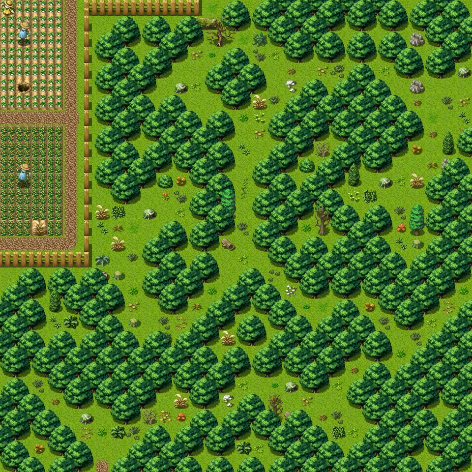

# Lodar0

30×30 tiles · outdoors · part of [World1](index.md)

<label class="lg lg-spawn"><input type="checkbox" data-t="spawn" checked> Monsters / NPCs</label><label class="lg lg-mapchange"><input type="checkbox" data-t="mapchange" checked> Exit to another map</label><label class="lg lg-container"><input type="checkbox" data-t="container" checked> Container</label><label class="lg lg-sign"><input type="checkbox" data-t="sign" checked> Sign</label><label class="lg lg-rest"><input type="checkbox" data-t="rest" checked> Resting place</label><label class="lg lg-key"><input type="checkbox" data-t="key" checked> Blocked / needs key or quest</label><label class="lg lg-script"><input type="checkbox" data-t="script"> Scripted event</label><label class="lg lg-replace"><input type="checkbox" data-t="replace"> Changes after a quest</label>

## Exits

- [Lodar1](lodar1.md)
- [Lodar2](lodar2.md)
- [Lodar5](lodar5.md)
- [Loneford12](loneford12.md)
- [Loneford13](loneford13.md)
- [Roadbeforecrossroads1](roadbeforecrossroads1.md)

## Monsters & NPCs here

| Name | HP |
|---|---|
| [Forest guardian](../monsters/lodar0_g.md) | 0 |
| [Giant dungfly](../monsters/dungfly1.md) | 16 |
| [Aggressive dungfly](../monsters/dungfly2.md) | 23 |
| [Small horned anklebiter](../monsters/anklebiter2.md) | 38 |
| [Young horned anklebiter](../monsters/anklebiter3.md) | 46 |

<small>Map ID: `lodar0` · Data from v0.8.18</small>
