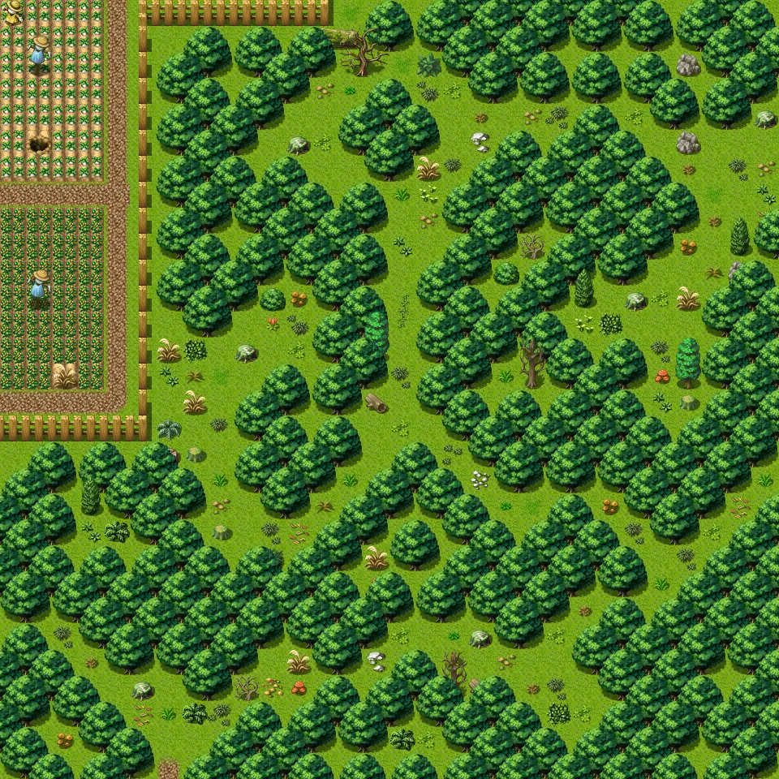

# Lodar 0

| | |
|---|---|
| **Map ID** | `lodar0` |
| **Region** | Near Loneford (settlement) |
| **Type** | Outdoors |
| **Size** | 30×30 tiles |
| **World map** | [World 1](index.md) |
| **Introduced** | v0.7.0 or earlier |
| **NPCs** | 1 |
| **Enemy types** | 4 |
| **Quests** | 1 |

**Lodar 0** is an outdoor map, near Loneford (settlement). It has 1 NPC and 4 kinds of enemy. Exits lead to Loneford 13, Lodar 2, Lodar 5, Roadbeforecrossroads 1 and 2 more.

## Map

<label class="lg"><input type="checkbox" data-t="spawn" checked><b>Red</b>&nbsp;Monsters / NPCs</label><label class="lg"><input type="checkbox" data-t="mapchange" checked><b>Blue</b>&nbsp;Exit to another map</label><label class="lg"><input type="checkbox" data-t="container" checked><b>Yellow</b>&nbsp;Container (click to see contents)</label><label class="lg"><input type="checkbox" data-t="sign" checked><b>Purple</b>&nbsp;Sign</label><label class="lg"><input type="checkbox" data-t="rest" checked><b>Green</b>&nbsp;Resting place</label><label class="lg"><input type="checkbox" data-t="key" checked><b>Orange dashed</b>&nbsp;Blocked until a quest step / item</label><label class="lg"><input type="checkbox" data-t="script"><b>Grey dotted</b>&nbsp;Scripted event</label><label class="lg"><input type="checkbox" data-t="replace"><b>White dotted</b>&nbsp;Changes during a quest</label><label class="lg"><input type="checkbox" data-t="pin" checked><b>Numbers</b>&nbsp;Numbered key points (see the key below the map)</label>

<a class="pin pin-exit" href="#key-1" style="left:10.000%;top:1.667%" title="Exit (north): to [Loneford 13](loneford13.md)">1</a><a class="pin pin-exit" href="#key-2" style="left:98.333%;top:21.667%" title="Exit (east): to [Lodar 2](lodar2.md)">2</a><a class="pin pin-exit" href="#key-3" style="left:98.333%;top:63.333%" title="Exit (east): to [Lodar 5](lodar5.md)">3</a><a class="pin pin-exit" href="#key-4" style="left:21.667%;top:98.333%" title="Exit (south): to [Roadbeforecrossroads 1](roadbeforecrossroads1.md)">4</a><a class="pin pin-exit" href="#key-5" style="left:1.667%;top:81.667%" title="Exit (west): to [Lodar 1](lodar1.md)">5</a><a class="pin pin-exit" href="#key-6" style="left:1.667%;top:28.333%" title="Exit (west): to [Loneford 12](loneford12.md)">6</a><a id="pin-npc-lodar0_g" class="pin pin-npc" href="#key-7" style="left:61.667%;top:85.000%" title="[Forest guardian](../../monsters/lodar0_g.md): 1 quest">7</a>

??? abstract "Key to the numbers on the map"

    | # | What | Details |
    |---|---|---|
    | 1 | Exit (north) | to [Loneford 13](loneford13.md) |
    | 2 | Exit (east) | to [Lodar 2](lodar2.md) |
    | 3 | Exit (east) | to [Lodar 5](lodar5.md) |
    | 4 | Exit (south) | to [Roadbeforecrossroads 1](roadbeforecrossroads1.md) |
    | 5 | Exit (west) | to [Lodar 1](lodar1.md) |
    | 6 | Exit (west) | to [Loneford 12](loneford12.md) |
    | 7 | [Forest guardian](../monsters/lodar0_g.md) | 1 quest |

Verified against v0.8.18 map data.

## Connections

| Direction | Leads to | Region there | Map # |
|---|---|---|---|
| North | [Loneford 13](loneford13.md) | Loneford | 1 |
| East | [Lodar 2](lodar2.md) | Loneford | 2 |
| East | [Lodar 5](lodar5.md) | Loneford | 3 |
| South | [Roadbeforecrossroads 1](roadbeforecrossroads1.md) | Crossroads Guardhouse | 4 |
| West | [Lodar 1](lodar1.md) | Loneford | 5 |
| West | [Loneford 12](loneford12.md) | Crossroads Guardhouse | 6 |

## NPCs

- [Forest guardian](../monsters/lodar0_g.md) — quests: [A lost potion](../quests/lodar.md) (#7)

## Enemies

| Enemy | HP | Damage | Up to | Notes |
|---|---|---|---|---|
| [Giant dungfly](../monsters/dungfly1.md) | 16 | 4–5 | 23 | shares spawn with Aggressive dungfly |
| [Aggressive dungfly](../monsters/dungfly2.md) | 23 | 5–7 | 23 | shares spawn with Giant dungfly |
| [Small horned anklebiter](../monsters/anklebiter2.md) | 38 | 3–7 | 3 | shares spawn with Young horned anklebiter |
| [Young horned anklebiter](../monsters/anklebiter3.md) | 46 | 5–7 | 3 | shares spawn with Small horned anklebiter |

<small>“Up to” is the most that can be alive at once from the spawn areas on this map.</small>

## Quests

- [A lost potion](../quests/lodar.md): [Forest guardian](../monsters/lodar0_g.md) is involved

## Version history

| Version | Change |
|---|---|
| [v0.7.0](../versions/0.7.0.md) | Present in v0.7.0 (earliest release tracked) |
| [v0.7.1](../versions/0.7.1.md) | Map layout or objects changed |
| [v0.7.2](../versions/0.7.2.md) | Map layout or objects changed |

Verified against v0.8.18 and every earlier release back to v0.7.0 (game data compared release by release).

## Community notes

<small>Written by players, not generated from game data. **Observations**: what players notice in-game · **Lore**: the in-world story · **Trivia**: real-world facts, references, development history · **Theory / speculation**: unconfirmed ideas; may just be unfinished content</small>

### Observations

*No notes yet. Contributions are welcome: [add a note](https://github.com/asdfghjkl628/Andor-s-Trail-Wikiiii/new/main/notes/maps?filename=lodar0.md&value=%23%23%20Observations%0A%0A%3C%21--%20what%20players%20notice%20in-game%20--%3E%0A%0A%23%23%20Lore%0A%0A%3C%21--%20the%20in-world%20story%20--%3E%0A%0A%23%23%20Trivia%0A%0A%3C%21--%20real-world%20facts%2C%20references%2C%20development%20history%20--%3E%0A%0A%23%23%20Theory%20/%20speculation%0A%0A%3C%21--%20unconfirmed%20ideas%3B%20may%20just%20be%20unfinished%20content%20--%3E%0A).*

### Lore

*No notes yet. Contributions are welcome: [add a note](https://github.com/asdfghjkl628/Andor-s-Trail-Wikiiii/new/main/notes/maps?filename=lodar0.md&value=%23%23%20Observations%0A%0A%3C%21--%20what%20players%20notice%20in-game%20--%3E%0A%0A%23%23%20Lore%0A%0A%3C%21--%20the%20in-world%20story%20--%3E%0A%0A%23%23%20Trivia%0A%0A%3C%21--%20real-world%20facts%2C%20references%2C%20development%20history%20--%3E%0A%0A%23%23%20Theory%20/%20speculation%0A%0A%3C%21--%20unconfirmed%20ideas%3B%20may%20just%20be%20unfinished%20content%20--%3E%0A).*

### Trivia

*No notes yet. Contributions are welcome: [add a note](https://github.com/asdfghjkl628/Andor-s-Trail-Wikiiii/new/main/notes/maps?filename=lodar0.md&value=%23%23%20Observations%0A%0A%3C%21--%20what%20players%20notice%20in-game%20--%3E%0A%0A%23%23%20Lore%0A%0A%3C%21--%20the%20in-world%20story%20--%3E%0A%0A%23%23%20Trivia%0A%0A%3C%21--%20real-world%20facts%2C%20references%2C%20development%20history%20--%3E%0A%0A%23%23%20Theory%20/%20speculation%0A%0A%3C%21--%20unconfirmed%20ideas%3B%20may%20just%20be%20unfinished%20content%20--%3E%0A).*

### Theory / speculation

*No notes yet. Contributions are welcome: [add a note](https://github.com/asdfghjkl628/Andor-s-Trail-Wikiiii/new/main/notes/maps?filename=lodar0.md&value=%23%23%20Observations%0A%0A%3C%21--%20what%20players%20notice%20in-game%20--%3E%0A%0A%23%23%20Lore%0A%0A%3C%21--%20the%20in-world%20story%20--%3E%0A%0A%23%23%20Trivia%0A%0A%3C%21--%20real-world%20facts%2C%20references%2C%20development%20history%20--%3E%0A%0A%23%23%20Theory%20/%20speculation%0A%0A%3C%21--%20unconfirmed%20ideas%3B%20may%20just%20be%20unfinished%20content%20--%3E%0A).*

??? info "Technical information"

    | | |
    |---|---|
    | Map ID | `lodar0` |
    | File | `res/xml/lodar0.tmx` |
    | Size | 30×30 tiles (960×960 px) |
    | outdoors property | 1 |
    | Layers drawn | ground, objects, above |
    | Tilesets | map_bed_1, map_border_1, map_bridge_1, map_bridge_2, map_broken_1, map_cavewall_1, map_cavewall_2, map_cavewall_3, map_cavewall_4, map_chair_table_1, map_chair_table_2, map_crate_1, map_cupboard_1, map_curtain_1, map_entrance_1, map_entrance_2, map_fence_1, map_fence_2, map_fence_3, map_fence_4, map_ground_1, map_ground_2, map_ground_3, map_ground_4, map_ground_5, map_ground_6, map_ground_7, map_ground_8, map_house_1, map_house_2, map_indoor_1, map_indoor_2, map_kitchen_1, map_outdoor_1, map_pillar_1, map_pillar_2, map_plant_1, map_plant_2, map_rock_1, map_rock_2, map_roof_1, map_roof_2, map_roof_3, map_shop_1, map_sign_ladder_1, map_table_1, map_trail_1, map_transition_1, map_transition_2, map_transition_3, map_transition_4, map_transition_5, map_tree_1, map_tree_2, map_wall_1, map_wall_2, map_wall_3, map_wall_4, map_window_1, map_window_2 |
    | Map objects | spawn: 12, mapchange: 6 |
    | World map position | segment `world1`, x 250, y 291 |

<small>Data from v0.8.18</small>
