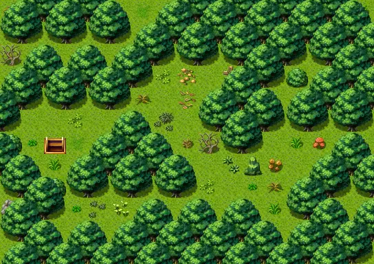

# Lodar1

17×12 tiles · outdoors · part of [World1](index.md)

<label class="lg lg-spawn"><input type="checkbox" data-t="spawn" checked> Monsters / NPCs</label><label class="lg lg-mapchange"><input type="checkbox" data-t="mapchange" checked> Exit to another map</label><label class="lg lg-container"><input type="checkbox" data-t="container" checked> Container</label><label class="lg lg-sign"><input type="checkbox" data-t="sign" checked> Sign</label><label class="lg lg-rest"><input type="checkbox" data-t="rest" checked> Resting place</label><label class="lg lg-key"><input type="checkbox" data-t="key" checked> Blocked / needs key or quest</label><label class="lg lg-script"><input type="checkbox" data-t="script"> Scripted event</label><label class="lg lg-replace"><input type="checkbox" data-t="replace"> Changes after a quest</label>

## Exits

- [Lodar0](lodar0.md)
- [Lodar1cave0](lodar1cave0.md)

## Monsters & NPCs here

| Name | HP |
|---|---|
| [Giant dungfly](../monsters/dungfly1.md) | 16 |
| [Aggressive dungfly](../monsters/dungfly2.md) | 23 |
| [Mudfiend](../monsters/mudfiend1.md) | 37 |
| [Tough mudfiend](../monsters/mudfiend2.md) | 41 |

<small>Map ID: `lodar1` · Data from v0.8.18</small>
