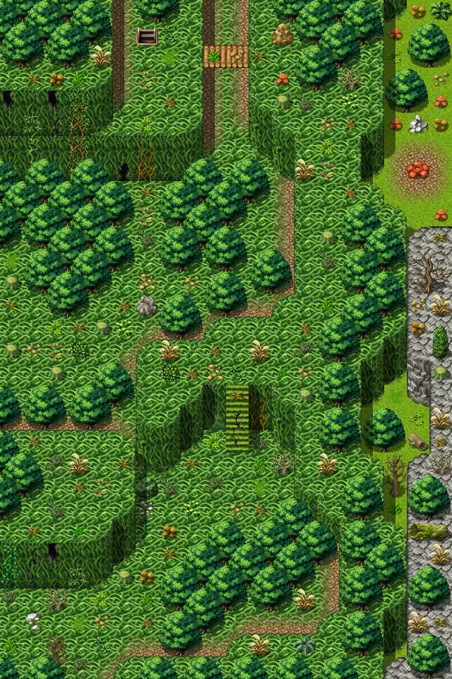

# Lodar12

20×30 tiles · outdoors · part of [World1](index.md)

<label class="lg lg-spawn"><input type="checkbox" data-t="spawn" checked> Monsters / NPCs</label><label class="lg lg-mapchange"><input type="checkbox" data-t="mapchange" checked> Exit to another map</label><label class="lg lg-container"><input type="checkbox" data-t="container" checked> Container</label><label class="lg lg-sign"><input type="checkbox" data-t="sign" checked> Sign</label><label class="lg lg-rest"><input type="checkbox" data-t="rest" checked> Resting place</label><label class="lg lg-key"><input type="checkbox" data-t="key" checked> Blocked / needs key or quest</label><label class="lg lg-script"><input type="checkbox" data-t="script"> Scripted event</label><label class="lg lg-replace"><input type="checkbox" data-t="replace"> Changes after a quest</label>

## Exits

- [Lodar11](lodar11.md)
- [Lodar12cave0](lodar12cave0.md)
- [Lodar20](lodar20.md)

## Monsters & NPCs here

| Name | HP |
|---|---|
| [Morkin lookout](../monsters/morkin1.md) | 145 |
| [Morkin scout](../monsters/morkin2.md) | 152 |
| [Morkin fighter](../monsters/morkin3.md) | 159 |
| [Morkin guard](../monsters/morkin4.md) | 165 |
| [Morkin berserker](../monsters/morkin5.md) | 171 |
| [Morkin leader](../monsters/morkin6.md) | 175 |
| [Morkin elder](../monsters/morkin_cr.md) | 375 |

<small>Map ID: `lodar12` · Data from v0.8.18</small>
