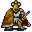

# Lodar12

20×30 tiles · outdoors · part of [World1](index.md)

<label class="lg"><input type="checkbox" data-t="spawn" checked><b>Red</b>&nbsp;Monsters / NPCs</label><label class="lg"><input type="checkbox" data-t="mapchange" checked><b>Blue</b>&nbsp;Exit to another map</label><label class="lg"><input type="checkbox" data-t="container" checked><b>Yellow</b>&nbsp;Container (click to see contents)</label><label class="lg"><input type="checkbox" data-t="sign" checked><b>Purple</b>&nbsp;Sign</label><label class="lg"><input type="checkbox" data-t="rest" checked><b>Green</b>&nbsp;Resting place</label><label class="lg"><input type="checkbox" data-t="key" checked><b>Orange dashed</b>&nbsp;Blocked until a quest step / item</label><label class="lg"><input type="checkbox" data-t="script"><b>Grey dotted</b>&nbsp;Scripted event</label><label class="lg"><input type="checkbox" data-t="replace"><b>White dotted</b>&nbsp;Changes during a quest</label>

## Exits

- [Lodar11](lodar11.md)
- [Lodar12cave0](lodar12cave0.md)
- [Lodar20](lodar20.md)

## Monsters & NPCs here

| Name | HP |
|---|---|
| [Morkin lookout](../monsters/morkin1.md) | 145 |
| [Morkin scout](../monsters/morkin2.md) | 152 |
| [Morkin fighter](../monsters/morkin3.md) | 159 |
| [Morkin guard](../monsters/morkin4.md) | 165 |
| [Morkin berserker](../monsters/morkin5.md) | 171 |
| [Morkin leader](../monsters/morkin6.md) | 175 |
| [Morkin elder](../monsters/morkin_cr.md) | 375 |

<small>Map ID: `lodar12` · Data from v0.8.18</small>
