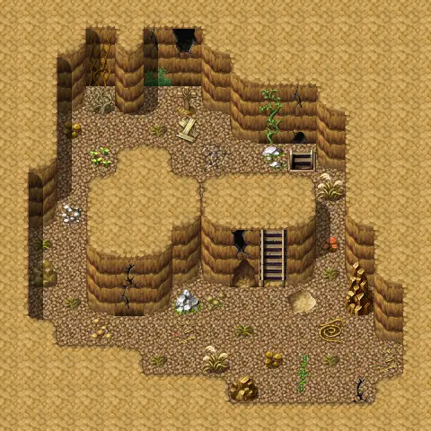

# Lodar12cave0

15×15 tiles

<label class="lg"><input type="checkbox" data-t="spawn" checked><b>Red</b>&nbsp;Monsters / NPCs</label><label class="lg"><input type="checkbox" data-t="mapchange" checked><b>Blue</b>&nbsp;Exit to another map</label><label class="lg"><input type="checkbox" data-t="container" checked><b>Yellow</b>&nbsp;Container (click to see contents)</label><label class="lg"><input type="checkbox" data-t="sign" checked><b>Purple</b>&nbsp;Sign</label><label class="lg"><input type="checkbox" data-t="rest" checked><b>Green</b>&nbsp;Resting place</label><label class="lg"><input type="checkbox" data-t="key" checked><b>Orange dashed</b>&nbsp;Blocked until a quest step / item</label><label class="lg"><input type="checkbox" data-t="script"><b>Grey dotted</b>&nbsp;Scripted event</label><label class="lg"><input type="checkbox" data-t="replace"><b>White dotted</b>&nbsp;Changes during a quest</label>

## Exits

- [Lodar12](lodar12.md)
- [Lodar12cave1](lodar12cave1.md)

## Monsters & NPCs here

| Name | HP |
|---|---|
| [Gray cave bat](../monsters/cavebat1.md) | 28 |
| [Black cave bat](../monsters/cavebat2.md) | 32 |
| [Brown cave bat](../monsters/cavebat3.md) | 36 |
| [Thin mist of the crypt](../monsters/cryptmist1.md) | 162 |
| [Clear mist of the crypt](../monsters/cryptmist2.md) | 166 |
| [Mist of the crypt](../monsters/cryptmist3.md) | 170 |
| [Thick mist of the crypt](../monsters/cryptmist4.md) | 174 |

<small>Map ID: `lodar12cave0` · Data from v0.8.18</small>
