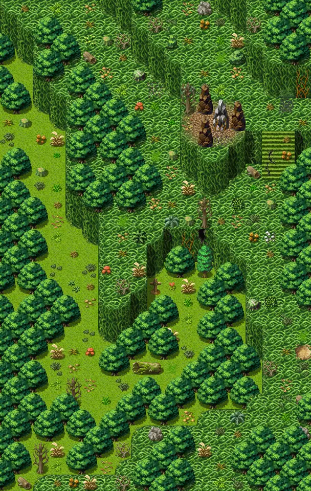

# Lodar14

19×30 tiles · outdoors · part of [World1](index.md)

<label class="lg lg-spawn"><input type="checkbox" data-t="spawn" checked> Monsters / NPCs</label><label class="lg lg-mapchange"><input type="checkbox" data-t="mapchange" checked> Exit to another map</label><label class="lg lg-container"><input type="checkbox" data-t="container" checked> Container</label><label class="lg lg-sign"><input type="checkbox" data-t="sign" checked> Sign</label><label class="lg lg-rest"><input type="checkbox" data-t="rest" checked> Resting place</label><label class="lg lg-key"><input type="checkbox" data-t="key" checked> Blocked / needs key or quest</label><label class="lg lg-script"><input type="checkbox" data-t="script"> Scripted event</label><label class="lg lg-replace"><input type="checkbox" data-t="replace"> Changes after a quest</label>

## Exits

- [Lodar13](lodar13.md)
- [Lodar15](lodar15.md)
- [Lodar16](lodar16.md)
- [Lodar7](lodar7.md)

## Monsters & NPCs here

| Name | HP |
|---|---|
| [Giant dungfly](../monsters/dungfly1.md) | 16 |
| [Aggressive dungfly](../monsters/dungfly2.md) | 23 |
| [Puny yellowjacket](../monsters/yjacket1.md) | 31 |
| [Small yellowjacket](../monsters/yjacket2.md) | 37 |
| [Small horned anklebiter](../monsters/anklebiter2.md) | 38 |
| [Swarming yellowjacket](../monsters/yjacket3.md) | 42 |
| [Young horned anklebiter](../monsters/anklebiter3.md) | 46 |
| [Stinging yellowjacket](../monsters/yjacket4.md) | 48 |
| [Quick yellowjacket](../monsters/yjacket5.md) | 53 |
| [Aggressive yellowjacket](../monsters/yjacket6.md) | 58 |
| [Enraged yellowjacket](../monsters/yjacket7.md) | 66 |
| [Giant yellowjacket](../monsters/yjacket8.md) | 74 |
| [Young erumen forest lizard](../monsters/erumen_8.md) | 92 |
| [Erumen forest lizard](../monsters/erumen_9.md) | 107 |
| [Tiqui](../monsters/tiqui.md) | 145 |
| [Zortak scout](../monsters/zortak1.md) | 173 |

<small>Map ID: `lodar14` · Data from v0.8.18</small>
