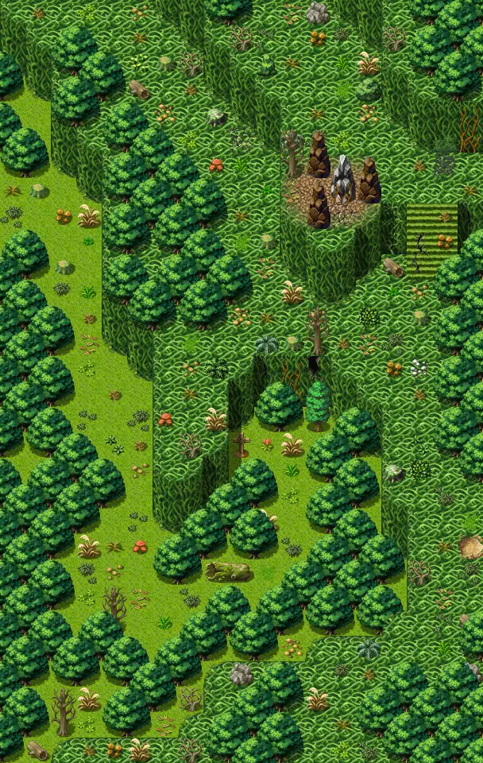

# Lodar14

| | |
|---|---|
| **Map ID** | `lodar14` |
| **Type** | Outdoors |
| **Size** | 19×30 tiles |
| **World map** | [World1](index.md) |
| **Introduced** | v0.7.0 or earlier |
| **NPCs** | 1 |
| **Enemy types** | 15 |
| **Quests** | 2 |

**Lodar14** is an outdoor map. It has 1 NPC and 15 kinds of enemy. Exits lead to Lodar7, Lodar16, Lodar15, Lodar13.

## Map

<label class="lg"><input type="checkbox" data-t="spawn" checked><b>Red</b>&nbsp;Monsters / NPCs</label><label class="lg"><input type="checkbox" data-t="mapchange" checked><b>Blue</b>&nbsp;Exit to another map</label><label class="lg"><input type="checkbox" data-t="container" checked><b>Yellow</b>&nbsp;Container (click to see contents)</label><label class="lg"><input type="checkbox" data-t="sign" checked><b>Purple</b>&nbsp;Sign</label><label class="lg"><input type="checkbox" data-t="rest" checked><b>Green</b>&nbsp;Resting place</label><label class="lg"><input type="checkbox" data-t="key" checked><b>Orange dashed</b>&nbsp;Blocked until a quest step / item</label><label class="lg"><input type="checkbox" data-t="script"><b>Grey dotted</b>&nbsp;Scripted event</label><label class="lg"><input type="checkbox" data-t="replace"><b>White dotted</b>&nbsp;Changes during a quest</label><label class="lg"><input type="checkbox" data-t="pin" checked><b>Numbers</b>&nbsp;Numbered key points (see the key below the map)</label>

<a class="pin pin-exit" href="#key-1" style="left:18.421%;top:1.667%" title="Exit (north): to [Lodar7](lodar7.md)">1</a><a class="pin pin-exit" href="#key-1" style="left:57.895%;top:1.667%" title="Exit (north): to [Lodar7](lodar7.md)">1</a><a class="pin pin-exit" href="#key-2" style="left:97.368%;top:23.333%" title="Exit (east): to [Lodar16](lodar16.md)">2</a><a class="pin pin-exit" href="#key-2" style="left:97.368%;top:71.667%" title="Exit (east): to [Lodar16](lodar16.md)">2</a><a class="pin pin-exit" href="#key-3" style="left:71.053%;top:98.333%" title="Exit (south): to [Lodar15](lodar15.md)">3</a><a class="pin pin-exit" href="#key-4" style="left:2.632%;top:28.333%" title="Exit (west): to [Lodar13](lodar13.md)">4</a><a id="pin-npc-tiqui" class="pin pin-npc" href="#key-5" style="left:55.263%;top:58.333%" title="[Tiqui](../../monsters/tiqui.md): 1 quest">5</a><a class="pin pin-sign" href="#key-6" style="left:86.842%;top:26.667%" title="Sign: A sign">6</a>

??? abstract "Key to the numbers on the map"

    | # | What | Details |
    |---|---|---|
    | 1 | Exit (north) | to [Lodar7](lodar7.md) |
    | 2 | Exit (east) | to [Lodar16](lodar16.md) |
    | 3 | Exit (south) | to [Lodar15](lodar15.md) |
    | 4 | Exit (west) | to [Lodar13](lodar13.md) |
    | 5 | [Tiqui](../monsters/tiqui.md) | 1 quest |
    | 6 | Sign | A sign |

Verified against v0.8.18 map data.

## Connections

| Direction | Leads to | Region there | Map # |
|---|---|---|---|
| North | [Lodar7](lodar7.md) | – | 1 |
| East | [Lodar16](lodar16.md) | – | 2 |
| South | [Lodar15](lodar15.md) | – | 3 |
| West | [Lodar13](lodar13.md) | – | 4 |

## NPCs

- [Tiqui](../monsters/tiqui.md) — can be fought — quests: [No rest for the guilty](../quests/lodar13_rest.md) (#5)

## Enemies

| Enemy | HP | Damage | Up to | Notes |
|---|---|---|---|---|
| [Giant dungfly](../monsters/dungfly1.md) | 16 | 4–5 | 5 | shares spawn with Aggressive dungfly |
| [Aggressive dungfly](../monsters/dungfly2.md) | 23 | 5–7 | 5 | shares spawn with Giant dungfly |
| [Puny yellowjacket](../monsters/yjacket1.md) | 31 | 3–4 | 2 | shares spawn with Small yellowjacket, Swarming yellowjacket |
| [Small yellowjacket](../monsters/yjacket2.md) | 37 | 3–4 | 2 | shares spawn with Puny yellowjacket, Swarming yellowjacket |
| [Small horned anklebiter](../monsters/anklebiter2.md) | 38 | 3–7 | 1 | shares spawn with Young horned anklebiter |
| [Swarming yellowjacket](../monsters/yjacket3.md) | 42 | 3–4 | 2 | shares spawn with Puny yellowjacket, Small yellowjacket |
| [Young horned anklebiter](../monsters/anklebiter3.md) | 46 | 5–7 | 1 | shares spawn with Small horned anklebiter |
| [Stinging yellowjacket](../monsters/yjacket4.md) | 48 | 3–4 | 11 | shares spawn with Quick yellowjacket |
| [Quick yellowjacket](../monsters/yjacket5.md) | 53 | 3–4 | 11 | shares spawn with Stinging yellowjacket |
| [Aggressive yellowjacket](../monsters/yjacket6.md) | 58 | 3–4 | 5 | shares spawn with Enraged yellowjacket |
| [Enraged yellowjacket](../monsters/yjacket7.md) | 66 | 3–4 | 5 | shares spawn with Aggressive yellowjacket |
| [Giant yellowjacket](../monsters/yjacket8.md) | 74 | 3–4 | 2 | – |
| [Young erumen forest lizard](../monsters/erumen_8.md) | 92 | 4–7 | 5 | shares spawn with Erumen forest lizard |
| [Erumen forest lizard](../monsters/erumen_9.md) | 107 | 6–7 | 5 | shares spawn with Young erumen forest lizard |
| [Zortak scout](../monsters/zortak1.md) | 173 | 4–12 | 1 | – |

<small>“Up to” is the most that can be alive at once from the spawn areas on this map.</small>

## Quests

- [A lost potion](../quests/lodar.md): something on this map advances it
- [No rest for the guilty](../quests/lodar13_rest.md): [Tiqui](../monsters/tiqui.md) is involved

## Points of interest

- **Sign** (#6): A sign

## Version history

| Version | Change |
|---|---|
| [v0.7.0](../versions/0.7.0.md) | Present in v0.7.0 (earliest release tracked) |
| [v0.7.1](../versions/0.7.1.md) | map layout or objects changed |
| [v0.7.2](../versions/0.7.2.md) | map layout or objects changed |
| [v0.8.2](../versions/0.8.2.md) | map layout or objects changed |

Verified against v0.8.18 and every earlier release back to v0.7.0 (game data compared release by release).

## Community notes

<small>Written by players, not generated from game data. **Observations**: what players notice in-game · **Lore**: the in-world story · **Trivia**: real-world facts, references, development history · **Theory / speculation**: unconfirmed ideas; may just be unfinished content</small>

### Observations

*No notes yet. Contributions are welcome: [add a note](https://github.com/asdfghjkl628/Andor-s-Trail-Wikiiii/new/main/notes/maps?filename=lodar14.md&value=%23%23%20Observations%0A%0A%3C%21--%20what%20players%20notice%20in-game%20--%3E%0A%0A%23%23%20Lore%0A%0A%3C%21--%20the%20in-world%20story%20--%3E%0A%0A%23%23%20Trivia%0A%0A%3C%21--%20real-world%20facts%2C%20references%2C%20development%20history%20--%3E%0A%0A%23%23%20Theory%20/%20speculation%0A%0A%3C%21--%20unconfirmed%20ideas%3B%20may%20just%20be%20unfinished%20content%20--%3E%0A).*

### Lore

*No notes yet. Contributions are welcome: [add a note](https://github.com/asdfghjkl628/Andor-s-Trail-Wikiiii/new/main/notes/maps?filename=lodar14.md&value=%23%23%20Observations%0A%0A%3C%21--%20what%20players%20notice%20in-game%20--%3E%0A%0A%23%23%20Lore%0A%0A%3C%21--%20the%20in-world%20story%20--%3E%0A%0A%23%23%20Trivia%0A%0A%3C%21--%20real-world%20facts%2C%20references%2C%20development%20history%20--%3E%0A%0A%23%23%20Theory%20/%20speculation%0A%0A%3C%21--%20unconfirmed%20ideas%3B%20may%20just%20be%20unfinished%20content%20--%3E%0A).*

### Trivia

*No notes yet. Contributions are welcome: [add a note](https://github.com/asdfghjkl628/Andor-s-Trail-Wikiiii/new/main/notes/maps?filename=lodar14.md&value=%23%23%20Observations%0A%0A%3C%21--%20what%20players%20notice%20in-game%20--%3E%0A%0A%23%23%20Lore%0A%0A%3C%21--%20the%20in-world%20story%20--%3E%0A%0A%23%23%20Trivia%0A%0A%3C%21--%20real-world%20facts%2C%20references%2C%20development%20history%20--%3E%0A%0A%23%23%20Theory%20/%20speculation%0A%0A%3C%21--%20unconfirmed%20ideas%3B%20may%20just%20be%20unfinished%20content%20--%3E%0A).*

### Theory / speculation

*No notes yet. Contributions are welcome: [add a note](https://github.com/asdfghjkl628/Andor-s-Trail-Wikiiii/new/main/notes/maps?filename=lodar14.md&value=%23%23%20Observations%0A%0A%3C%21--%20what%20players%20notice%20in-game%20--%3E%0A%0A%23%23%20Lore%0A%0A%3C%21--%20the%20in-world%20story%20--%3E%0A%0A%23%23%20Trivia%0A%0A%3C%21--%20real-world%20facts%2C%20references%2C%20development%20history%20--%3E%0A%0A%23%23%20Theory%20/%20speculation%0A%0A%3C%21--%20unconfirmed%20ideas%3B%20may%20just%20be%20unfinished%20content%20--%3E%0A).*

??? info "Technical information"

    | | |
    |---|---|
    | Map ID | `lodar14` |
    | File | `res/xml/lodar14.tmx` |
    | Size | 19×30 tiles (608×960 px) |
    | outdoors property | 1 |
    | Layers drawn | ground, objects, above |
    | Tilesets | map_bed_1, map_border_1, map_bridge_1, map_bridge_2, map_broken_1, map_cavewall_1, map_cavewall_2, map_cavewall_3, map_cavewall_4, map_chair_table_1, map_chair_table_2, map_crate_1, map_cupboard_1, map_curtain_1, map_entrance_1, map_entrance_2, map_fence_1, map_fence_2, map_fence_3, map_fence_4, map_ground_1, map_ground_2, map_ground_3, map_ground_4, map_ground_5, map_ground_6, map_ground_7, map_ground_8, map_house_1, map_house_2, map_indoor_1, map_indoor_2, map_kitchen_1, map_outdoor_1, map_pillar_1, map_pillar_2, map_plant_1, map_plant_2, map_rock_1, map_rock_2, map_roof_1, map_roof_2, map_roof_3, map_shop_1, map_sign_ladder_1, map_table_1, map_trail_1, map_transition_1, map_transition_2, map_transition_3, map_transition_4, map_transition_5, map_tree_1, map_tree_2, map_wall_1, map_wall_2, map_wall_3, map_wall_4, map_window_1, map_window_2 |
    | Map objects | spawn: 19, mapchange: 6, replace: 3, sign: 1 |
    | World map position | segment `world1`, x 293, y 353 |

<small>Data from v0.8.18</small>
