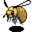

# Lodar15

19×19 tiles · outdoors · part of [World1](index.md)

<label class="lg"><input type="checkbox" data-t="spawn" checked><b>Red</b>&nbsp;Monsters / NPCs</label><label class="lg"><input type="checkbox" data-t="mapchange" checked><b>Blue</b>&nbsp;Exit to another map</label><label class="lg"><input type="checkbox" data-t="container" checked><b>Yellow</b>&nbsp;Container (click to see contents)</label><label class="lg"><input type="checkbox" data-t="sign" checked><b>Purple</b>&nbsp;Sign</label><label class="lg"><input type="checkbox" data-t="rest" checked><b>Green</b>&nbsp;Resting place</label><label class="lg"><input type="checkbox" data-t="key" checked><b>Orange dashed</b>&nbsp;Blocked until a quest step / item</label><label class="lg"><input type="checkbox" data-t="script"><b>Grey dotted</b>&nbsp;Scripted event</label><label class="lg"><input type="checkbox" data-t="replace"><b>White dotted</b>&nbsp;Changes during a quest</label>

## Exits

- [Lodar14](lodar14.md)
- [Lodar17](lodar17.md)

## Monsters & NPCs here

| Name | HP |
|---|---|
| [Stinging yellowjacket](../monsters/yjacket4.md) | 48 |
| [Fast horned anklebiter](../monsters/anklebiter4.md) | 52 |
| [Quick yellowjacket](../monsters/yjacket5.md) | 53 |
| [Branchtender](../monsters/brtender1.md) | 57 |
| [Aggressive yellowjacket](../monsters/yjacket6.md) | 58 |
| [Tough horned anklebiter](../monsters/anklebiter5.md) | 64 |
| [Enraged yellowjacket](../monsters/yjacket7.md) | 66 |
| [Giant yellowjacket](../monsters/yjacket8.md) | 74 |
| [Strong horned anklebiter](../monsters/anklebiter6.md) | 76 |
| [Yellowjacket queen](../monsters/yjacket9.md) | 87 |
| [Steelhide horned anklebiter](../monsters/anklebiter7.md) | 124 |
| [Ancient branchtender](../monsters/brtender_cr.md) | 253 |

<small>Map ID: `lodar15` · Data from v0.8.18</small>
