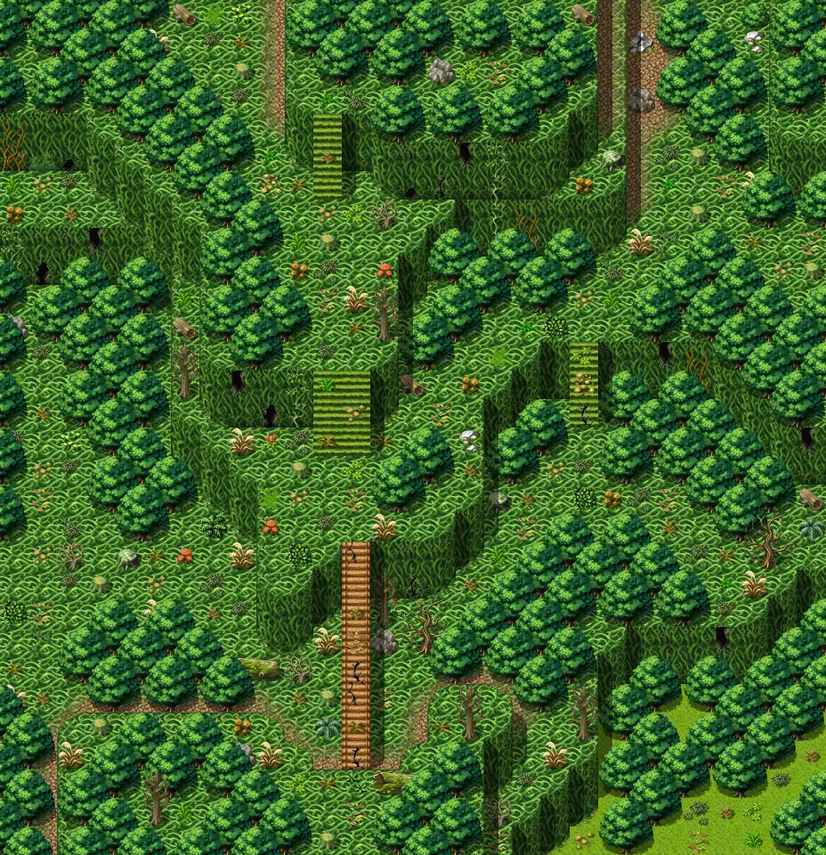
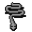

# Lodar16

29×30 tiles · outdoors · part of [World1](index.md)

<label class="lg"><input type="checkbox" data-t="spawn" checked><b>Red</b>&nbsp;Monsters / NPCs</label><label class="lg"><input type="checkbox" data-t="mapchange" checked><b>Blue</b>&nbsp;Exit to another map</label><label class="lg"><input type="checkbox" data-t="container" checked><b>Yellow</b>&nbsp;Container (click to see contents)</label><label class="lg"><input type="checkbox" data-t="sign" checked><b>Purple</b>&nbsp;Sign</label><label class="lg"><input type="checkbox" data-t="rest" checked><b>Green</b>&nbsp;Resting place</label><label class="lg"><input type="checkbox" data-t="key" checked><b>Orange dashed</b>&nbsp;Blocked until a quest step / item</label><label class="lg"><input type="checkbox" data-t="script"><b>Grey dotted</b>&nbsp;Scripted event</label><label class="lg"><input type="checkbox" data-t="replace"><b>White dotted</b>&nbsp;Changes during a quest</label>

## Exits

- [Lodar14](lodar14.md)
- [Lodar17](lodar17.md)
- [Lodar18](lodar18.md)
- [Lodar19](lodar19.md)
- [Lodar8](lodar8.md)

## Monsters & NPCs here

| Name | HP |
|---|---|
| [Puny venomscale](../monsters/vscale1.md) | 42 |
| [Young venomscale](../monsters/vscale2.md) | 46 |
| [Gray venomscale](../monsters/vscale3.md) | 48 |
| [Burrowing glow worm](../monsters/burrowing_glow_worm.md) | 48 |
| [Stinging yellowjacket](../monsters/yjacket4.md) | 48 |
| [Aggressive venomscale](../monsters/vscale4.md) | 52 |
| [Quick yellowjacket](../monsters/yjacket5.md) | 53 |
| [Quick venomscale](../monsters/vscale5.md) | 56 |
| [Giant yellowjacket](../monsters/yjacket8.md) | 74 |
| [Breeder of venomscale](../monsters/vscaleb1.md) | 197 |

<small>Map ID: `lodar16` · Data from v0.8.18</small>
