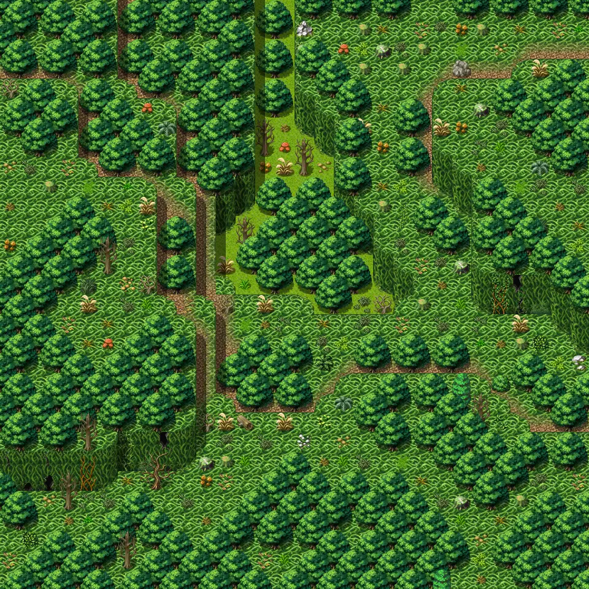
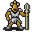

# Lodar18

30×30 tiles · outdoors · part of [World1](index.md)

<label class="lg"><input type="checkbox" data-t="spawn" checked><b>Red</b>&nbsp;Monsters / NPCs</label><label class="lg"><input type="checkbox" data-t="mapchange" checked><b>Blue</b>&nbsp;Exit to another map</label><label class="lg"><input type="checkbox" data-t="container" checked><b>Yellow</b>&nbsp;Container (click to see contents)</label><label class="lg"><input type="checkbox" data-t="sign" checked><b>Purple</b>&nbsp;Sign</label><label class="lg"><input type="checkbox" data-t="rest" checked><b>Green</b>&nbsp;Resting place</label><label class="lg"><input type="checkbox" data-t="key" checked><b>Orange dashed</b>&nbsp;Blocked until a quest step / item</label><label class="lg"><input type="checkbox" data-t="script"><b>Grey dotted</b>&nbsp;Scripted event</label><label class="lg"><input type="checkbox" data-t="replace"><b>White dotted</b>&nbsp;Changes during a quest</label>

## Exits

- [Lodar11](lodar11.md)
- [Lodar16](lodar16.md)
- [Lodar19](lodar19.md)
- [Lodar20](lodar20.md)
- [Lodar8](lodar8.md)

## Monsters & NPCs here

| Name | HP |
|---|---|
| [Aggressive venomscale](../monsters/vscale4.md) | 52 |
| [Quick venomscale](../monsters/vscale5.md) | 56 |
| [Vicious venomscale](../monsters/vscale6.md) | 59 |
| [Strong venomscale](../monsters/vscale7.md) | 63 |
| [Morkin lookout](../monsters/morkin1.md) | 145 |
| [Morkin scout](../monsters/morkin2.md) | 152 |
| [Morkin fighter](../monsters/morkin3.md) | 159 |
| [Morkin guard](../monsters/morkin4.md) | 165 |
| [Zortak scout](../monsters/zortak1.md) | 173 |
| [Zortak fighter](../monsters/zortak2.md) | 189 |
| [Zortak guard](../monsters/zortak3.md) | 195 |
| [Zortak barbarian](../monsters/zortak4.md) | 207 |

<small>Map ID: `lodar18` · Data from v0.8.18</small>
