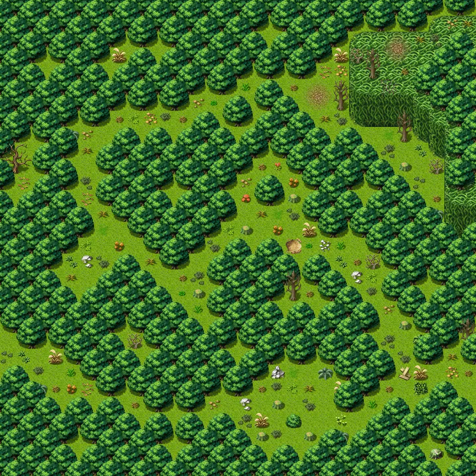

# Lodar2

30×30 tiles · outdoors · part of [World1](index.md)

<label class="lg lg-spawn"><input type="checkbox" data-t="spawn" checked> Monsters / NPCs</label><label class="lg lg-mapchange"><input type="checkbox" data-t="mapchange" checked> Exit to another map</label><label class="lg lg-container"><input type="checkbox" data-t="container" checked> Container</label><label class="lg lg-sign"><input type="checkbox" data-t="sign" checked> Sign</label><label class="lg lg-rest"><input type="checkbox" data-t="rest" checked> Resting place</label><label class="lg lg-key"><input type="checkbox" data-t="key" checked> Blocked / needs key or quest</label><label class="lg lg-script"><input type="checkbox" data-t="script"> Scripted event</label><label class="lg lg-replace"><input type="checkbox" data-t="replace"> Changes after a quest</label>

## Exits

- [Lodar0](lodar0.md)
- [Lodar3](lodar3.md)
- [Lodar4](lodar4.md)

## Monsters & NPCs here

| Name | HP |
|---|---|
| [Feygard guard](../monsters/lodar_fg1.md) | 0 |
| [Rambling Feygard guard](../monsters/lodar_fg2.md) | 0 |
| [Giant dungfly](../monsters/dungfly1.md) | 16 |
| [Aggressive dungfly](../monsters/dungfly2.md) | 23 |
| [Vicious dungfly](../monsters/dungfly3.md) | 34 |
| [Small horned anklebiter](../monsters/anklebiter2.md) | 38 |
| [Young horned anklebiter](../monsters/anklebiter3.md) | 46 |
| [Strong khakin beast](../monsters/khakin4.md) | 50 |
| [Branchtender](../monsters/brtender1.md) | 57 |

<small>Map ID: `lodar2` · Data from v0.8.18</small>
