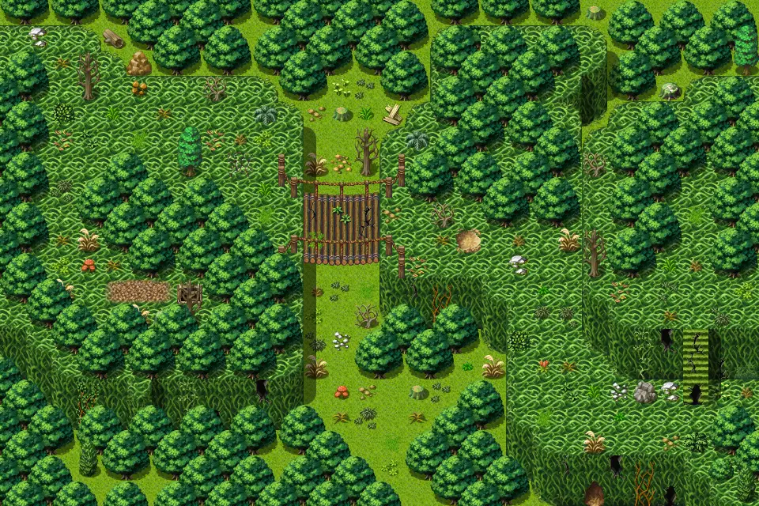
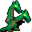
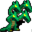

# Lodar3

30×20 tiles · outdoors · part of [World1](index.md)

<label class="lg"><input type="checkbox" data-t="spawn" checked><b>Red</b>&nbsp;Monsters / NPCs</label><label class="lg"><input type="checkbox" data-t="mapchange" checked><b>Blue</b>&nbsp;Exit to another map</label><label class="lg"><input type="checkbox" data-t="container" checked><b>Yellow</b>&nbsp;Container (click to see contents)</label><label class="lg"><input type="checkbox" data-t="sign" checked><b>Purple</b>&nbsp;Sign</label><label class="lg"><input type="checkbox" data-t="rest" checked><b>Green</b>&nbsp;Resting place</label><label class="lg"><input type="checkbox" data-t="key" checked><b>Orange dashed</b>&nbsp;Blocked until a quest step / item</label><label class="lg"><input type="checkbox" data-t="script"><b>Grey dotted</b>&nbsp;Scripted event</label><label class="lg"><input type="checkbox" data-t="replace"><b>White dotted</b>&nbsp;Changes during a quest</label>

## Exits

- [Lodar2](lodar2.md)
- [Lodar4](lodar4.md)
- [Lodar9](lodar9.md)
- [Lodarcave0](lodarcave0.md)

## Monsters & NPCs here

| Name | HP |
|---|---|
| [Giant dungfly](../monsters/dungfly1.md) | 16 |
| [Aggressive dungfly](../monsters/dungfly2.md) | 23 |
| [Vicious dungfly](../monsters/dungfly3.md) | 34 |
| [Khakin spawn](../monsters/khakin1.md) | 47 |
| [Aggressive khakin beast](../monsters/khakin2.md) | 48 |
| [Tough khakin beast](../monsters/khakin3.md) | 49 |
| [Strong khakin beast](../monsters/khakin4.md) | 50 |

<small>Map ID: `lodar3` · Data from v0.8.18</small>
