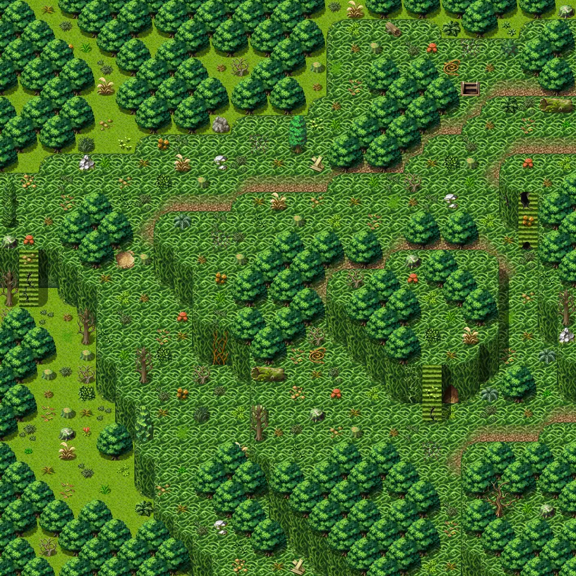
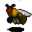
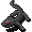
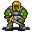
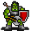

# Lodar7

30×30 tiles · outdoors · part of [World1](index.md)

<label class="lg"><input type="checkbox" data-t="spawn" checked><b>Red</b>&nbsp;Monsters / NPCs</label><label class="lg"><input type="checkbox" data-t="mapchange" checked><b>Blue</b>&nbsp;Exit to another map</label><label class="lg"><input type="checkbox" data-t="container" checked><b>Yellow</b>&nbsp;Container (click to see contents)</label><label class="lg"><input type="checkbox" data-t="sign" checked><b>Purple</b>&nbsp;Sign</label><label class="lg"><input type="checkbox" data-t="rest" checked><b>Green</b>&nbsp;Resting place</label><label class="lg"><input type="checkbox" data-t="key" checked><b>Orange dashed</b>&nbsp;Blocked until a quest step / item</label><label class="lg"><input type="checkbox" data-t="script"><b>Grey dotted</b>&nbsp;Scripted event</label><label class="lg"><input type="checkbox" data-t="replace"><b>White dotted</b>&nbsp;Changes during a quest</label>

## Exits

- [Lodar14](lodar14.md)
- [Lodar6](lodar6.md)
- [Lodar8](lodar8.md)
- [Lodar8cave0](lodar8cave0.md)

## Monsters & NPCs here

| Name | HP |
|---|---|
| [Puny yellowjacket](../monsters/yjacket1.md) | 31 |
| [Small yellowjacket](../monsters/yjacket2.md) | 37 |
| [Small horned anklebiter](../monsters/anklebiter2.md) | 38 |
| [Swarming yellowjacket](../monsters/yjacket3.md) | 42 |
| [Young horned anklebiter](../monsters/anklebiter3.md) | 46 |
| [Stinging yellowjacket](../monsters/yjacket4.md) | 48 |
| [Fast horned anklebiter](../monsters/anklebiter4.md) | 52 |
| [Quick yellowjacket](../monsters/yjacket5.md) | 53 |
| [Tough horned anklebiter](../monsters/anklebiter5.md) | 64 |
| [Young erumen forest lizard](../monsters/erumen_8.md) | 92 |
| [Erumen forest lizard](../monsters/erumen_9.md) | 107 |
| [Zortak scout](../monsters/zortak1.md) | 173 |
| [Zortak fighter](../monsters/zortak2.md) | 189 |
| [Zortak guard](../monsters/zortak3.md) | 195 |

<small>Map ID: `lodar7` · Data from v0.8.18</small>
