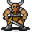
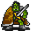

# Lodar8

30×30 tiles · outdoors · part of [World1](index.md)

<label class="lg"><input type="checkbox" data-t="spawn" checked><b>Red</b>&nbsp;Monsters / NPCs</label><label class="lg"><input type="checkbox" data-t="mapchange" checked><b>Blue</b>&nbsp;Exit to another map</label><label class="lg"><input type="checkbox" data-t="container" checked><b>Yellow</b>&nbsp;Container (click to see contents)</label><label class="lg"><input type="checkbox" data-t="sign" checked><b>Purple</b>&nbsp;Sign</label><label class="lg"><input type="checkbox" data-t="rest" checked><b>Green</b>&nbsp;Resting place</label><label class="lg"><input type="checkbox" data-t="key" checked><b>Orange dashed</b>&nbsp;Blocked until a quest step / item</label><label class="lg"><input type="checkbox" data-t="script"><b>Grey dotted</b>&nbsp;Scripted event</label><label class="lg"><input type="checkbox" data-t="replace"><b>White dotted</b>&nbsp;Changes during a quest</label>

## Exits

- [Lodar11](lodar11.md)
- [Lodar16](lodar16.md)
- [Lodar18](lodar18.md)
- [Lodar4](lodar4.md)
- [Lodar7](lodar7.md)
- [Lodar8cave0](lodar8cave0.md)

## Monsters & NPCs here

| Name | HP |
|---|---|
| [Puny yellowjacket](../monsters/yjacket1.md) | 31 |
| [Small yellowjacket](../monsters/yjacket2.md) | 37 |
| [Small horned anklebiter](../monsters/anklebiter2.md) | 38 |
| [Swarming yellowjacket](../monsters/yjacket3.md) | 42 |
| [Puny venomscale](../monsters/vscale1.md) | 42 |
| [Young horned anklebiter](../monsters/anklebiter3.md) | 46 |
| [Young venomscale](../monsters/vscale2.md) | 46 |
| [Gray venomscale](../monsters/vscale3.md) | 48 |
| [Burrowing glow worm](../monsters/burrowing_glow_worm.md) | 48 |
| [Zortak fighter](../monsters/zortak2.md) | 189 |
| [Zortak guard](../monsters/zortak3.md) | 195 |
| [Zortak barbarian](../monsters/zortak4.md) | 207 |
| [Insane Feygard guard](../monsters/lodar_fg4.md) | 212 |
| [Guardian of the bridge](../monsters/lbridge.md) | 213 |
| [Zortak leader](../monsters/zortakb.md) | 279 |

<small>Map ID: `lodar8` · Data from v0.8.18</small>
