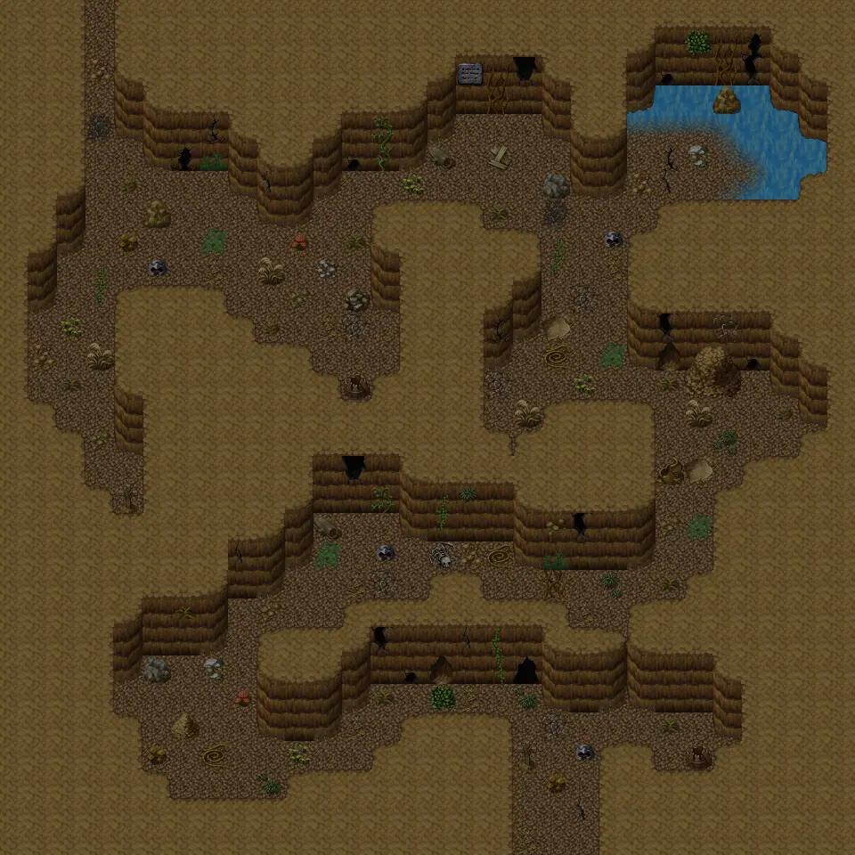

# Lodarcave3

30×30 tiles · part of [Lodarcave](index.md)

<label class="lg"><input type="checkbox" data-t="spawn" checked><b>Red</b>&nbsp;Monsters / NPCs</label><label class="lg"><input type="checkbox" data-t="mapchange" checked><b>Blue</b>&nbsp;Exit to another map</label><label class="lg"><input type="checkbox" data-t="container" checked><b>Yellow</b>&nbsp;Container (click to see contents)</label><label class="lg"><input type="checkbox" data-t="sign" checked><b>Purple</b>&nbsp;Sign</label><label class="lg"><input type="checkbox" data-t="rest" checked><b>Green</b>&nbsp;Resting place</label><label class="lg"><input type="checkbox" data-t="key" checked><b>Orange dashed</b>&nbsp;Blocked until a quest step / item</label><label class="lg"><input type="checkbox" data-t="script"><b>Grey dotted</b>&nbsp;Scripted event</label><label class="lg"><input type="checkbox" data-t="replace"><b>White dotted</b>&nbsp;Changes during a quest</label>

## Exits

- [Lodarcave2](lodarcave2.md)
- [Lodarcave4](lodarcave4.md)

## Monsters & NPCs here

| Name | HP |
|---|---|
| [Gray cave bat](../monsters/cavebat1.md) | 28 |
| [Black cave bat](../monsters/cavebat2.md) | 32 |
| [Brown cave bat](../monsters/cavebat3.md) | 36 |
| [Hirathil spawn](../monsters/hirathil0.md) | 73 |
| [Aggressive hirathil ghost](../monsters/hirathil1.md) | 75 |
| [Hirathil ghost](../monsters/hirathil2.md) | 77 |
| [Ferocious hirathil ghost](../monsters/hirathil3.md) | 79 |
| [Restless hirathil ghost](../monsters/hirathil4.md) | 83 |
| [Hirathil servant](../monsters/hirathil5.md) | 87 |

<small>Map ID: `lodarcave3` · Data from v0.8.18</small>
