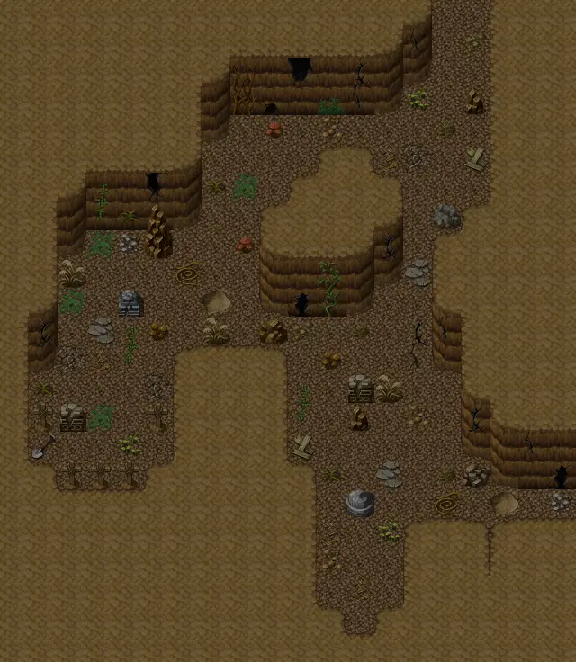

# Lodarcave6

20×23 tiles · part of [Lodarcave](index.md)

<label class="lg lg-spawn"><input type="checkbox" data-t="spawn" checked> Monsters / NPCs</label><label class="lg lg-mapchange"><input type="checkbox" data-t="mapchange" checked> Exit to another map</label><label class="lg lg-container"><input type="checkbox" data-t="container" checked> Container</label><label class="lg lg-sign"><input type="checkbox" data-t="sign" checked> Sign</label><label class="lg lg-rest"><input type="checkbox" data-t="rest" checked> Resting place</label><label class="lg lg-key"><input type="checkbox" data-t="key" checked> Blocked / needs key or quest</label><label class="lg lg-script"><input type="checkbox" data-t="script"> Scripted event</label><label class="lg lg-replace"><input type="checkbox" data-t="replace"> Changes after a quest</label>

## Exits

- [Lodarcave5](lodarcave5.md)
- [Lodarcave7](lodarcave7.md)

## Monsters & NPCs here

| Name | HP |
|---|---|
| [Gray cave bat](../monsters/cavebat1.md) | 28 |
| [Black cave bat](../monsters/cavebat2.md) | 32 |
| [Brown cave bat](../monsters/cavebat3.md) | 36 |
| [Ferocious hirathil ghost](../monsters/hirathil3.md) | 79 |
| [Restless hirathil ghost](../monsters/hirathil4.md) | 83 |
| [Hirathil servant](../monsters/hirathil5.md) | 87 |
| [Hirathil master](../monsters/hirathil6.md) | 89 |
| [Ancient hirathil ghost](../monsters/hirathil7.md) | 92 |

<small>Map ID: `lodarcave6` · Data from v0.8.18</small>
