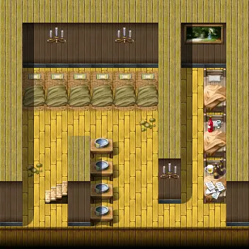

# Loneford 10

| | |
|---|---|
| **Map ID** | `loneford10` |
| **Region** | In Loneford (settlement) |
| **Type** | Indoors / underground |
| **Size** | 11×11 tiles |
| **Introduced** | v0.7.0 or earlier |
| **NPCs** | 2 |
| **Quests** | 1 |

**Loneford 10** is an indoor map, in Loneford (settlement). It has 2 NPCs, and no enemies. Exits lead to Stoutford castle barrack 2, Loneford 3.

## Map

<label class="lg"><input type="checkbox" data-t="spawn" checked><b>Red</b>&nbsp;Monsters / NPCs</label><label class="lg"><input type="checkbox" data-t="mapchange" checked><b>Blue</b>&nbsp;Exit to another map</label><label class="lg"><input type="checkbox" data-t="container" checked><b>Yellow</b>&nbsp;Container (click to see contents)</label><label class="lg"><input type="checkbox" data-t="sign" checked><b>Purple</b>&nbsp;Sign</label><label class="lg"><input type="checkbox" data-t="rest" checked><b>Green</b>&nbsp;Resting place</label><label class="lg"><input type="checkbox" data-t="key" checked><b>Orange dashed</b>&nbsp;Blocked until a quest step / item</label><label class="lg"><input type="checkbox" data-t="script"><b>Grey dotted</b>&nbsp;Scripted event</label><label class="lg"><input type="checkbox" data-t="replace"><b>White dotted</b>&nbsp;Changes during a quest</label><label class="lg"><input type="checkbox" data-t="pin" checked><b>Numbers</b>&nbsp;Numbered key points (see the key below the map)</label>

<a class="pin pin-exit" href="#key-1" style="left:13.636%;top:40.909%" title="Exit (west): to [Stoutford castle barrack 2](stoutford_castle_barrack2.md)">1</a><a class="pin pin-exit" href="#key-2" style="left:22.727%;top:77.273%" title="Exit (stairs / passage): to [Loneford 3](loneford3.md)">2</a><a id="pin-npc-arngyr" class="pin pin-npc" href="#key-3" style="left:50.000%;top:86.364%" title="[Arngyr](../../monsters/arngyr.md): NPC">3</a><a id="pin-npc-loneford_guard0" class="pin pin-npc" href="#key-4" style="left:13.636%;top:50.000%" title="[Guard](../../monsters/guard.md#v-loneford_guard0): NPC">4</a><a class="pin pin-rest" href="#key-5" style="left:86.364%;top:40.909%" title="Resting place: Rest here to heal and set your respawn point">5</a><a class="pin pin-key" href="#key-6" style="left:68.182%;top:86.364%" title="Blocked passage: Unlocked during the quest: hidden story flag “nondisplay” (stage 19: “Sleeping quarters in Loneford10”)">6</a><a class="pin pin-key" href="#key-7" style="left:14.235%;top:34.092%" title="Blocked passage: Unlocked during the quest: base_nondisplay (stage 1: “1=Developers Debug Version active”)">7</a>

??? abstract "Key to the numbers on the map"

    | # | What | Details |
    |---|---|---|
    | 1 | Exit (west) | to [Stoutford castle barrack 2](stoutford_castle_barrack2.md) |
    | 2 | Exit (stairs / passage) | to [Loneford 3](loneford3.md) |
    | 3 | [Arngyr](../monsters/arngyr.md) | NPC |
    | 4 | [Guard](../monsters/guard.md#v-loneford_guard0) | NPC |
    | 5 | Resting place | Rest here to heal and set your respawn point |
    | 6 | Blocked passage | Unlocked during the quest: hidden story flag “nondisplay” (stage 19: “Sleeping quarters in Loneford10”) |
    | 7 | Blocked passage | Unlocked during the quest: base_nondisplay (stage 1: “1=Developers Debug Version active”) |

Verified against v0.8.18 map data.

## Connections

| Direction | Leads to | Region there | Map # |
|---|---|---|---|
| West | [Stoutford castle barrack 2](stoutford_castle_barrack2.md) | Prim | 1 |
| Stairs / passage | [Loneford 3](loneford3.md) | Loneford | 2 |

## NPCs

- [Arngyr](../monsters/arngyr.md) (#3)
- [Guard](../monsters/guard.md#v-loneford_guard0) (#4)

## Quests

- [base_nondisplay](../quests/base_nondisplay.md): blocked passage opens at stage 1
- [General story flags (hidden flag)](../quests/nondisplay.md): [Arngyr](../monsters/arngyr.md) is involved; blocked passage opens at stage 19

## Points of interest

- **Resting place** (#5): Rest here to heal and set your respawn point
- **Blocked passage** (#6): Unlocked during the quest: hidden story flag “nondisplay” (stage 19: “Sleeping quarters in Loneford10”)
- **Blocked passage** (#7): Unlocked during the quest: base_nondisplay (stage 1: “1=Developers Debug Version active”)

## Version history

| Version | Change |
|---|---|
| [v0.7.0](../versions/0.7.0.md) | Present in v0.7.0 (earliest release tracked) |
| [v0.7.1](../versions/0.7.1.md) | Map layout or objects changed |
| [v0.7.2](../versions/0.7.2.md) | Map layout or objects changed |

Verified against v0.8.18 and every earlier release back to v0.7.0 (game data compared release by release).

## Community notes

<small>Written by players, not generated from game data. **Observations**: what players notice in-game · **Lore**: the in-world story · **Trivia**: real-world facts, references, development history · **Theory / speculation**: unconfirmed ideas; may just be unfinished content</small>

### Observations

*No notes yet. Contributions are welcome: [add a note](https://github.com/asdfghjkl628/Andor-s-Trail-Wikiiii/new/main/notes/maps?filename=loneford10.md&value=%23%23%20Observations%0A%0A%3C%21--%20what%20players%20notice%20in-game%20--%3E%0A%0A%23%23%20Lore%0A%0A%3C%21--%20the%20in-world%20story%20--%3E%0A%0A%23%23%20Trivia%0A%0A%3C%21--%20real-world%20facts%2C%20references%2C%20development%20history%20--%3E%0A%0A%23%23%20Theory%20/%20speculation%0A%0A%3C%21--%20unconfirmed%20ideas%3B%20may%20just%20be%20unfinished%20content%20--%3E%0A).*

### Lore

*No notes yet. Contributions are welcome: [add a note](https://github.com/asdfghjkl628/Andor-s-Trail-Wikiiii/new/main/notes/maps?filename=loneford10.md&value=%23%23%20Observations%0A%0A%3C%21--%20what%20players%20notice%20in-game%20--%3E%0A%0A%23%23%20Lore%0A%0A%3C%21--%20the%20in-world%20story%20--%3E%0A%0A%23%23%20Trivia%0A%0A%3C%21--%20real-world%20facts%2C%20references%2C%20development%20history%20--%3E%0A%0A%23%23%20Theory%20/%20speculation%0A%0A%3C%21--%20unconfirmed%20ideas%3B%20may%20just%20be%20unfinished%20content%20--%3E%0A).*

### Trivia

*No notes yet. Contributions are welcome: [add a note](https://github.com/asdfghjkl628/Andor-s-Trail-Wikiiii/new/main/notes/maps?filename=loneford10.md&value=%23%23%20Observations%0A%0A%3C%21--%20what%20players%20notice%20in-game%20--%3E%0A%0A%23%23%20Lore%0A%0A%3C%21--%20the%20in-world%20story%20--%3E%0A%0A%23%23%20Trivia%0A%0A%3C%21--%20real-world%20facts%2C%20references%2C%20development%20history%20--%3E%0A%0A%23%23%20Theory%20/%20speculation%0A%0A%3C%21--%20unconfirmed%20ideas%3B%20may%20just%20be%20unfinished%20content%20--%3E%0A).*

### Theory / speculation

*No notes yet. Contributions are welcome: [add a note](https://github.com/asdfghjkl628/Andor-s-Trail-Wikiiii/new/main/notes/maps?filename=loneford10.md&value=%23%23%20Observations%0A%0A%3C%21--%20what%20players%20notice%20in-game%20--%3E%0A%0A%23%23%20Lore%0A%0A%3C%21--%20the%20in-world%20story%20--%3E%0A%0A%23%23%20Trivia%0A%0A%3C%21--%20real-world%20facts%2C%20references%2C%20development%20history%20--%3E%0A%0A%23%23%20Theory%20/%20speculation%0A%0A%3C%21--%20unconfirmed%20ideas%3B%20may%20just%20be%20unfinished%20content%20--%3E%0A).*

??? info "Technical information"

    | | |
    |---|---|
    | Map ID | `loneford10` |
    | File | `res/xml/loneford10.tmx` |
    | Size | 11×11 tiles (352×352 px) |
    | outdoors property | – |
    | Layers drawn | ground, objects, above |
    | Tilesets | map_bed_1, map_border_1, map_bridge_1, map_bridge_2, map_broken_1, map_cavewall_1, map_cavewall_2, map_cavewall_3, map_cavewall_4, map_chair_table_1, map_chair_table_2, map_crate_1, map_cupboard_1, map_curtain_1, map_entrance_1, map_entrance_2, map_fence_1, map_fence_2, map_fence_3, map_fence_4, map_ground_1, map_ground_2, map_ground_3, map_ground_4, map_ground_5, map_ground_6, map_ground_7, map_ground_8, map_house_1, map_house_2, map_indoor_1, map_indoor_2, map_kitchen_1, map_outdoor_1, map_pillar_1, map_pillar_2, map_plant_1, map_plant_2, map_rock_1, map_rock_2, map_roof_1, map_roof_2, map_roof_3, map_shop_1, map_sign_ladder_1, map_table_1, map_trail_1, map_transition_1, map_transition_2, map_transition_3, map_transition_4, map_transition_5, map_tree_1, map_tree_2, map_wall_1, map_wall_2, map_wall_3, map_wall_4, map_window_1, map_window_2 |
    | Map objects | spawn: 3, mapchange: 2, key: 2, rest: 1 |
    | World map position | – |

<small>Data from v0.8.18</small>
