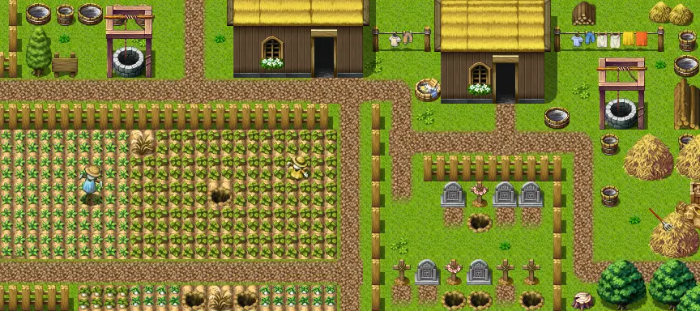

# Loneford13

| | |
|---|---|
| **Map ID** | `loneford13` |
| **Region** | Near Loneford (settlement) |
| **Type** | Outdoors |
| **Size** | 27×12 tiles |
| **World map** | [World1](index.md) |
| **Introduced** | [v0.7.2](../versions/0.7.2.md) |
| **Quests** | 1 |

**Loneford13** is an outdoor map, near Loneford (settlement). It has no NPCs, and no enemies. Exits lead to Loneford2, Loneford14, Lodar0, Loneford12 and 3 more.

## Map

<label class="lg"><input type="checkbox" data-t="spawn" checked><b>Red</b>&nbsp;Monsters / NPCs</label><label class="lg"><input type="checkbox" data-t="mapchange" checked><b>Blue</b>&nbsp;Exit to another map</label><label class="lg"><input type="checkbox" data-t="container" checked><b>Yellow</b>&nbsp;Container (click to see contents)</label><label class="lg"><input type="checkbox" data-t="sign" checked><b>Purple</b>&nbsp;Sign</label><label class="lg"><input type="checkbox" data-t="rest" checked><b>Green</b>&nbsp;Resting place</label><label class="lg"><input type="checkbox" data-t="key" checked><b>Orange dashed</b>&nbsp;Blocked until a quest step / item</label><label class="lg"><input type="checkbox" data-t="script"><b>Grey dotted</b>&nbsp;Scripted event</label><label class="lg"><input type="checkbox" data-t="replace"><b>White dotted</b>&nbsp;Changes during a quest</label><label class="lg"><input type="checkbox" data-t="pin" checked><b>Numbers</b>&nbsp;Numbered key points (see the key below the map)</label>

<a class="pin pin-exit" href="#key-1" style="left:27.778%;top:4.167%" title="Exit (north): to [Loneford2](../loneford2.md)">1</a><a class="pin pin-exit" href="#key-2" style="left:98.148%;top:87.500%" title="Exit (southeast): to [Loneford14](../loneford14.md)">2</a><a class="pin pin-exit" href="#key-3" style="left:44.444%;top:95.833%" title="Exit (south): to [Lodar0](../lodar0.md)">3</a><a class="pin pin-exit" href="#key-4" style="left:18.519%;top:95.833%" title="Exit (south): to [Loneford12](../loneford12.md)">4</a><a class="pin pin-exit" href="#key-5" style="left:1.852%;top:66.667%" title="Exit (west): to [Loneford1](../loneford1.md)">5</a><a class="pin pin-exit" href="#key-5" style="left:1.852%;top:29.167%" title="Exit (west): to [Loneford1](../loneford1.md)">5</a><a class="pin pin-exit" href="#key-6" style="left:46.296%;top:20.833%" title="Exit (door): to [Loneford16](../loneford16.md)">6</a><a class="pin pin-exit" href="#key-7" style="left:72.222%;top:29.167%" title="Exit (door): to [Loneford17](../loneford17.md)">7</a><a class="pin pin-sign" href="#key-8" style="left:64.815%;top:70.833%" title="Sign: “Here lies Damurrela of Loneford, wife of Hagale and mother of Aradilles. Killed by Plaguestriders.”">8</a><a class="pin pin-sign" href="#key-9" style="left:9.259%;top:20.833%" title="Sign: “Welcome to peaceful Loneford.
[The sign also contains a drawing of a bale of hay with what looks like a farmer sitting on top]”">9</a><a class="pin pin-sign" href="#key-10" style="left:72.222%;top:70.833%" title="Sign: “Here lies Aradilles of Loneford, daughter of Hagale and Damurrela. Died from blistering skin.”">10</a><a class="pin pin-key" href="#key-11" style="left:94.444%;top:70.833%" title="Blocked passage: Unlocked during the quest: hidden story flag “sullengard_hidden” (stage 500: “Key:(Never true condition)”)">11</a><a class="pin pin-replace" href="#key-12" style="left:94.688%;top:64.584%" title="Changes during a quest: This area changes during the quest: hidden story flag “sullengard_hidden” (stage 100: “I successfully lifted up the pitchfork from the haystack.”)">12</a>

??? abstract "Key to the numbers on the map"

    | # | What | Details |
    |---|---|---|
    | 1 | Exit (north) | to [Loneford2](../loneford2.md) |
    | 2 | Exit (southeast) | to [Loneford14](../loneford14.md) |
    | 3 | Exit (south) | to [Lodar0](../lodar0.md) |
    | 4 | Exit (south) | to [Loneford12](../loneford12.md) |
    | 5 | Exit (west) | to [Loneford1](../loneford1.md) |
    | 6 | Exit (door) | to [Loneford16](../loneford16.md) |
    | 7 | Exit (door) | to [Loneford17](../loneford17.md) |
    | 8 | Sign | “Here lies Damurrela of Loneford, wife of Hagale and mother of Aradilles. Killed by Plaguestriders.” |
    | 9 | Sign | “Welcome to peaceful Loneford. [The sign also contains a drawing of a bale of hay with what looks like a farmer sitting on top]” |
    | 10 | Sign | “Here lies Aradilles of Loneford, daughter of Hagale and Damurrela. Died from blistering skin.” |
    | 11 | Blocked passage | Unlocked during the quest: hidden story flag “sullengard_hidden” (stage 500: “Key:(Never true condition)”) |
    | 12 | Changes during a quest | This area changes during the quest: hidden story flag “sullengard_hidden” (stage 100: “I successfully lifted up the pitchfork from the haystack.”) |

Verified against v0.8.18 map data.

## Connections

| Direction | Leads to | Region there | Map # |
|---|---|---|---|
| North | [Loneford2](loneford2.md) | Loneford | 1 |
| Southeast | [Loneford14](loneford14.md) | Loneford | 2 |
| South | [Lodar0](lodar0.md) | Loneford | 3 |
| South | [Loneford12](loneford12.md) | Crossroads Guardhouse | 4 |
| West | [Loneford1](loneford1.md) | Crossroads Guardhouse | 5 |
| Door | [Loneford16](loneford16.md) | Loneford | 6 |
| Door | [Loneford17](loneford17.md) | Loneford | 7 |

## Quests

- [Getting home on time](../quests/deebo_orchard_ght.md): something on this map advances it
- [sullengard_nondisplay (hidden flag)](../quests/sullengard_hidden.md): blocked passage opens at stage 500; part of the map changes at stage 100; something on this map advances it

## Points of interest

- **Sign** (#8): “Here lies Damurrela of Loneford, wife of Hagale and mother of Aradilles. Killed by Plaguestriders.”
- **Sign** (#9): “Welcome to peaceful Loneford. [The sign also contains a drawing of a bale of hay with what looks like a farmer sitting on top]”
- **Sign** (#10): “Here lies Aradilles of Loneford, daughter of Hagale and Damurrela. Died from blistering skin.”
- **Blocked passage** (#11): Unlocked during the quest: hidden story flag “sullengard_hidden” (stage 500: “Key:(Never true condition)”)
- **Changes during a quest** (#12): This area changes during the quest: hidden story flag “sullengard_hidden” (stage 100: “I successfully lifted up the pitchfork from the haystack.”)

## Version history

| Version | Change |
|---|---|
| [v0.7.2](../versions/0.7.2.md) | Added |
| [v0.8.2](../versions/0.8.2.md) | map layout or objects changed |
| [v0.8.4](../versions/0.8.4.md) | map layout or objects changed |
| [v0.8.12.1](../versions/0.8.12.1.md) | map layout or objects changed |

Verified against v0.8.18 and every earlier release back to v0.7.0 (game data compared release by release).

## Community notes

<small>Written by players, not generated from game data. **Observations**: what players notice in-game · **Lore**: the in-world story · **Trivia**: real-world facts, references, development history · **Theory / speculation**: unconfirmed ideas; may just be unfinished content</small>

### Observations

*Nothing here yet. Know something? [Add it](https://github.com/asdfghjkl628/Andor-s-Trail-Wikiiii/new/main/notes/maps?filename=loneford13.md&value=%23%23%20Observations%0A%0A%3C%21--%20what%20players%20notice%20in-game%20--%3E%0A%0A%23%23%20Lore%0A%0A%3C%21--%20the%20in-world%20story%20--%3E%0A%0A%23%23%20Trivia%0A%0A%3C%21--%20real-world%20facts%2C%20references%2C%20development%20history%20--%3E%0A%0A%23%23%20Theory%20/%20speculation%0A%0A%3C%21--%20unconfirmed%20ideas%3B%20may%20just%20be%20unfinished%20content%20--%3E%0A).*

### Lore

*Nothing here yet. Know something? [Add it](https://github.com/asdfghjkl628/Andor-s-Trail-Wikiiii/new/main/notes/maps?filename=loneford13.md&value=%23%23%20Observations%0A%0A%3C%21--%20what%20players%20notice%20in-game%20--%3E%0A%0A%23%23%20Lore%0A%0A%3C%21--%20the%20in-world%20story%20--%3E%0A%0A%23%23%20Trivia%0A%0A%3C%21--%20real-world%20facts%2C%20references%2C%20development%20history%20--%3E%0A%0A%23%23%20Theory%20/%20speculation%0A%0A%3C%21--%20unconfirmed%20ideas%3B%20may%20just%20be%20unfinished%20content%20--%3E%0A).*

### Trivia

*Nothing here yet. Know something? [Add it](https://github.com/asdfghjkl628/Andor-s-Trail-Wikiiii/new/main/notes/maps?filename=loneford13.md&value=%23%23%20Observations%0A%0A%3C%21--%20what%20players%20notice%20in-game%20--%3E%0A%0A%23%23%20Lore%0A%0A%3C%21--%20the%20in-world%20story%20--%3E%0A%0A%23%23%20Trivia%0A%0A%3C%21--%20real-world%20facts%2C%20references%2C%20development%20history%20--%3E%0A%0A%23%23%20Theory%20/%20speculation%0A%0A%3C%21--%20unconfirmed%20ideas%3B%20may%20just%20be%20unfinished%20content%20--%3E%0A).*

### Theory / speculation

*Nothing here yet. Know something? [Add it](https://github.com/asdfghjkl628/Andor-s-Trail-Wikiiii/new/main/notes/maps?filename=loneford13.md&value=%23%23%20Observations%0A%0A%3C%21--%20what%20players%20notice%20in-game%20--%3E%0A%0A%23%23%20Lore%0A%0A%3C%21--%20the%20in-world%20story%20--%3E%0A%0A%23%23%20Trivia%0A%0A%3C%21--%20real-world%20facts%2C%20references%2C%20development%20history%20--%3E%0A%0A%23%23%20Theory%20/%20speculation%0A%0A%3C%21--%20unconfirmed%20ideas%3B%20may%20just%20be%20unfinished%20content%20--%3E%0A).*

??? info "Technical information"

    | | |
    |---|---|
    | Map ID | `loneford13` |
    | File | `res/xml/loneford13.tmx` |
    | Size | 27×12 tiles (864×384 px) |
    | outdoors property | 1 |
    | Layers drawn | ground, objects, above |
    | Tilesets | map_bed_1, map_border_1, map_bridge_1, map_bridge_2, map_broken_1, map_cavewall_1, map_cavewall_2, map_cavewall_3, map_cavewall_4, map_chair_table_1, map_chair_table_2, map_crate_1, map_cupboard_1, map_curtain_1, map_entrance_1, map_entrance_2, map_fence_1, map_fence_2, map_fence_3, map_fence_4, map_ground_1, map_ground_2, map_ground_3, map_ground_4, map_ground_5, map_ground_6, map_ground_7, map_ground_8, map_house_1, map_house_2, map_indoor_1, map_indoor_2, map_kitchen_1, map_outdoor_1, map_pillar_1, map_pillar_2, map_plant_1, map_plant_2, map_rock_1, map_rock_2, map_roof_1, map_roof_2, map_roof_3, map_shop_1, map_sign_ladder_1, map_table_1, map_trail_1, map_transition_1, map_transition_2, map_transition_3, map_transition_4, map_transition_5, map_tree_1, map_tree_2, map_wall_1, map_wall_2, map_wall_3, map_wall_4, map_window_1, map_window_2 |
    | Map objects | mapchange: 8, sign: 3, script: 1, key: 1, replace: 1 |
    | World map position | segment `world1`, x 241, y 278 |

<small>Data from v0.8.18</small>
