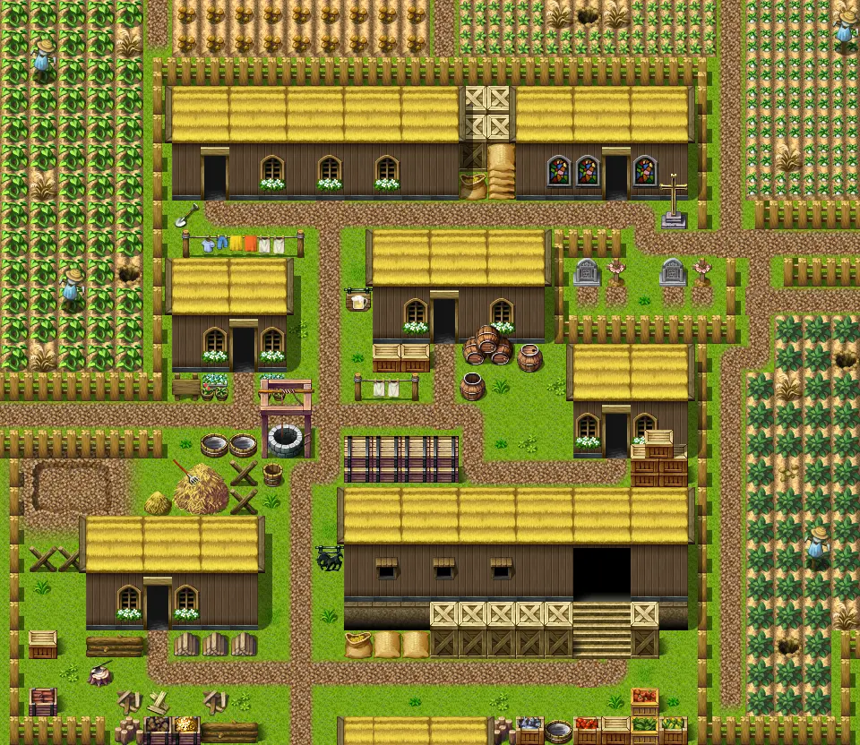
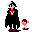

# Loneford2

30×26 tiles · outdoors · part of [World1](index.md)

<label class="lg"><input type="checkbox" data-t="spawn" checked><b>Red</b>&nbsp;Monsters / NPCs</label><label class="lg"><input type="checkbox" data-t="mapchange" checked><b>Blue</b>&nbsp;Exit to another map</label><label class="lg"><input type="checkbox" data-t="container" checked><b>Yellow</b>&nbsp;Container (click to see contents)</label><label class="lg"><input type="checkbox" data-t="sign" checked><b>Purple</b>&nbsp;Sign</label><label class="lg"><input type="checkbox" data-t="rest" checked><b>Green</b>&nbsp;Resting place</label><label class="lg"><input type="checkbox" data-t="key" checked><b>Orange dashed</b>&nbsp;Blocked until a quest step / item</label><label class="lg"><input type="checkbox" data-t="script"><b>Grey dotted</b>&nbsp;Scripted event</label><label class="lg"><input type="checkbox" data-t="replace"><b>White dotted</b>&nbsp;Changes during a quest</label>

## Exits

- [Fields11b](fields11b.md)
- [Fields4](fields4.md)
- [Loneford11](loneford11.md)
- [Loneford13](loneford13.md)
- [Loneford3](loneford3.md)
- [Loneford4](loneford4.md)
- [Loneford5](loneford5.md)
- [Loneford6](loneford6.md)
- [Loneford7](loneford7.md)
- [Loneford8](loneford8.md)
- [Loneford9](loneford9.md)
- [Waytobrimhaven0](waytobrimhaven0.md)

## Monsters & NPCs here

| Name | HP |
|---|---|
| [Pig](../monsters/pig.md) | 0 |
| [Wallach](../monsters/wallach.md) | 0 |
| [Conren](../monsters/conren.md) | 0 |
| [Villager](../monsters/loneford_villager1.md) | 0 |
| [Villager](../monsters/loneford_villager3.md) | 0 |
| [Villager](../monsters/loneford_villager0.md) | 0 |
| [Villager](../monsters/loneford_villager4.md) | 0 |
| [Guard](../monsters/loneford_wellguard.md) | 0 |
| [Guard](../monsters/loneford_guard0.md) | 0 |
| [Villager](../monsters/loneford_villager2.md) | 0 |

<small>Map ID: `loneford2` · Data from v0.8.18</small>
