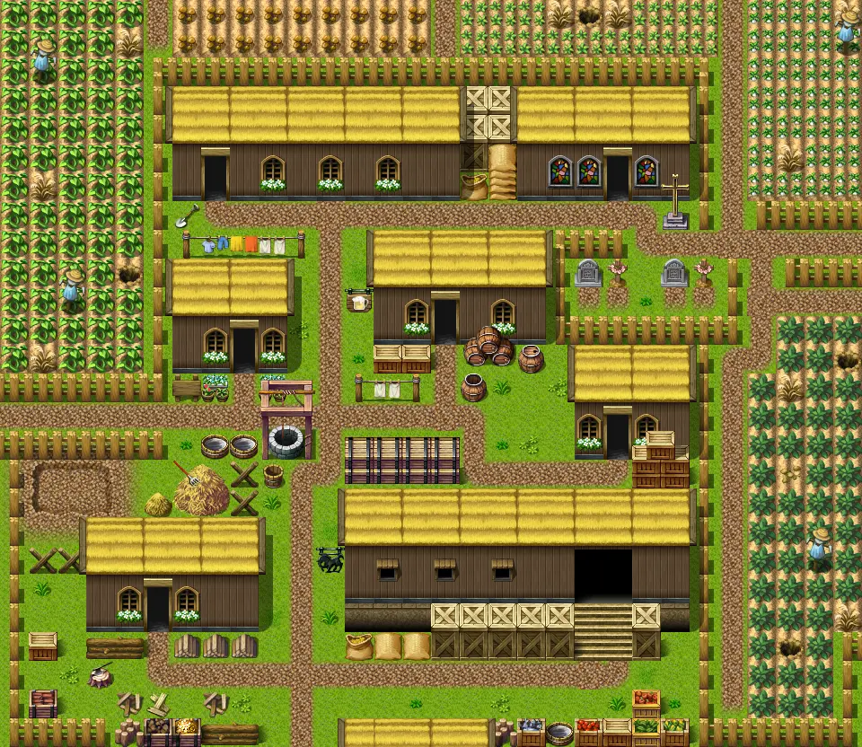

# Loneford2

| | |
|---|---|
| **Map ID** | `loneford2` |
| **Region** | In Loneford (settlement) |
| **Type** | Outdoors |
| **Size** | 30×26 tiles |
| **World map** | [World1](index.md) |
| **Introduced** | v0.7.0 or earlier |
| **NPCs** | 10 |
| **Quests** | 2 |

**Loneford2** is an outdoor map, in Loneford (settlement). It has 10 NPCs, and no enemies. Exits lead to Fields11b, Loneford11, Waytobrimhaven0, Loneford13 and 8 more.

## Map

<label class="lg"><input type="checkbox" data-t="spawn" checked><b>Red</b>&nbsp;Monsters / NPCs</label><label class="lg"><input type="checkbox" data-t="mapchange" checked><b>Blue</b>&nbsp;Exit to another map</label><label class="lg"><input type="checkbox" data-t="container" checked><b>Yellow</b>&nbsp;Container (click to see contents)</label><label class="lg"><input type="checkbox" data-t="sign" checked><b>Purple</b>&nbsp;Sign</label><label class="lg"><input type="checkbox" data-t="rest" checked><b>Green</b>&nbsp;Resting place</label><label class="lg"><input type="checkbox" data-t="key" checked><b>Orange dashed</b>&nbsp;Blocked until a quest step / item</label><label class="lg"><input type="checkbox" data-t="script"><b>Grey dotted</b>&nbsp;Scripted event</label><label class="lg"><input type="checkbox" data-t="replace"><b>White dotted</b>&nbsp;Changes during a quest</label><label class="lg"><input type="checkbox" data-t="pin" checked><b>Numbers</b>&nbsp;Numbered key points (see the key below the map)</label>

<a class="pin pin-exit" href="#key-1" style="left:40.000%;top:1.923%" title="Exit (north): to [Fields11b](../fields11b.md)">1</a><a class="pin pin-exit" href="#key-2" style="left:85.000%;top:1.923%" title="Exit (north): to [Loneford11](../loneford11.md)">2</a><a class="pin pin-exit" href="#key-3" style="left:98.333%;top:32.692%" title="Exit (east): to [Waytobrimhaven0](../waytobrimhaven0.md)">3</a><a class="pin pin-exit" href="#key-3" style="left:98.333%;top:17.308%" title="Exit (east): to [Waytobrimhaven0](../waytobrimhaven0.md)">3</a><a class="pin pin-exit" href="#key-3" style="left:98.333%;top:40.385%" title="Exit (east): to [Waytobrimhaven0](../waytobrimhaven0.md)">3</a><a class="pin pin-exit" href="#key-4" style="left:35.000%;top:98.077%" title="Exit (south): to [Loneford13](../loneford13.md)">4</a><a class="pin pin-exit" href="#key-5" style="left:1.667%;top:55.769%" title="Exit (west): to [Fields4](../fields4.md)">5</a><a class="pin pin-exit" href="#key-6" style="left:25.000%;top:25.000%" title="Exit (door): to [Loneford3](../loneford3.md)">6</a><a class="pin pin-exit" href="#key-7" style="left:71.667%;top:25.000%" title="Exit (door): to [Loneford4](../loneford4.md)">7</a><a class="pin pin-exit" href="#key-8" style="left:28.333%;top:48.077%" title="Exit (door): to [Loneford5](../loneford5.md)">8</a><a class="pin pin-exit" href="#key-9" style="left:51.667%;top:44.231%" title="Exit (door): to [Loneford6](../loneford6.md)">9</a><a class="pin pin-exit" href="#key-10" style="left:71.667%;top:59.615%" title="Exit (door): to [Loneford7](../loneford7.md)">10</a><a class="pin pin-exit" href="#key-11" style="left:18.333%;top:82.692%" title="Exit (door): to [Loneford8](../loneford8.md)">11</a><a class="pin pin-exit" href="#key-12" style="left:70.000%;top:78.846%" title="Exit (door): to [Loneford9](../loneford9.md)">12</a><a class="pin pin-npc" href="#key-13" style="left:58.333%;top:51.923%" title="[Conren](../../monsters/conren.md): NPC">13</a><a class="pin pin-npc" href="#key-14" style="left:21.667%;top:59.615%" title="[Guard](../../monsters/loneford_guard0.md): NPC">14</a><a class="pin pin-npc" href="#key-15" style="left:35.000%;top:48.077%" title="[Guard](../../monsters/loneford_wellguard.md): NPC">15</a><a class="pin pin-npc" href="#key-16" style="left:5.000%;top:63.462%" title="[Pig](../../monsters/pig.md): NPC">16</a><a class="pin pin-npc" href="#key-17" style="left:35.000%;top:67.308%" title="[Villager](../../monsters/loneford_villager0.md): 1 quest">17</a><a class="pin pin-npc" href="#key-18" style="left:58.333%;top:94.231%" title="[Villager](../../monsters/loneford_villager3.md): 1 quest">18</a><a class="pin pin-npc" href="#key-19" style="left:78.333%;top:86.538%" title="[Villager](../../monsters/loneford_villager4.md): NPC">19</a><a class="pin pin-npc" href="#key-20" style="left:15.000%;top:90.385%" title="[Villager](../../monsters/loneford_villager2.md): 1 quest">20</a><a class="pin pin-npc" href="#key-21" style="left:55.000%;top:59.615%" title="[Villager](../../monsters/loneford_villager1.md): 1 quest">21</a><a class="pin pin-npc" href="#key-22" style="left:75.000%;top:40.385%" title="[Wallach](../../monsters/wallach.md): NPC">22</a><a class="pin pin-script" href="#key-23" style="left:51.667%;top:48.077%" title="Quest trigger: Scripted event: advances the quest: hidden story flag “quest_burhczyd_nd” to stage 53 (“53=show oven in Loneford”)">23</a><a class="pin pin-sign" href="#key-24" style="left:21.667%;top:51.923%" title="Sign: “Welcome to peaceful Loneford.
[The sign also contains a drawing of a bale of hay with what looks like a farmer sitting on top]”">24</a>

??? abstract "Key to the numbers on the map"

    | # | What | Details |
    |---|---|---|
    | 1 | Exit (north) | to [Fields11b](../fields11b.md) |
    | 2 | Exit (north) | to [Loneford11](../loneford11.md) |
    | 3 | Exit (east) | to [Waytobrimhaven0](../waytobrimhaven0.md) |
    | 4 | Exit (south) | to [Loneford13](../loneford13.md) |
    | 5 | Exit (west) | to [Fields4](../fields4.md) |
    | 6 | Exit (door) | to [Loneford3](../loneford3.md) |
    | 7 | Exit (door) | to [Loneford4](../loneford4.md) |
    | 8 | Exit (door) | to [Loneford5](../loneford5.md) |
    | 9 | Exit (door) | to [Loneford6](../loneford6.md) |
    | 10 | Exit (door) | to [Loneford7](../loneford7.md) |
    | 11 | Exit (door) | to [Loneford8](../loneford8.md) |
    | 12 | Exit (door) | to [Loneford9](../loneford9.md) |
    | 13 | [Conren](../monsters/conren.md) | NPC |
    | 14 | [Guard](../monsters/loneford_guard0.md) | NPC |
    | 15 | [Guard](../monsters/loneford_wellguard.md) | NPC |
    | 16 | [Pig](../monsters/pig.md) | NPC |
    | 17 | [Villager](../monsters/loneford_villager0.md) | 1 quest |
    | 18 | [Villager](../monsters/loneford_villager3.md) | 1 quest |
    | 19 | [Villager](../monsters/loneford_villager4.md) | NPC |
    | 20 | [Villager](../monsters/loneford_villager2.md) | 1 quest |
    | 21 | [Villager](../monsters/loneford_villager1.md) | 1 quest |
    | 22 | [Wallach](../monsters/wallach.md) | NPC |
    | 23 | Quest trigger | Scripted event: advances the quest: hidden story flag “quest_burhczyd_nd” to stage 53 (“53=show oven in Loneford”) |
    | 24 | Sign | “Welcome to peaceful Loneford. [The sign also contains a drawing of a bale of hay with what looks like a farmer sitting on top]” |

Verified against v0.8.18 map data.

## Connections

| Direction | Leads to | Region there | Map # |
|---|---|---|---|
| North | [Fields11b](fields11b.md) | Loneford | 1 |
| North | [Loneford11](loneford11.md) | Loneford | 2 |
| East | [Waytobrimhaven0](waytobrimhaven0.md) | Loneford | 3 |
| South | [Loneford13](loneford13.md) | Loneford | 4 |
| West | [Fields4](fields4.md) | Loneford | 5 |
| Door | [Loneford3](loneford3.md) | Loneford | 6 |
| Door | [Loneford4](loneford4.md) | Loneford | 7 |
| Door | [Loneford5](loneford5.md) | Loneford | 8 |
| Door | [Loneford6](loneford6.md) | Loneford | 9 |
| Door | [Loneford7](loneford7.md) | Loneford | 10 |
| Door | [Loneford8](loneford8.md) | Loneford | 11 |
| Door | [Loneford9](loneford9.md) | Loneford | 12 |

## NPCs

- [Conren](../monsters/conren.md) (#13)
- [Guard](../monsters/loneford_guard0.md) (#14)
- [Guard](../monsters/loneford_wellguard.md) (#15)
- [Pig](../monsters/pig.md) (#16)
- [Villager](../monsters/loneford_villager0.md) — quests: [Flows through the veins](../quests/loneford.md) (#17)
- [Villager](../monsters/loneford_villager3.md) — quests: [Flows through the veins](../quests/loneford.md) (#18)
- [Villager](../monsters/loneford_villager4.md) (#19)
- [Villager](../monsters/loneford_villager2.md) — quests: [It makes no fence](../quests/tunlon_fence.md) (#20)
- [Villager](../monsters/loneford_villager1.md) — quests: [Flows through the veins](../quests/loneford.md) (#21)
- [Wallach](../monsters/wallach.md) (#22)

## Quests

- [Flows through the veins](../quests/loneford.md): [Villager](../monsters/loneford_villager0.md) is involved; [Villager](../monsters/loneford_villager1.md) is involved; [Villager](../monsters/loneford_villager3.md) is involved
- [It makes no fence](../quests/tunlon_fence.md): [Villager](../monsters/loneford_villager2.md) is involved
- [Young merchant Non-displayed (hidden flag)](../quests/quest_burhczyd_nd.md): something on this map advances it; stepping on a trigger here sets stage 53

## Points of interest

- **Quest trigger** (#23): Scripted event: advances the quest: hidden story flag “quest_burhczyd_nd” to stage 53 (“53=show oven in Loneford”)
- **Sign** (#24): “Welcome to peaceful Loneford. [The sign also contains a drawing of a bale of hay with what looks like a farmer sitting on top]”

## Version history

| Version | Change |
|---|---|
| [v0.7.0](../versions/0.7.0.md) | Present in v0.7.0 (earliest release tracked) |
| [v0.7.1](../versions/0.7.1.md) | map layout or objects changed |
| [v0.7.2](../versions/0.7.2.md) | map layout or objects changed |
| [v0.7.11](../versions/0.7.11.md) | map layout or objects changed |

Verified against v0.8.18 and every earlier release back to v0.7.0 (game data compared release by release).

## Community notes

<small>Written by players, not generated from game data. **Observations**: what players notice in-game · **Lore**: the in-world story · **Trivia**: real-world facts, references, development history · **Theory / speculation**: unconfirmed ideas; may just be unfinished content</small>

### Observations

*Nothing here yet. Know something? [Add it](https://github.com/asdfghjkl628/Andor-s-Trail-Wikiiii/new/main/notes/maps?filename=loneford2.md&value=%23%23%20Observations%0A%0A%3C%21--%20what%20players%20notice%20in-game%20--%3E%0A%0A%23%23%20Lore%0A%0A%3C%21--%20the%20in-world%20story%20--%3E%0A%0A%23%23%20Trivia%0A%0A%3C%21--%20real-world%20facts%2C%20references%2C%20development%20history%20--%3E%0A%0A%23%23%20Theory%20/%20speculation%0A%0A%3C%21--%20unconfirmed%20ideas%3B%20may%20just%20be%20unfinished%20content%20--%3E%0A).*

### Lore

*Nothing here yet. Know something? [Add it](https://github.com/asdfghjkl628/Andor-s-Trail-Wikiiii/new/main/notes/maps?filename=loneford2.md&value=%23%23%20Observations%0A%0A%3C%21--%20what%20players%20notice%20in-game%20--%3E%0A%0A%23%23%20Lore%0A%0A%3C%21--%20the%20in-world%20story%20--%3E%0A%0A%23%23%20Trivia%0A%0A%3C%21--%20real-world%20facts%2C%20references%2C%20development%20history%20--%3E%0A%0A%23%23%20Theory%20/%20speculation%0A%0A%3C%21--%20unconfirmed%20ideas%3B%20may%20just%20be%20unfinished%20content%20--%3E%0A).*

### Trivia

*Nothing here yet. Know something? [Add it](https://github.com/asdfghjkl628/Andor-s-Trail-Wikiiii/new/main/notes/maps?filename=loneford2.md&value=%23%23%20Observations%0A%0A%3C%21--%20what%20players%20notice%20in-game%20--%3E%0A%0A%23%23%20Lore%0A%0A%3C%21--%20the%20in-world%20story%20--%3E%0A%0A%23%23%20Trivia%0A%0A%3C%21--%20real-world%20facts%2C%20references%2C%20development%20history%20--%3E%0A%0A%23%23%20Theory%20/%20speculation%0A%0A%3C%21--%20unconfirmed%20ideas%3B%20may%20just%20be%20unfinished%20content%20--%3E%0A).*

### Theory / speculation

*Nothing here yet. Know something? [Add it](https://github.com/asdfghjkl628/Andor-s-Trail-Wikiiii/new/main/notes/maps?filename=loneford2.md&value=%23%23%20Observations%0A%0A%3C%21--%20what%20players%20notice%20in-game%20--%3E%0A%0A%23%23%20Lore%0A%0A%3C%21--%20the%20in-world%20story%20--%3E%0A%0A%23%23%20Trivia%0A%0A%3C%21--%20real-world%20facts%2C%20references%2C%20development%20history%20--%3E%0A%0A%23%23%20Theory%20/%20speculation%0A%0A%3C%21--%20unconfirmed%20ideas%3B%20may%20just%20be%20unfinished%20content%20--%3E%0A).*

??? info "Technical information"

    | | |
    |---|---|
    | Map ID | `loneford2` |
    | File | `res/xml/loneford2.tmx` |
    | Size | 30×26 tiles (960×832 px) |
    | outdoors property | 1 |
    | Layers drawn | ground, objects, above |
    | Tilesets | map_bed_1, map_border_1, map_bridge_1, map_bridge_2, map_broken_1, map_cavewall_1, map_cavewall_2, map_cavewall_3, map_cavewall_4, map_chair_table_1, map_chair_table_2, map_crate_1, map_cupboard_1, map_curtain_1, map_entrance_1, map_entrance_2, map_fence_1, map_fence_2, map_fence_3, map_fence_4, map_ground_1, map_ground_2, map_ground_3, map_ground_4, map_ground_5, map_ground_6, map_ground_7, map_ground_8, map_house_1, map_house_2, map_indoor_1, map_indoor_2, map_kitchen_1, map_outdoor_1, map_pillar_1, map_pillar_2, map_plant_1, map_plant_2, map_rock_1, map_rock_2, map_roof_1, map_roof_2, map_roof_3, map_shop_1, map_sign_ladder_1, map_table_1, map_trail_1, map_transition_1, map_transition_2, map_transition_3, map_transition_4, map_transition_5, map_tree_1, map_tree_2, map_wall_1, map_wall_2, map_wall_3, map_wall_4, map_window_1, map_window_2 |
    | Map objects | mapchange: 14, spawn: 10, script: 1, sign: 1 |
    | World map position | segment `world1`, x 238, y 251 |

<small>Data from v0.8.18</small>
