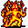

# Lostmine10

14×20 tiles · part of [Lostmine4](index.md)

<label class="lg"><input type="checkbox" data-t="spawn" checked><b>Red</b>&nbsp;Monsters / NPCs</label><label class="lg"><input type="checkbox" data-t="mapchange" checked><b>Blue</b>&nbsp;Exit to another map</label><label class="lg"><input type="checkbox" data-t="container" checked><b>Yellow</b>&nbsp;Container (click to see contents)</label><label class="lg"><input type="checkbox" data-t="sign" checked><b>Purple</b>&nbsp;Sign</label><label class="lg"><input type="checkbox" data-t="rest" checked><b>Green</b>&nbsp;Resting place</label><label class="lg"><input type="checkbox" data-t="key" checked><b>Orange dashed</b>&nbsp;Blocked until a quest step / item</label><label class="lg"><input type="checkbox" data-t="script"><b>Grey dotted</b>&nbsp;Scripted event</label><label class="lg"><input type="checkbox" data-t="replace"><b>White dotted</b>&nbsp;Changes during a quest</label>

## Exits

- [Lostmine11](lostmine11.md)
- [Lostmine9](lostmine9.md)

## Monsters & NPCs here

| Name | HP |
|---|---|
| [Glowing flame](../monsters/fire5.md) | 112 |
| [Flame spawn](../monsters/fire6.md) | 127 |
| [Walking flame](../monsters/fire7.md) | 131 |
| [Walking inferno](../monsters/fire8.md) | 135 |

<small>Map ID: `lostmine10` · Data from v0.8.18</small>
