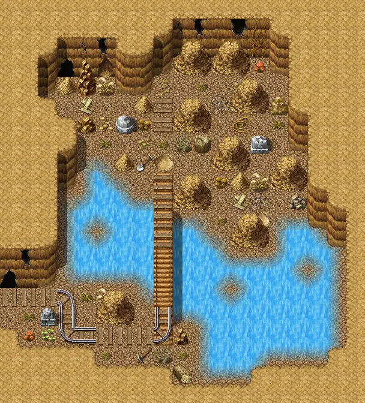

# Lostmine2a

19×21 tiles · part of [Lostmine1](index.md)

<label class="lg"><input type="checkbox" data-t="spawn" checked><b>Red</b>&nbsp;Monsters / NPCs</label><label class="lg"><input type="checkbox" data-t="mapchange" checked><b>Blue</b>&nbsp;Exit to another map</label><label class="lg"><input type="checkbox" data-t="container" checked><b>Yellow</b>&nbsp;Container (click to see contents)</label><label class="lg"><input type="checkbox" data-t="sign" checked><b>Purple</b>&nbsp;Sign</label><label class="lg"><input type="checkbox" data-t="rest" checked><b>Green</b>&nbsp;Resting place</label><label class="lg"><input type="checkbox" data-t="key" checked><b>Orange dashed</b>&nbsp;Blocked until a quest step / item</label><label class="lg"><input type="checkbox" data-t="script"><b>Grey dotted</b>&nbsp;Scripted event</label><label class="lg"><input type="checkbox" data-t="replace"><b>White dotted</b>&nbsp;Changes during a quest</label>

## Exits

- [Lostmine2](lostmine2.md)

## Monsters & NPCs here

| Name | HP |
|---|---|
| [Charwood goblin](../monsters/charwdg4.md) | 73 |
| [Charwood goblin fighter](../monsters/charwdg5.md) | 81 |
| [Tough Charwood goblin](../monsters/charwdg6.md) | 92 |
| [Aggressive Charwood goblin](../monsters/charwdg7.md) | 103 |
| [Strong Charwood goblin](../monsters/charwdg8.md) | 112 |
| [Mazarth beast](../monsters/mazarth1.md) | 129 |
| [Tough mazarth beast](../monsters/mazarth2.md) | 148 |

<small>Map ID: `lostmine2a` · Data from v0.8.18</small>
