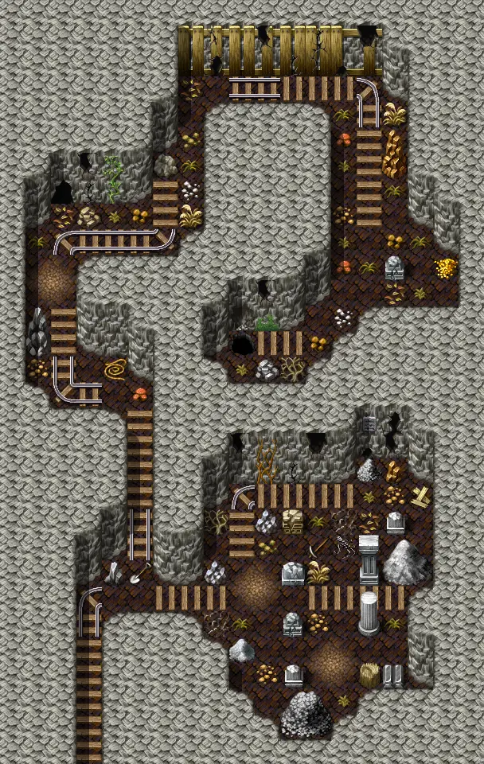

# Lostmine3

19×30 tiles · part of [Lostmine1](index.md)

<label class="lg"><input type="checkbox" data-t="spawn" checked><b>Red</b>&nbsp;Monsters / NPCs</label><label class="lg"><input type="checkbox" data-t="mapchange" checked><b>Blue</b>&nbsp;Exit to another map</label><label class="lg"><input type="checkbox" data-t="container" checked><b>Yellow</b>&nbsp;Container (click to see contents)</label><label class="lg"><input type="checkbox" data-t="sign" checked><b>Purple</b>&nbsp;Sign</label><label class="lg"><input type="checkbox" data-t="rest" checked><b>Green</b>&nbsp;Resting place</label><label class="lg"><input type="checkbox" data-t="key" checked><b>Orange dashed</b>&nbsp;Blocked until a quest step / item</label><label class="lg"><input type="checkbox" data-t="script"><b>Grey dotted</b>&nbsp;Scripted event</label><label class="lg"><input type="checkbox" data-t="replace"><b>White dotted</b>&nbsp;Changes during a quest</label>

## Exits

- [Lostmine2](lostmine2.md)
- [Lostmine4](lostmine4.md)

## Monsters & NPCs here

| Name | HP |
|---|---|
| [Young ash spawn](../monsters/ash5.md) | 80 |
| [Ash spawn](../monsters/ash6.md) | 83 |
| [Ash spectre](../monsters/ashs3.md) | 97 |
| [Young ash gargoyle](../monsters/ash1.md) | 109 |
| [Ash gargoyle](../monsters/ash2.md) | 116 |
| [Hardened ash gargoyle](../monsters/ash4.md) | 131 |
| [Strong ash gargoyle](../monsters/ash3.md) | 131 |

<small>Map ID: `lostmine3` · Data from v0.8.18</small>
