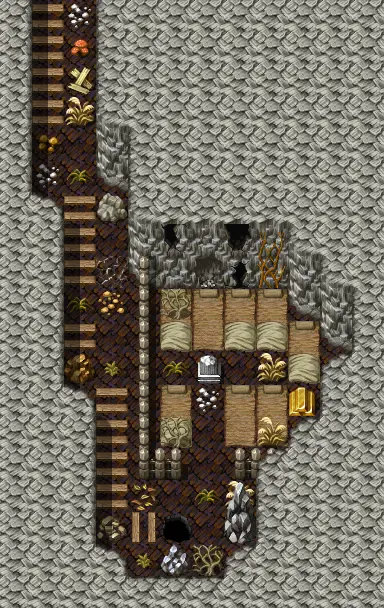

# Lostmine6

12×19 tiles · part of [Lostmine2](index.md)

<label class="lg"><input type="checkbox" data-t="spawn" checked><b>Red</b>&nbsp;Monsters / NPCs</label><label class="lg"><input type="checkbox" data-t="mapchange" checked><b>Blue</b>&nbsp;Exit to another map</label><label class="lg"><input type="checkbox" data-t="container" checked><b>Yellow</b>&nbsp;Container (click to see contents)</label><label class="lg"><input type="checkbox" data-t="sign" checked><b>Purple</b>&nbsp;Sign</label><label class="lg"><input type="checkbox" data-t="rest" checked><b>Green</b>&nbsp;Resting place</label><label class="lg"><input type="checkbox" data-t="key" checked><b>Orange dashed</b>&nbsp;Blocked until a quest step / item</label><label class="lg"><input type="checkbox" data-t="script"><b>Grey dotted</b>&nbsp;Scripted event</label><label class="lg"><input type="checkbox" data-t="replace"><b>White dotted</b>&nbsp;Changes during a quest</label>

## Exits

- [Lostmine5](lostmine5.md)
- [Lostmine7](lostmine7.md)

## Monsters & NPCs here

| Name | HP |
|---|---|
| [Young ash spawn](../monsters/ash5.md) | 80 |
| [Ash spawn](../monsters/ash6.md) | 83 |
| [Tough ash spawn](../monsters/ash7.md) | 87 |
| [Glowing abcess](../monsters/fire1.md) | 91 |
| [Blazing abcess](../monsters/fire2.md) | 95 |

<small>Map ID: `lostmine6` · Data from v0.8.18</small>
