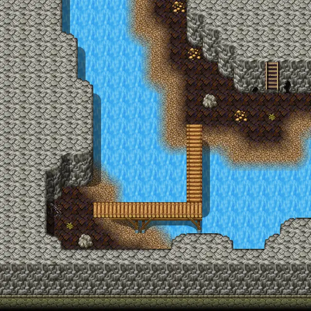

# Mountaincave1

20×20 tiles · part of [Mountaincave](index.md)

<label class="lg"><input type="checkbox" data-t="spawn" checked><b>Red</b>&nbsp;Monsters / NPCs</label><label class="lg"><input type="checkbox" data-t="mapchange" checked><b>Blue</b>&nbsp;Exit to another map</label><label class="lg"><input type="checkbox" data-t="container" checked><b>Yellow</b>&nbsp;Container (click to see contents)</label><label class="lg"><input type="checkbox" data-t="sign" checked><b>Purple</b>&nbsp;Sign</label><label class="lg"><input type="checkbox" data-t="rest" checked><b>Green</b>&nbsp;Resting place</label><label class="lg"><input type="checkbox" data-t="key" checked><b>Orange dashed</b>&nbsp;Blocked until a quest step / item</label><label class="lg"><input type="checkbox" data-t="script"><b>Grey dotted</b>&nbsp;Scripted event</label><label class="lg"><input type="checkbox" data-t="replace"><b>White dotted</b>&nbsp;Changes during a quest</label>

## Exits

- [Mountaincave0](mountaincave0.md)
- [Mountaincave2](mountaincave2.md)
- [Waytolake0](waytolake0.md)

## Monsters & NPCs here

| Name | HP |
|---|---|
| [Young scaradon](../monsters/scaradon_1.md) | 32 |
| [Scaradon](../monsters/scaradon_3.md) | 35 |
| [Small scaradon](../monsters/scaradon_2.md) | 35 |
| [Tough scaradon](../monsters/scaradon_4.md) | 37 |
| [Young carrion beetle](../monsters/cbeetle_1.md) | 45 |
| [Carrion beetle](../monsters/cbeetle_2.md) | 51 |

<small>Map ID: `mountaincave1` · Data from v0.8.18</small>
