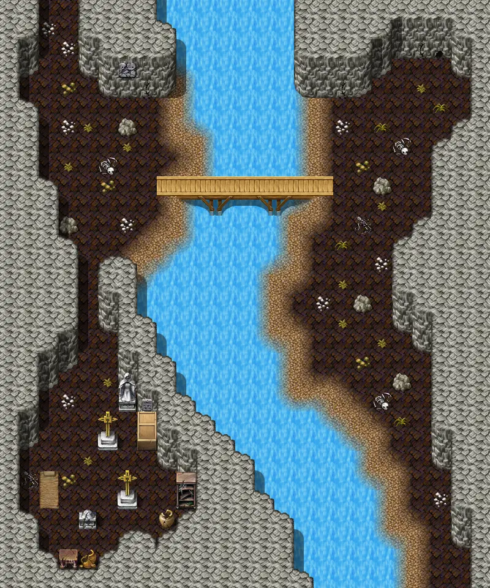

# Mountaincave2

25×30 tiles · part of [Mountaincave](index.md)

<label class="lg lg-spawn"><input type="checkbox" data-t="spawn" checked> Monsters / NPCs</label><label class="lg lg-mapchange"><input type="checkbox" data-t="mapchange" checked> Exit to another map</label><label class="lg lg-container"><input type="checkbox" data-t="container" checked> Container</label><label class="lg lg-sign"><input type="checkbox" data-t="sign" checked> Sign</label><label class="lg lg-rest"><input type="checkbox" data-t="rest" checked> Resting place</label><label class="lg lg-key"><input type="checkbox" data-t="key" checked> Blocked / needs key or quest</label><label class="lg lg-script"><input type="checkbox" data-t="script"> Scripted event</label><label class="lg lg-replace"><input type="checkbox" data-t="replace"> Changes after a quest</label>

## Exits

- [Mountaincave1](mountaincave1.md)
- [Mountaincave3](mountaincave3.md)

## Monsters & NPCs here

| Name | HP |
|---|---|
| [Young scaradon](../monsters/scaradon_1.md) | 32 |
| [Small scaradon](../monsters/scaradon_2.md) | 35 |
| [Scaradon](../monsters/scaradon_3.md) | 35 |
| [Tough scaradon](../monsters/scaradon_4.md) | 37 |
| [Hardshell scaradon](../monsters/scaradon_5.md) | 38 |
| [Young carrion beetle](../monsters/cbeetle_1.md) | 45 |
| [Carrion beetle](../monsters/cbeetle_2.md) | 51 |

<small>Map ID: `mountaincave2` · Data from v0.8.18</small>
