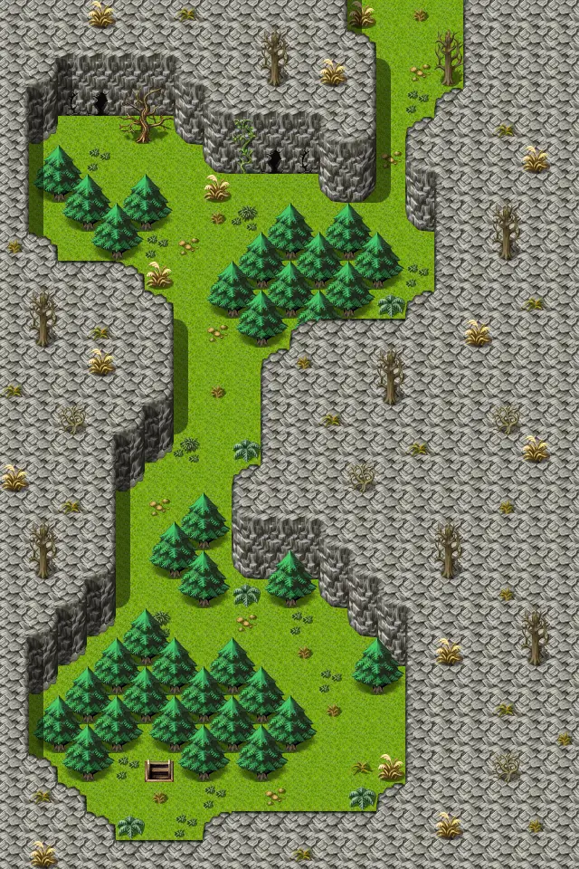

# Mountainlake0

20×30 tiles · outdoors · part of [World1](index.md)

<label class="lg lg-spawn"><input type="checkbox" data-t="spawn" checked> Monsters / NPCs</label><label class="lg lg-mapchange"><input type="checkbox" data-t="mapchange" checked> Exit to another map</label><label class="lg lg-container"><input type="checkbox" data-t="container" checked> Container</label><label class="lg lg-sign"><input type="checkbox" data-t="sign" checked> Sign</label><label class="lg lg-rest"><input type="checkbox" data-t="rest" checked> Resting place</label><label class="lg lg-key"><input type="checkbox" data-t="key" checked> Blocked / needs key or quest</label><label class="lg lg-script"><input type="checkbox" data-t="script"> Scripted event</label><label class="lg lg-replace"><input type="checkbox" data-t="replace"> Changes after a quest</label>

## Exits

- [Mountainlake1](mountainlake1.md)
- [Waytolake12](waytolake12.md)
- [Waytolake5](waytolake5.md)

## Monsters & NPCs here

| Name | HP |
|---|---|
| [Black plaguecrawler](../monsters/plaguesp_4.md) | 61 |
| [Plaguestrider](../monsters/plaguesp_5.md) | 62 |
| [Hardshell plaguestrider](../monsters/plaguesp_6.md) | 63 |
| [Tough plaguestrider](../monsters/plaguesp_7.md) | 64 |
| [Wooly plaguestrider](../monsters/plaguesp_8.md) | 65 |
| [Tough wooly plaguestrider](../monsters/plaguesp_9.md) | 66 |
| [Maonit troll](../monsters/maonit_1.md) | 255 |
| [Giant maonit troll](../monsters/maonit_2.md) | 270 |

<small>Map ID: `mountainlake0` · Data from v0.8.18</small>
