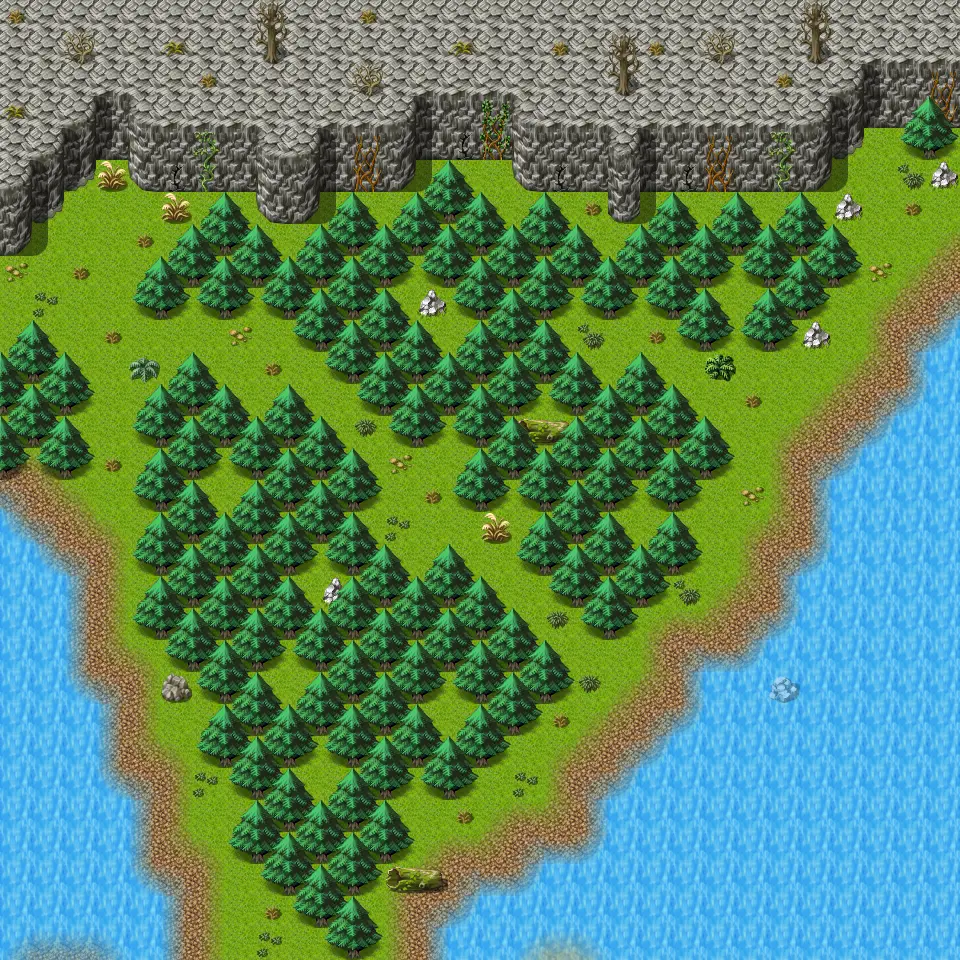

# Mountainlake10

30×30 tiles · outdoors · part of [World1](index.md)

<label class="lg lg-spawn"><input type="checkbox" data-t="spawn" checked> Monsters / NPCs</label><label class="lg lg-mapchange"><input type="checkbox" data-t="mapchange" checked> Exit to another map</label><label class="lg lg-container"><input type="checkbox" data-t="container" checked> Container</label><label class="lg lg-sign"><input type="checkbox" data-t="sign" checked> Sign</label><label class="lg lg-rest"><input type="checkbox" data-t="rest" checked> Resting place</label><label class="lg lg-key"><input type="checkbox" data-t="key" checked> Blocked / needs key or quest</label><label class="lg lg-script"><input type="checkbox" data-t="script"> Scripted event</label><label class="lg lg-replace"><input type="checkbox" data-t="replace"> Changes after a quest</label>

## Exits

- [Mountainlake10a](mountainlake10a.md)
- [Mountainlake11](mountainlake11.md)
- [Mountainlake22](mountainlake22.md)
- [Mountainlake9](mountainlake9.md)

## Monsters & NPCs here

| Name | HP |
|---|---|
| [Mountain fox](../monsters/mwolf_4.md) | 60 |
| [Ferocious mountain fox](../monsters/mwolf_5.md) | 64 |
| [Rabid mountain wolf](../monsters/mwolf_6.md) | 67 |
| [Strong mountain wolf](../monsters/mwolf_7.md) | 73 |
| [Ferocious mountain wolf](../monsters/mwolf_8.md) | 78 |
| [Fast mountain brute](../monsters/mbrute_6.md) | 82 |
| [Young mountain brute](../monsters/mbrute_1.md) | 148 |
| [Weak mountain brute](../monsters/mbrute_2.md) | 157 |
| [Whitefur mountain brute](../monsters/mbrute_3.md) | 166 |
| [Mountain brute](../monsters/mbrute_4.md) | 175 |
| [Large mountain brute](../monsters/mbrute_5.md) | 184 |

<small>Map ID: `mountainlake10` · Data from v0.8.18</small>
