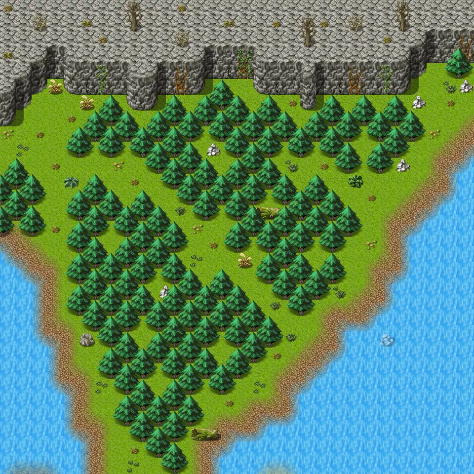

# Mountainlake 10

| | |
|---|---|
| **Map ID** | `mountainlake10` |
| **Type** | Outdoors |
| **Size** | 30×30 tiles |
| **World map** | [World 1](index.md) |
| **Introduced** | v0.7.0 or earlier |
| **Enemy types** | 11 |
| **Quests** | 1 |

**Mountainlake 10** is an outdoor map. It has no NPCs and 11 kinds of enemy. Exits lead to Mountainlake 9, Mountainlake 10a, Mountainlake 22, Mountainlake 11.

## Map

<label class="lg"><input type="checkbox" data-t="spawn" checked><b>Red</b>&nbsp;Monsters / NPCs</label><label class="lg"><input type="checkbox" data-t="mapchange" checked><b>Blue</b>&nbsp;Exit to another map</label><label class="lg"><input type="checkbox" data-t="container" checked><b>Yellow</b>&nbsp;Container (click to see contents)</label><label class="lg"><input type="checkbox" data-t="sign" checked><b>Purple</b>&nbsp;Sign</label><label class="lg"><input type="checkbox" data-t="rest" checked><b>Green</b>&nbsp;Resting place</label><label class="lg"><input type="checkbox" data-t="key" checked><b>Orange dashed</b>&nbsp;Blocked until a quest step / item</label><label class="lg"><input type="checkbox" data-t="script"><b>Grey dotted</b>&nbsp;Scripted event</label><label class="lg"><input type="checkbox" data-t="replace"><b>White dotted</b>&nbsp;Changes during a quest</label><label class="lg"><input type="checkbox" data-t="pin" checked><b>Numbers</b>&nbsp;Numbered key points (see the key below the map)</label>

<a class="pin pin-exit" href="#key-1" style="left:98.333%;top:23.333%" title="Exit (east): to [Mountainlake 9](mountainlake9.md)">1</a><a class="pin pin-exit" href="#key-1" style="left:98.333%;top:73.333%" title="Exit (east): to [Mountainlake 9](mountainlake9.md)">1</a><a class="pin pin-exit" href="#key-2" style="left:26.667%;top:98.333%" title="Exit (south): to [Mountainlake 10a](mountainlake10a.md)">2</a><a class="pin pin-exit" href="#key-3" style="left:80.000%;top:98.333%" title="Exit (south): to [Mountainlake 22](mountainlake22.md)">3</a><a class="pin pin-exit" href="#key-4" style="left:1.667%;top:31.667%" title="Exit (west): to [Mountainlake 11](mountainlake11.md)">4</a><a class="pin pin-exit" href="#key-4" style="left:1.667%;top:80.000%" title="Exit (west): to [Mountainlake 11](mountainlake11.md)">4</a><a class="pin pin-key" href="#key-5" style="left:88.333%;top:71.667%" title="Blocked passage: Unlocked during the quest: Search for Andor (stage 1: “My father Mikhail says that Andor has not been home since yesterday. I should go look for him in the village.”)">5</a><a class="pin pin-key" href="#key-5" style="left:75.000%;top:83.333%" title="Blocked passage: Unlocked during the quest: Search for Andor (stage 1: “My father Mikhail says that Andor has not been home since yesterday. I should go look for him in the village.”)">5</a><a class="pin pin-key" href="#key-5" style="left:8.333%;top:88.333%" title="Blocked passage: Unlocked during the quest: Search for Andor (stage 1: “My father Mikhail says that Andor has not been home since yesterday. I should go look for him in the village.”)">5</a><a class="pin pin-key" href="#key-6" style="left:96.667%;top:48.333%" title="Blocked passage: Closed off once you reach this point in the quest: Search for Andor (stage 1: “My father Mikhail says that Andor has not been home since yesterday. I should go look for him in the village.”)">6</a><a class="pin pin-key" href="#key-6" style="left:61.667%;top:93.333%" title="Blocked passage: Closed off once you reach this point in the quest: Search for Andor (stage 1: “My father Mikhail says that Andor has not been home since yesterday. I should go look for him in the village.”)">6</a><a class="pin pin-key" href="#key-6" style="left:65.000%;top:90.000%" title="Blocked passage: Closed off once you reach this point in the quest: Search for Andor (stage 1: “My father Mikhail says that Andor has not been home since yesterday. I should go look for him in the village.”)">6</a>

??? abstract "Key to the numbers on the map"

    | # | What | Details |
    |---|---|---|
    | 1 | Exit (east) | to [Mountainlake 9](mountainlake9.md) |
    | 2 | Exit (south) | to [Mountainlake 10a](mountainlake10a.md) |
    | 3 | Exit (south) | to [Mountainlake 22](mountainlake22.md) |
    | 4 | Exit (west) | to [Mountainlake 11](mountainlake11.md) |
    | 5 | Blocked passage | Unlocked during the quest: Search for Andor (stage 1: “My father Mikhail says that Andor has not been home since yesterday. I should go look for him in the village.”) |
    | 6 | Blocked passage | Closed off once you reach this point in the quest: Search for Andor (stage 1: “My father Mikhail says that Andor has not been home since yesterday. I should go look for him in the village.”) |

Verified against v0.8.18 map data.

## Connections

| Direction | Leads to | Region there | Map # |
|---|---|---|---|
| East | [Mountainlake 9](mountainlake9.md) | – | 1 |
| South | [Mountainlake 10a](mountainlake10a.md) | Lake Laeroth | 2 |
| South | [Mountainlake 22](mountainlake22.md) | – | 3 |
| West | [Mountainlake 11](mountainlake11.md) | – | 4 |

## Enemies

| Enemy | HP | Damage | Up to | Notes |
|---|---|---|---|---|
| [Mountain fox](../monsters/mwolf_4.md) | 60 | 3–8 | 4 | shares spawn with Ferocious mountain fox, Rabid mountain wolf |
| [Ferocious mountain fox](../monsters/mwolf_5.md) | 64 | 3–8 | 4 | shares spawn with Mountain fox, Rabid mountain wolf |
| [Rabid mountain wolf](../monsters/mwolf_6.md) | 67 | 3–9 | 4 | shares spawn with Ferocious mountain fox, Mountain fox |
| [Strong mountain wolf](../monsters/mwolf_7.md) | 73 | 3–9 | 3 | shares spawn with Ferocious mountain wolf |
| [Ferocious mountain wolf](../monsters/mwolf_8.md) | 78 | 3–10 | 3 | shares spawn with Strong mountain wolf |
| [Fast mountain brute](../monsters/mbrute_6.md) | 82 | 0–14 | 1 | shares spawn with Large mountain brute, Mountain brute |
| [Young mountain brute](../monsters/mbrute_1.md) | 148 | 0–14 | 3 | shares spawn with Weak mountain brute, Whitefur mountain brute |
| [Weak mountain brute](../monsters/mbrute_2.md) | 157 | 0–14 | 3 | shares spawn with Whitefur mountain brute, Young mountain brute |
| [Whitefur mountain brute](../monsters/mbrute_3.md) | 166 | 0–14 | 3 | shares spawn with Weak mountain brute, Young mountain brute |
| [Mountain brute](../monsters/mbrute_4.md) | 175 | 0–14 | 1 | shares spawn with Fast mountain brute, Large mountain brute |
| [Large mountain brute](../monsters/mbrute_5.md) | 184 | 0–14 | 1 | shares spawn with Fast mountain brute, Mountain brute |

<small>“Up to” is the most that can be alive at once from the spawn areas on this map.</small>

## Quests

- [Search for Andor](../quests/andor.md): blocked passage closes at stage 1; blocked passage opens at stage 1
- [Lake Laeroth story flags (hidden flag)](../quests/ll2_nd.md): something on this map advances it

## Points of interest

- **Blocked passage** (#5): Unlocked during the quest: Search for Andor (stage 1: “My father Mikhail says that Andor has not been home since yesterday. I should go look for him in the village.”)
- **Blocked passage** (#6): Closed off once you reach this point in the quest: Search for Andor (stage 1: “My father Mikhail says that Andor has not been home since yesterday. I should go look for him in the village.”)

## Version history

| Version | Change |
|---|---|
| [v0.7.0](../versions/0.7.0.md) | Present in v0.7.0 (earliest release tracked) |
| [v0.7.1](../versions/0.7.1.md) | Map layout or objects changed |
| [v0.7.2](../versions/0.7.2.md) | Map layout or objects changed |
| [v0.8.2](../versions/0.8.2.md) | Map layout or objects changed |
| [v0.8.18](../versions/0.8.18.md) | Map layout or objects changed |

Verified against v0.8.18 and every earlier release back to v0.7.0 (game data compared release by release).

## Community notes

<small>Written by players, not generated from game data. **Observations**: what players notice in-game · **Lore**: the in-world story · **Trivia**: real-world facts, references, development history · **Theory / speculation**: unconfirmed ideas; may just be unfinished content</small>

### Observations

*No notes yet. Contributions are welcome: [add a note](https://github.com/asdfghjkl628/Andor-s-Trail-Wikiiii/new/main/notes/maps?filename=mountainlake10.md&value=%23%23%20Observations%0A%0A%3C%21--%20what%20players%20notice%20in-game%20--%3E%0A%0A%23%23%20Lore%0A%0A%3C%21--%20the%20in-world%20story%20--%3E%0A%0A%23%23%20Trivia%0A%0A%3C%21--%20real-world%20facts%2C%20references%2C%20development%20history%20--%3E%0A%0A%23%23%20Theory%20/%20speculation%0A%0A%3C%21--%20unconfirmed%20ideas%3B%20may%20just%20be%20unfinished%20content%20--%3E%0A).*

### Lore

*No notes yet. Contributions are welcome: [add a note](https://github.com/asdfghjkl628/Andor-s-Trail-Wikiiii/new/main/notes/maps?filename=mountainlake10.md&value=%23%23%20Observations%0A%0A%3C%21--%20what%20players%20notice%20in-game%20--%3E%0A%0A%23%23%20Lore%0A%0A%3C%21--%20the%20in-world%20story%20--%3E%0A%0A%23%23%20Trivia%0A%0A%3C%21--%20real-world%20facts%2C%20references%2C%20development%20history%20--%3E%0A%0A%23%23%20Theory%20/%20speculation%0A%0A%3C%21--%20unconfirmed%20ideas%3B%20may%20just%20be%20unfinished%20content%20--%3E%0A).*

### Trivia

*No notes yet. Contributions are welcome: [add a note](https://github.com/asdfghjkl628/Andor-s-Trail-Wikiiii/new/main/notes/maps?filename=mountainlake10.md&value=%23%23%20Observations%0A%0A%3C%21--%20what%20players%20notice%20in-game%20--%3E%0A%0A%23%23%20Lore%0A%0A%3C%21--%20the%20in-world%20story%20--%3E%0A%0A%23%23%20Trivia%0A%0A%3C%21--%20real-world%20facts%2C%20references%2C%20development%20history%20--%3E%0A%0A%23%23%20Theory%20/%20speculation%0A%0A%3C%21--%20unconfirmed%20ideas%3B%20may%20just%20be%20unfinished%20content%20--%3E%0A).*

### Theory / speculation

*No notes yet. Contributions are welcome: [add a note](https://github.com/asdfghjkl628/Andor-s-Trail-Wikiiii/new/main/notes/maps?filename=mountainlake10.md&value=%23%23%20Observations%0A%0A%3C%21--%20what%20players%20notice%20in-game%20--%3E%0A%0A%23%23%20Lore%0A%0A%3C%21--%20the%20in-world%20story%20--%3E%0A%0A%23%23%20Trivia%0A%0A%3C%21--%20real-world%20facts%2C%20references%2C%20development%20history%20--%3E%0A%0A%23%23%20Theory%20/%20speculation%0A%0A%3C%21--%20unconfirmed%20ideas%3B%20may%20just%20be%20unfinished%20content%20--%3E%0A).*

??? info "Technical information"

    | | |
    |---|---|
    | Map ID | `mountainlake10` |
    | File | `res/xml/mountainlake10.tmx` |
    | Size | 30×30 tiles (960×960 px) |
    | outdoors property | 1 |
    | Layers drawn | ground, objects, above |
    | Tilesets | map_bed_1, map_border_1, map_bridge_1, map_bridge_2, map_broken_1, map_cavewall_1, map_cavewall_2, map_cavewall_3, map_cavewall_4, map_chair_table_1, map_chair_table_2, map_crate_1, map_cupboard_1, map_curtain_1, map_entrance_1, map_entrance_2, map_fence_1, map_fence_2, map_fence_3, map_fence_4, map_ground_1, map_ground_2, map_ground_3, map_ground_4, map_ground_5, map_ground_6, map_ground_7, map_ground_8, map_guynmart, map_house_1, map_house_2, map_indoor_1, map_indoor_2, map_kitchen_1, map_outdoor_1, map_pillar_1, map_pillar_2, map_plant_1, map_plant_2, map_rock_1, map_rock_2, map_roof_1, map_roof_2, map_roof_3, map_shop_1, map_sign_ladder_1, map_table_1, map_trail_1, map_transition_1, map_transition_2, map_transition_3, map_transition_4, map_transition_5, map_tree_1, map_tree_2, map_wall_1, map_wall_2, map_wall_3, map_wall_4, map_window_1, map_window_2 |
    | Map objects | spawn: 10, mapchange: 6, key: 6 |
    | World map position | segment `world1`, x 732, y 0 |

<small>Data from v0.8.18</small>
