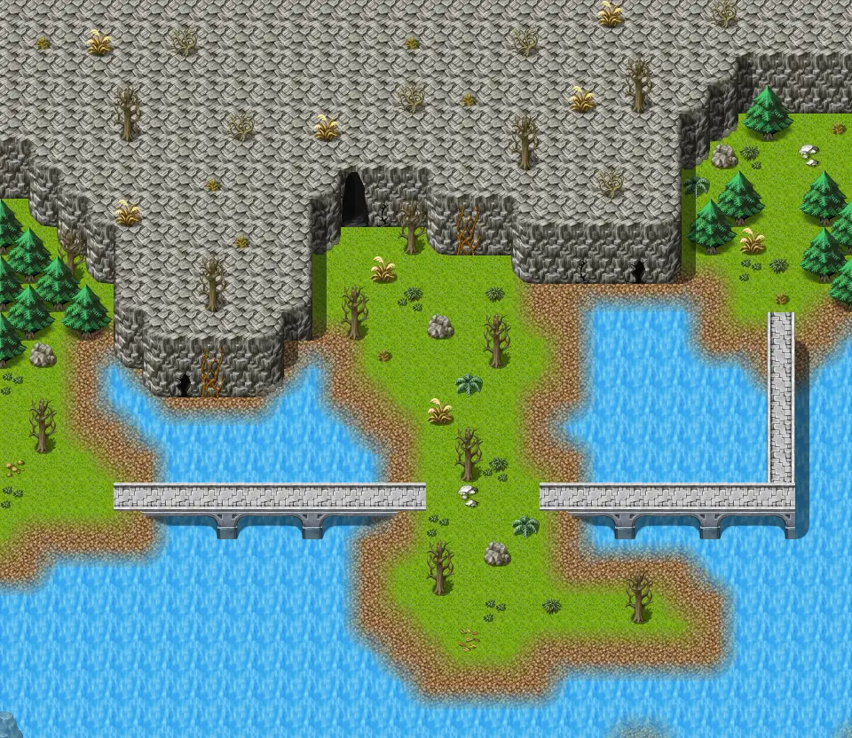
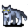
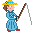

# Mountainlake11

30×26 tiles · outdoors · part of [World1](index.md)

<label class="lg"><input type="checkbox" data-t="spawn" checked><b>Red</b>&nbsp;Monsters / NPCs</label><label class="lg"><input type="checkbox" data-t="mapchange" checked><b>Blue</b>&nbsp;Exit to another map</label><label class="lg"><input type="checkbox" data-t="container" checked><b>Yellow</b>&nbsp;Container (click to see contents)</label><label class="lg"><input type="checkbox" data-t="sign" checked><b>Purple</b>&nbsp;Sign</label><label class="lg"><input type="checkbox" data-t="rest" checked><b>Green</b>&nbsp;Resting place</label><label class="lg"><input type="checkbox" data-t="key" checked><b>Orange dashed</b>&nbsp;Blocked until a quest step / item</label><label class="lg"><input type="checkbox" data-t="script"><b>Grey dotted</b>&nbsp;Scripted event</label><label class="lg"><input type="checkbox" data-t="replace"><b>White dotted</b>&nbsp;Changes during a quest</label>

## Exits

- [Lakecave0](lakecave0.md)
- [Mountainlake10](mountainlake10.md)
- [Mountainlake10a](mountainlake10a.md)
- [Mountainlake12](mountainlake12.md)
- [Mountainlake19](mountainlake19.md)

## Monsters & NPCs here

| Name | HP |
|---|---|
| [Bidro](../monsters/brute_fisherman.md) | 0 |
| [Mountain wolf pup](../monsters/mwolf_1.md) | 45 |
| [Young mountain wolf](../monsters/mwolf_2.md) | 52 |
| [Young mountain fox](../monsters/mwolf_3.md) | 56 |
| [Mountain fox](../monsters/mwolf_4.md) | 60 |
| [Ferocious mountain fox](../monsters/mwolf_5.md) | 64 |
| [Rabid mountain wolf](../monsters/mwolf_6.md) | 67 |
| [Strong mountain wolf](../monsters/mwolf_7.md) | 73 |
| [Ferocious mountain wolf](../monsters/mwolf_8.md) | 78 |

<small>Map ID: `mountainlake11` · Data from v0.8.18</small>
