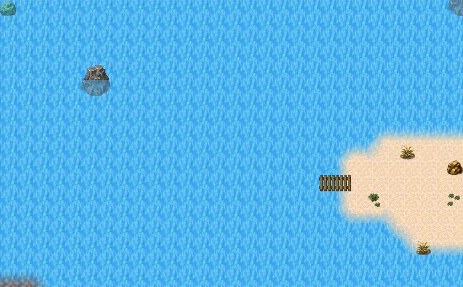

# Mountainlake14

| | |
|---|---|
| **Map ID** | `mountainlake14` |
| **Region** | Near Remgard (settlement) |
| **Type** | Outdoors |
| **Size** | 29×18 tiles |
| **World map** | [World1](index.md) |
| **Introduced** | [v0.8.18](../versions/0.8.18.md) |
| **NPCs** | 2 |
| **Enemy types** | 10 |
| **Quests** | 1 |

**Mountainlake14** is an outdoor map, near Remgard (settlement). It has 2 NPCs and 10 kinds of enemy. Exits lead to Mountainlake12, Mountainlake19, Mountainlake15, Mountainlake13.

## Map

<label class="lg"><input type="checkbox" data-t="spawn" checked><b>Red</b>&nbsp;Monsters / NPCs</label><label class="lg"><input type="checkbox" data-t="mapchange" checked><b>Blue</b>&nbsp;Exit to another map</label><label class="lg"><input type="checkbox" data-t="container" checked><b>Yellow</b>&nbsp;Container (click to see contents)</label><label class="lg"><input type="checkbox" data-t="sign" checked><b>Purple</b>&nbsp;Sign</label><label class="lg"><input type="checkbox" data-t="rest" checked><b>Green</b>&nbsp;Resting place</label><label class="lg"><input type="checkbox" data-t="key" checked><b>Orange dashed</b>&nbsp;Blocked until a quest step / item</label><label class="lg"><input type="checkbox" data-t="script"><b>Grey dotted</b>&nbsp;Scripted event</label><label class="lg"><input type="checkbox" data-t="replace"><b>White dotted</b>&nbsp;Changes during a quest</label><label class="lg"><input type="checkbox" data-t="pin" checked><b>Numbers</b>&nbsp;Numbered key points (see the key below the map)</label>

<a class="pin pin-exit" href="#key-1" style="left:50.000%;top:2.778%" title="Exit (north): to [Mountainlake12](../mountainlake12.md)">1</a><a class="pin pin-exit" href="#key-2" style="left:98.276%;top:44.444%" title="Exit (east): to [Mountainlake19](../mountainlake19.md)">2</a><a class="pin pin-exit" href="#key-3" style="left:51.724%;top:97.222%" title="Exit (south): to [Mountainlake15](../mountainlake15.md)">3</a><a class="pin pin-exit" href="#key-4" style="left:1.724%;top:50.000%" title="Exit (west): to [Mountainlake13](../mountainlake13.md)">4</a><a class="pin pin-npc" href="#key-5" style="left:98.276%;top:97.222%" title="[Captain Burry](../../monsters/ll2_captain.md): NPC">5</a><a class="pin pin-npc" href="#key-6" style="left:98.276%;top:91.667%" title="[Kalypso](../../monsters/kalypso.md): 1 quest">6</a><a class="pin pin-script" href="#key-7" style="left:67.241%;top:63.889%" title="Quest trigger: Scripted event: advances the quest: hidden story flag “ll2_nd” to stage 10 (“10=Boat afloat”) (+1 more quest(s))">7</a><a class="pin pin-script" href="#key-8" style="left:50.000%;top:8.333%" title="Quest trigger: Scripted event: advances the quest: hidden story flag “ll2_maps” to stage 14 (“14=mountainlake14”) (+1 more quest(s))">8</a><a class="pin pin-script" href="#key-8" style="left:5.172%;top:50.000%" title="Quest trigger: Scripted event: advances the quest: hidden story flag “ll2_maps” to stage 14 (“14=mountainlake14”) (+1 more quest(s))">8</a><a class="pin pin-script" href="#key-8" style="left:48.276%;top:91.667%" title="Quest trigger: Scripted event: advances the quest: hidden story flag “ll2_maps” to stage 14 (“14=mountainlake14”) (+1 more quest(s))">8</a><a class="pin pin-script" href="#key-8" style="left:94.828%;top:27.778%" title="Quest trigger: Scripted event: advances the quest: hidden story flag “ll2_maps” to stage 14 (“14=mountainlake14”) (+1 more quest(s))">8</a><a class="pin pin-key" href="#key-9" style="left:77.586%;top:63.889%" title="Blocked passage: Only while not affected by Hero&#x27;s body">9</a><a class="pin pin-replace" href="#key-10" style="left:67.468%;top:56.945%" title="Changes during a quest: This area changes during the quest: hidden story flag “ll2_nd” (stage 12: “12=Boat anchored at Kalypso”)">10</a><a class="pin pin-replace" href="#key-11" style="left:64.207%;top:60.246%" title="Changes during a quest: This area changes back during the quest: hidden story flag “ll2_nd” (stage 12: “12=Boat anchored at Kalypso”)">11</a>

??? abstract "Key to the numbers on the map"

    | # | What | Details |
    |---|---|---|
    | 1 | Exit (north) | to [Mountainlake12](../mountainlake12.md) |
    | 2 | Exit (east) | to [Mountainlake19](../mountainlake19.md) |
    | 3 | Exit (south) | to [Mountainlake15](../mountainlake15.md) |
    | 4 | Exit (west) | to [Mountainlake13](../mountainlake13.md) |
    | 5 | [Captain Burry](../monsters/ll2_captain.md) | NPC |
    | 6 | [Kalypso](../monsters/kalypso.md) | 1 quest |
    | 7 | Quest trigger | Scripted event: advances the quest: hidden story flag “ll2_nd” to stage 10 (“10=Boat afloat”) (+1 more quest(s)) |
    | 8 | Quest trigger | Scripted event: advances the quest: hidden story flag “ll2_maps” to stage 14 (“14=mountainlake14”) (+1 more quest(s)) |
    | 9 | Blocked passage | Only while not affected by Hero's body |
    | 10 | Changes during a quest | This area changes during the quest: hidden story flag “ll2_nd” (stage 12: “12=Boat anchored at Kalypso”) |
    | 11 | Changes during a quest | This area changes back during the quest: hidden story flag “ll2_nd” (stage 12: “12=Boat anchored at Kalypso”) |

Verified against v0.8.18 map data.

## Connections

| Direction | Leads to | Region there | Map # |
|---|---|---|---|
| North | [Mountainlake12](mountainlake12.md) | Remgard | 1 |
| East | [Mountainlake19](mountainlake19.md) | – | 2 |
| South | [Mountainlake15](mountainlake15.md) | Remgard | 3 |
| West | [Mountainlake13](mountainlake13.md) | Remgard | 4 |

## NPCs

- [Captain Burry](../monsters/ll2_captain.md) (#5)
- [Kalypso](../monsters/kalypso.md) — quests: [A map of the Great Lake Laeroth](../quests/lake_map.md) (#6)

## Enemies

| Enemy | HP | Damage | Up to | Notes |
|---|---|---|---|---|
| [Jellyfish](../monsters/ll2_jelly1.md) | 0 | 0–0 | 7 | shares spawn with Eel, Fish, Squid, Turtle |
| [Fish](../monsters/ll2_fish3.md) | 0 | 0–0 | 7 | shares spawn with Eel, Fish, Jellyfish, Squid, Turtle |
| [Fish](../monsters/ll2_fish4.md) | 0 | 0–0 | 7 | shares spawn with Eel, Fish, Jellyfish, Squid, Turtle |
| [Eel](../monsters/ll2_watersnake1.md) | 0 | 0–0 | 7 | shares spawn with Fish, Jellyfish, Squid, Turtle |
| [Fish](../monsters/ll2_fish1.md) | 0 | 0–0 | 7 | shares spawn with Eel, Fish, Jellyfish, Squid, Turtle |
| [Fish](../monsters/ll2_fish5.md) | 0 | 0–0 | 7 | shares spawn with Eel, Fish, Jellyfish, Squid, Turtle |
| [Fish](../monsters/ll2_fish2.md) | 0 | 0–0 | 7 | shares spawn with Eel, Fish, Jellyfish, Squid, Turtle |
| [Fish](../monsters/ll2_fish6.md) | 0 | 0–0 | 7 | shares spawn with Eel, Fish, Jellyfish, Squid, Turtle |
| [Turtle](../monsters/ll2_turtle1.md) | 0 | 0–0 | 7 | shares spawn with Eel, Fish, Jellyfish, Squid |
| [Squid](../monsters/ll2_squid1.md) | 0 | 0–0 | 7 | shares spawn with Eel, Fish, Jellyfish, Turtle |

<small>“Up to” is the most that can be alive at once from the spawn areas on this map.</small>

## Quests

- [A map of the Great Lake Laeroth](../quests/lake_map.md): [Kalypso](../monsters/kalypso.md) is involved; something on this map advances it; stepping on a trigger here sets stage 28; stepping on a trigger here sets stage 900
- [Lake Laeroth Maps found (hidden flag)](../quests/ll2_maps.md): something on this map advances it; stepping on a trigger here sets stage 14
- [Lake Laeroth nondisplay (hidden flag)](../quests/ll2_nd.md): part of the map changes at stage 12; something on this map advances it; stepping on a trigger here sets stage 10; stepping on a trigger here sets stage 12

## Points of interest

- **Quest trigger** (#7): Scripted event: advances the quest: hidden story flag “ll2_nd” to stage 10 (“10=Boat afloat”) (+1 more quest(s))
- **Quest trigger** (#8): Scripted event: advances the quest: hidden story flag “ll2_maps” to stage 14 (“14=mountainlake14”) (+1 more quest(s))
- **Blocked passage** (#9): Only while not affected by Hero's body
- **Changes during a quest** (#10): This area changes during the quest: hidden story flag “ll2_nd” (stage 12: “12=Boat anchored at Kalypso”)
- **Changes during a quest** (#11): This area changes back during the quest: hidden story flag “ll2_nd” (stage 12: “12=Boat anchored at Kalypso”)

## Version history

| Version | Change |
|---|---|
| [v0.8.18](../versions/0.8.18.md) | Added |

Verified against v0.8.18 and every earlier release back to v0.7.0 (game data compared release by release).

## Community notes

<small>Written by players, not generated from game data. **Observations**: what players notice in-game · **Lore**: the in-world story · **Trivia**: real-world facts, references, development history · **Theory / speculation**: unconfirmed ideas; may just be unfinished content</small>

### Observations

*Nothing here yet. Know something? [Add it](https://github.com/asdfghjkl628/Andor-s-Trail-Wikiiii/new/main/notes/maps?filename=mountainlake14.md&value=%23%23%20Observations%0A%0A%3C%21--%20what%20players%20notice%20in-game%20--%3E%0A%0A%23%23%20Lore%0A%0A%3C%21--%20the%20in-world%20story%20--%3E%0A%0A%23%23%20Trivia%0A%0A%3C%21--%20real-world%20facts%2C%20references%2C%20development%20history%20--%3E%0A%0A%23%23%20Theory%20/%20speculation%0A%0A%3C%21--%20unconfirmed%20ideas%3B%20may%20just%20be%20unfinished%20content%20--%3E%0A).*

### Lore

*Nothing here yet. Know something? [Add it](https://github.com/asdfghjkl628/Andor-s-Trail-Wikiiii/new/main/notes/maps?filename=mountainlake14.md&value=%23%23%20Observations%0A%0A%3C%21--%20what%20players%20notice%20in-game%20--%3E%0A%0A%23%23%20Lore%0A%0A%3C%21--%20the%20in-world%20story%20--%3E%0A%0A%23%23%20Trivia%0A%0A%3C%21--%20real-world%20facts%2C%20references%2C%20development%20history%20--%3E%0A%0A%23%23%20Theory%20/%20speculation%0A%0A%3C%21--%20unconfirmed%20ideas%3B%20may%20just%20be%20unfinished%20content%20--%3E%0A).*

### Trivia

*Nothing here yet. Know something? [Add it](https://github.com/asdfghjkl628/Andor-s-Trail-Wikiiii/new/main/notes/maps?filename=mountainlake14.md&value=%23%23%20Observations%0A%0A%3C%21--%20what%20players%20notice%20in-game%20--%3E%0A%0A%23%23%20Lore%0A%0A%3C%21--%20the%20in-world%20story%20--%3E%0A%0A%23%23%20Trivia%0A%0A%3C%21--%20real-world%20facts%2C%20references%2C%20development%20history%20--%3E%0A%0A%23%23%20Theory%20/%20speculation%0A%0A%3C%21--%20unconfirmed%20ideas%3B%20may%20just%20be%20unfinished%20content%20--%3E%0A).*

### Theory / speculation

*Nothing here yet. Know something? [Add it](https://github.com/asdfghjkl628/Andor-s-Trail-Wikiiii/new/main/notes/maps?filename=mountainlake14.md&value=%23%23%20Observations%0A%0A%3C%21--%20what%20players%20notice%20in-game%20--%3E%0A%0A%23%23%20Lore%0A%0A%3C%21--%20the%20in-world%20story%20--%3E%0A%0A%23%23%20Trivia%0A%0A%3C%21--%20real-world%20facts%2C%20references%2C%20development%20history%20--%3E%0A%0A%23%23%20Theory%20/%20speculation%0A%0A%3C%21--%20unconfirmed%20ideas%3B%20may%20just%20be%20unfinished%20content%20--%3E%0A).*

??? info "Technical information"

    | | |
    |---|---|
    | Map ID | `mountainlake14` |
    | File | `res/xml/mountainlake14.tmx` |
    | Size | 29×18 tiles (928×576 px) |
    | outdoors property | 1 |
    | Layers drawn | base, ground, objects, above |
    | Tilesets | map_bed_1, map_boats_2, map_border_1, map_bridge_1, map_bridge_2, map_broken_1, map_cavewall_1, map_cavewall_2, map_cavewall_3, map_cavewall_4, map_chair_table_1, map_chair_table_2, map_crate_1, map_cupboard_1, map_curtain_1, map_entrance_1, map_entrance_2, map_fence_1, map_fence_2, map_fence_3, map_fence_4, map_ground_1, map_ground_2, map_ground_3, map_ground_4, map_ground_5, map_ground_6, map_ground_7, map_ground_8, map_guynmart, map_house_1, map_house_2, map_indoor_1, map_indoor_2, map_kitchen_1, map_outdoor_1, map_pillar_1, map_pillar_2, map_plant_1, map_plant_2, map_rock_1, map_rock_2, map_roof_1, map_roof_2, map_roof_3, map_shop_1, map_sign_ladder_1, map_table_1, map_trail_1, map_transition_1, map_transition_2, map_transition_3, map_transition_4, map_transition_5, map_tree_1, map_tree_2, map_wall_1, map_wall_2, map_wall_3, map_wall_4, map_window_1, map_window_2 |
    | Map objects | script: 5, mapchange: 4, spawn: 4, replace: 2, key: 1 |
    | World map position | segment `world1`, x 671, y 31 |

<small>Data from v0.8.18</small>
