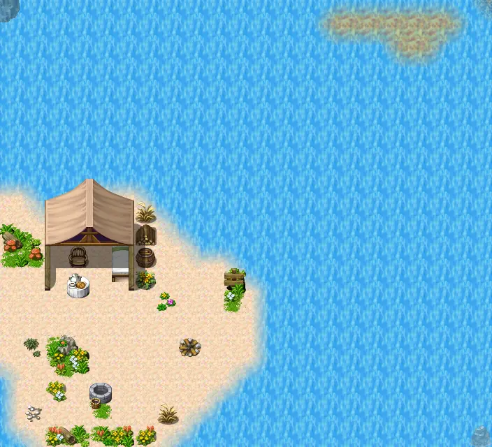

# Mountainlake19

22×20 tiles · outdoors · part of [World1](index.md)

<label class="lg lg-spawn"><input type="checkbox" data-t="spawn" checked> Monsters / NPCs</label><label class="lg lg-mapchange"><input type="checkbox" data-t="mapchange" checked> Exit to another map</label><label class="lg lg-container"><input type="checkbox" data-t="container" checked> Container</label><label class="lg lg-sign"><input type="checkbox" data-t="sign" checked> Sign</label><label class="lg lg-rest"><input type="checkbox" data-t="rest" checked> Resting place</label><label class="lg lg-key"><input type="checkbox" data-t="key" checked> Blocked / needs key or quest</label><label class="lg lg-script"><input type="checkbox" data-t="script"> Scripted event</label><label class="lg lg-replace"><input type="checkbox" data-t="replace"> Changes after a quest</label>

## Exits

- [Mountainlake10a](mountainlake10a.md)
- [Mountainlake11](mountainlake11.md)
- [Mountainlake14](mountainlake14.md)
- [Mountainlake20](mountainlake20.md)

## Monsters & NPCs here

| Name | HP |
|---|---|
| [Eel](../monsters/ll2_watersnake1.md) | 0 |
| [Squid](../monsters/ll2_squid1.md) | 0 |
| [Kalypso](../monsters/kalypso.md) | 0 |
| [Fish](../monsters/ll2_fish2.md) | 0 |
| [Turtle](../monsters/ll2_turtle1.md) | 0 |
| [Fish](../monsters/ll2_fish6.md) | 0 |
| [Fish](../monsters/ll2_fish5.md) | 0 |
| [Fish](../monsters/ll2_fish4.md) | 0 |
| [Fish](../monsters/ll2_fish3.md) | 0 |
| [Jellyfish](../monsters/ll2_jelly1.md) | 0 |
| [Fish](../monsters/ll2_fish1.md) | 0 |

<small>Map ID: `mountainlake19` · Data from v0.8.18</small>
