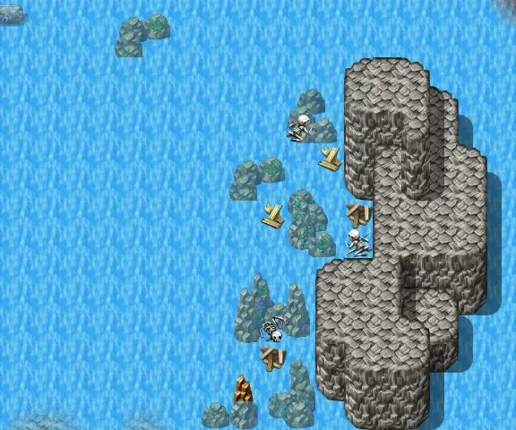

# Mountainlake21

| | |
|---|---|
| **Map ID** | `mountainlake21` |
| **Region** | In Lake Laeroth (other) |
| **Type** | Indoors / underground |
| **Size** | 18×15 tiles |
| **World map** | [World1](index.md) |
| **Introduced** | [v0.8.18](../versions/0.8.18.md) |
| **NPCs** | 4 |
| **Enemy types** | 10 |
| **Quests** | 1 |

**Mountainlake21** is an indoor map, in Lake Laeroth (other). It has 4 NPCs and 10 kinds of enemy. Exits lead to Mountainlake10a, Laerothisland0, Mountainlake20.

## Map

<label class="lg"><input type="checkbox" data-t="spawn" checked><b>Red</b>&nbsp;Monsters / NPCs</label><label class="lg"><input type="checkbox" data-t="mapchange" checked><b>Blue</b>&nbsp;Exit to another map</label><label class="lg"><input type="checkbox" data-t="container" checked><b>Yellow</b>&nbsp;Container (click to see contents)</label><label class="lg"><input type="checkbox" data-t="sign" checked><b>Purple</b>&nbsp;Sign</label><label class="lg"><input type="checkbox" data-t="rest" checked><b>Green</b>&nbsp;Resting place</label><label class="lg"><input type="checkbox" data-t="key" checked><b>Orange dashed</b>&nbsp;Blocked until a quest step / item</label><label class="lg"><input type="checkbox" data-t="script"><b>Grey dotted</b>&nbsp;Scripted event</label><label class="lg"><input type="checkbox" data-t="replace"><b>White dotted</b>&nbsp;Changes during a quest</label><label class="lg"><input type="checkbox" data-t="pin" checked><b>Numbers</b>&nbsp;Numbered key points (see the key below the map)</label>

<a class="pin pin-exit" href="#key-1" style="left:13.889%;top:3.333%" title="Exit (north): to [Mountainlake10a](mountainlake10a.md)">1</a><a class="pin pin-exit" href="#key-2" style="left:97.222%;top:16.667%" title="Exit (east): to [Laerothisland0](laerothisland0.md)">2</a><a class="pin pin-exit" href="#key-3" style="left:2.778%;top:53.333%" title="Exit (west): to [Mountainlake20](mountainlake20.md)">3</a><a id="pin-npc-ll2_captain" class="pin pin-npc" href="#key-4" style="left:91.667%;top:63.333%" title="[Captain Burry](../../monsters/ll2_captain.md): NPC">4</a><a id="pin-npc-sirene3" class="pin pin-npc" href="#key-5" style="left:69.444%;top:63.333%" title="[Leukosia](../../monsters/sirene3.md): NPC">5</a><a id="pin-npc-sirene2" class="pin pin-npc" href="#key-6" style="left:75.000%;top:56.667%" title="[Ligeia](../../monsters/sirene2.md): NPC">6</a><a id="pin-npc-sirene1" class="pin pin-npc" href="#key-7" style="left:75.000%;top:23.333%" title="[Parthenope](../../monsters/sirene1.md): NPC">7</a><a class="pin pin-script" href="#key-8" style="left:91.667%;top:13.333%" title="Quest trigger: Scripted event: advances the quest: A map of the Great Lake Laeroth to stage 48 (“We have managed to passage by the Sirens&#x27; cliff.”)">8</a><a class="pin pin-script" href="#key-9" style="left:13.889%;top:53.333%" title="Quest trigger: Scripted event: advances the quest: hidden story flag “ll2_maps” to stage 21 (“21=mountainlake21”) (+1 more quest(s))">9</a><a class="pin pin-key" href="#key-10" style="left:30.556%;top:56.667%" title="Blocked passage: Unlocked during the quest: hidden story flag “ll2_nd” (stage 104: “104=Sirene passage free”)">10</a>

??? abstract "Key to the numbers on the map"

    | # | What | Details |
    |---|---|---|
    | 1 | Exit (north) | to [Mountainlake10a](mountainlake10a.md) |
    | 2 | Exit (east) | to [Laerothisland0](laerothisland0.md) |
    | 3 | Exit (west) | to [Mountainlake20](mountainlake20.md) |
    | 4 | [Captain Burry](../monsters/ll2_captain.md) | NPC |
    | 5 | [Leukosia](../monsters/sirene3.md) | NPC |
    | 6 | [Ligeia](../monsters/sirene2.md) | NPC |
    | 7 | [Parthenope](../monsters/sirene1.md) | NPC |
    | 8 | Quest trigger | Scripted event: advances the quest: A map of the Great Lake Laeroth to stage 48 (“We have managed to passage by the Sirens' cliff.”) |
    | 9 | Quest trigger | Scripted event: advances the quest: hidden story flag “ll2_maps” to stage 21 (“21=mountainlake21”) (+1 more quest(s)) |
    | 10 | Blocked passage | Unlocked during the quest: hidden story flag “ll2_nd” (stage 104: “104=Sirene passage free”) |

Verified against v0.8.18 map data.

## Connections

| Direction | Leads to | Region there | Map # |
|---|---|---|---|
| North | [Mountainlake10a](mountainlake10a.md) | Lake Laeroth | 1 |
| East | [Laerothisland0](laerothisland0.md) | Lake Laeroth | 2 |
| West | [Mountainlake20](mountainlake20.md) | Remgard | 3 |

## NPCs

- [Captain Burry](../monsters/ll2_captain.md) (#4)
- [Leukosia](../monsters/sirene3.md) (#5)
- [Ligeia](../monsters/sirene2.md) (#6)
- [Parthenope](../monsters/sirene1.md) (#7)

## Enemies

| Enemy | HP | Damage | Up to | Notes |
|---|---|---|---|---|
| [Turtle](../monsters/ll2_turtle1.md) | 0 | 0–0 | 5 | shares spawn with Eel, Fish, Jellyfish, Squid |
| [Jellyfish](../monsters/ll2_jelly1.md) | 0 | 0–0 | 5 | shares spawn with Eel, Fish, Squid, Turtle |
| [Fish](../monsters/brv_fish1.md#v-ll2_fish5) | 0 | 0–0 | 5 | shares spawn with Eel, Fish, Jellyfish, Squid, Turtle |
| [Fish](../monsters/brv_fish1.md#v-ll2_fish3) | 0 | 0–0 | 5 | shares spawn with Eel, Fish, Jellyfish, Squid, Turtle |
| [Fish](../monsters/brv_fish1.md#v-ll2_fish6) | 0 | 0–0 | 5 | shares spawn with Eel, Fish, Jellyfish, Squid, Turtle |
| [Fish](../monsters/brv_fish1.md#v-ll2_fish1) | 0 | 0–0 | 5 | shares spawn with Eel, Fish, Jellyfish, Squid, Turtle |
| [Fish](../monsters/brv_fish1.md#v-ll2_fish4) | 0 | 0–0 | 5 | shares spawn with Eel, Fish, Jellyfish, Squid, Turtle |
| [Eel](../monsters/ll2_watersnake1.md) | 0 | 0–0 | 5 | shares spawn with Fish, Jellyfish, Squid, Turtle |
| [Fish](../monsters/brv_fish1.md#v-ll2_fish2) | 0 | 0–0 | 5 | shares spawn with Eel, Fish, Jellyfish, Squid, Turtle |
| [Squid](../monsters/ll2_squid1.md) | 0 | 0–0 | 5 | shares spawn with Eel, Fish, Jellyfish, Turtle |

<small>“Up to” is the most that can be alive at once from the spawn areas on this map.</small>

## Quests

- [A map of the Great Lake Laeroth](../quests/lake_map.md): something on this map advances it; stepping on a trigger here sets stage 48; stepping on a trigger here sets stage 900
- [Lake Laeroth Maps found (hidden flag)](../quests/ll2_maps.md): something on this map advances it; stepping on a trigger here sets stage 21
- [Lake Laeroth nondisplay (hidden flag)](../quests/ll2_nd.md): blocked passage opens at stage 104; something on this map advances it

## Points of interest

- **Quest trigger** (#8): Scripted event: advances the quest: A map of the Great Lake Laeroth to stage 48 (“We have managed to passage by the Sirens' cliff.”)
- **Quest trigger** (#9): Scripted event: advances the quest: hidden story flag “ll2_maps” to stage 21 (“21=mountainlake21”) (+1 more quest(s))
- **Blocked passage** (#10): Unlocked during the quest: hidden story flag “ll2_nd” (stage 104: “104=Sirene passage free”)

## Version history

| Version | Change |
|---|---|
| [v0.8.18](../versions/0.8.18.md) | Added |

Verified against v0.8.18 and every earlier release back to v0.7.0 (game data compared release by release).

## Community notes

<small>Written by players, not generated from game data. **Observations**: what players notice in-game · **Lore**: the in-world story · **Trivia**: real-world facts, references, development history · **Theory / speculation**: unconfirmed ideas; may just be unfinished content</small>

### Observations

*No notes yet. Contributions are welcome: [add a note](https://github.com/asdfghjkl628/Andor-s-Trail-Wikiiii/new/main/notes/maps?filename=mountainlake21.md&value=%23%23%20Observations%0A%0A%3C%21--%20what%20players%20notice%20in-game%20--%3E%0A%0A%23%23%20Lore%0A%0A%3C%21--%20the%20in-world%20story%20--%3E%0A%0A%23%23%20Trivia%0A%0A%3C%21--%20real-world%20facts%2C%20references%2C%20development%20history%20--%3E%0A%0A%23%23%20Theory%20/%20speculation%0A%0A%3C%21--%20unconfirmed%20ideas%3B%20may%20just%20be%20unfinished%20content%20--%3E%0A).*

### Lore

*No notes yet. Contributions are welcome: [add a note](https://github.com/asdfghjkl628/Andor-s-Trail-Wikiiii/new/main/notes/maps?filename=mountainlake21.md&value=%23%23%20Observations%0A%0A%3C%21--%20what%20players%20notice%20in-game%20--%3E%0A%0A%23%23%20Lore%0A%0A%3C%21--%20the%20in-world%20story%20--%3E%0A%0A%23%23%20Trivia%0A%0A%3C%21--%20real-world%20facts%2C%20references%2C%20development%20history%20--%3E%0A%0A%23%23%20Theory%20/%20speculation%0A%0A%3C%21--%20unconfirmed%20ideas%3B%20may%20just%20be%20unfinished%20content%20--%3E%0A).*

### Trivia

*No notes yet. Contributions are welcome: [add a note](https://github.com/asdfghjkl628/Andor-s-Trail-Wikiiii/new/main/notes/maps?filename=mountainlake21.md&value=%23%23%20Observations%0A%0A%3C%21--%20what%20players%20notice%20in-game%20--%3E%0A%0A%23%23%20Lore%0A%0A%3C%21--%20the%20in-world%20story%20--%3E%0A%0A%23%23%20Trivia%0A%0A%3C%21--%20real-world%20facts%2C%20references%2C%20development%20history%20--%3E%0A%0A%23%23%20Theory%20/%20speculation%0A%0A%3C%21--%20unconfirmed%20ideas%3B%20may%20just%20be%20unfinished%20content%20--%3E%0A).*

### Theory / speculation

*No notes yet. Contributions are welcome: [add a note](https://github.com/asdfghjkl628/Andor-s-Trail-Wikiiii/new/main/notes/maps?filename=mountainlake21.md&value=%23%23%20Observations%0A%0A%3C%21--%20what%20players%20notice%20in-game%20--%3E%0A%0A%23%23%20Lore%0A%0A%3C%21--%20the%20in-world%20story%20--%3E%0A%0A%23%23%20Trivia%0A%0A%3C%21--%20real-world%20facts%2C%20references%2C%20development%20history%20--%3E%0A%0A%23%23%20Theory%20/%20speculation%0A%0A%3C%21--%20unconfirmed%20ideas%3B%20may%20just%20be%20unfinished%20content%20--%3E%0A).*

??? info "Technical information"

    | | |
    |---|---|
    | Map ID | `mountainlake21` |
    | File | `res/xml/mountainlake21.tmx` |
    | Size | 18×15 tiles (576×480 px) |
    | outdoors property | – |
    | Layers drawn | base, ground, objects, above |
    | Tilesets | map_bed_1, map_border_1, map_bridge_1, map_bridge_2, map_broken_1, map_cavewall_1, map_cavewall_2, map_cavewall_3, map_cavewall_4, map_chair_table_1, map_chair_table_2, map_crate_1, map_cupboard_1, map_curtain_1, map_entrance_1, map_entrance_2, map_fence_1, map_fence_2, map_fence_3, map_fence_4, map_ground_1, map_ground_2, map_ground_3, map_ground_4, map_ground_5, map_ground_6, map_ground_7, map_ground_8, map_guynmart, map_house_1, map_house_2, map_indoor_1, map_indoor_2, map_kitchen_1, map_outdoor_1, map_pillar_1, map_pillar_2, map_plant_1, map_plant_2, map_rock_1, map_rock_2, map_roof_1, map_roof_2, map_roof_3, map_shop_1, map_sign_ladder_1, map_table_1, map_trail_1, map_transition_1, map_transition_2, map_transition_3, map_transition_4, map_transition_5, map_tree_1, map_tree_2, map_wall_1, map_wall_2, map_wall_3, map_wall_4, map_window_1, map_window_2 |
    | Map objects | script: 8, spawn: 5, mapchange: 3, key: 1 |
    | World map position | segment `world1`, x 724, y 52 |

<small>Data from v0.8.18</small>
