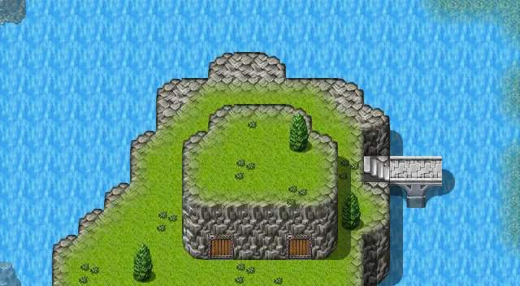

# Mountainlake27

20×11 tiles · part of [World1](index.md)

<label class="lg lg-spawn"><input type="checkbox" data-t="spawn" checked> Monsters / NPCs</label><label class="lg lg-mapchange"><input type="checkbox" data-t="mapchange" checked> Exit to another map</label><label class="lg lg-container"><input type="checkbox" data-t="container" checked> Container</label><label class="lg lg-sign"><input type="checkbox" data-t="sign" checked> Sign</label><label class="lg lg-rest"><input type="checkbox" data-t="rest" checked> Resting place</label><label class="lg lg-key"><input type="checkbox" data-t="key" checked> Blocked / needs key or quest</label><label class="lg lg-script"><input type="checkbox" data-t="script"> Scripted event</label><label class="lg lg-replace"><input type="checkbox" data-t="replace"> Changes after a quest</label>

## Exits

- [Mountainlake26](mountainlake26.md)
- [Mountainlake28](mountainlake28.md)
- [Mountainlake6](mountainlake6.md)
- [Mountainlake8](mountainlake8.md)

## Monsters & NPCs here

| Name | HP |
|---|---|
| [Sheep](../monsters/ll2_cyclops_sheep1.md) | 0 |
| [Captain Burry](../monsters/ll2_captain.md) | 0 |
| [Sheep](../monsters/ll2_cyclops_sheep2.md) | 0 |
| [Polyasem](../monsters/ll2_cyclops1.md) | 100 |
| [Aphem](../monsters/ll2_cyclops2.md) | 100 |

<small>Map ID: `mountainlake27` · Data from v0.8.18</small>
